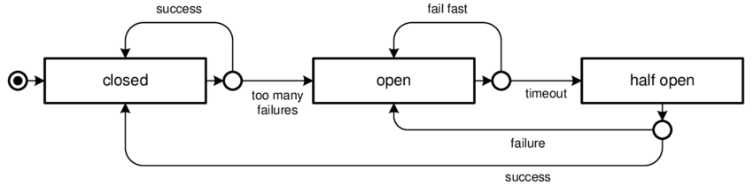
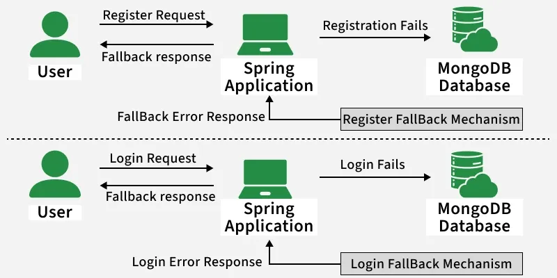

# Patrón Circuit Breaker: Resumen para Clase

## **¿Qué es el Patrón Circuit Breaker?**

El patrón **Circuit Breaker** es un mecanismo de resilencia que **protege un sistema de fallos cascada** monitoreando continuamente el estado de servicios externos. Funciona como un interruptor eléctrico: cuando detecta demasiados fallos, **abre el circuito** para bloquear llamadas adicionales y **permitir recuperación** del sistema degradado.

### Conceptos Fundamentales

#### 1. **Circuit Breaker como Protección**
- Previene llamadas a servicios no disponibles
- Detecta patrones de fallo automáticamente
- Permite recuperación automática del sistema

#### 2. **Estados del Circuit Breaker**
- **CLOSED**: Funcionamiento normal (permite todas las llamadas)
- **OPEN**: Bloquea llamadas (falla inmediatamente)
- **HALF-OPEN**: Permite una llamada de prueba (evalúa si el servicio se recuperó)

<br>




#### 3. **Detección de Fallos**
- **Failure Threshold**: Número de fallos consecutivos para abrir
- **Success Threshold**: Número de éxitos para cerrar (desde HALF-OPEN)
- **Timeout**: Tiempo de espera antes de intentar HALF-OPEN
- **Sliding Window**: Ventana de tiempo para evaluar estadísticas

<br>



#### 4. **Estrategias de Fallback**
- **Fail Fast**: Falla inmediatamente sin operación
- **Fallback**: Ejecuta operación alternativa
- **Cache**: Retorna datos desde cache local
- **Degraded Service**: Funcionalidad reducida


---

## **Casos de Uso**

### 1. **Protección de Microservicios**
- Evitar llamadas a servicios degradados
- Prevenir cascadas de fallos en sistemas distribuidos
- Aislar problemas en servicios específicos

### 2. **Integración con APIs Externas**
- APIs de terceros con disponibilidad variable
- Servicios de pago que pueden fallar
- Sistemas de autenticación externos

### 3. **Operaciones de Base de Datos**
- Prevenir sobrecarga de bases de datos saturadas
- Evitar timeouts acumulados
- Proteger contra deadlocks masivos

### 4. **Sistemas de Alta Carga**
- Aplicaciones con picos de tráfico
- Sistemas que manejan múltiples dependencias
- Plataformas que requieren alta disponibilidad

### 5. **Integraciones Legacy**
- Sistemas antiguos con estabilidad variable
- Aplicaciones que no pueden manejar sobrecarga
- Integraciones con hardware limitado

---

## **Ejemplos**

### Ejemplo 1: Circuit Breaker Básico

```java
import java.util.concurrent.atomic.AtomicInteger;
import java.util.concurrent.atomic.AtomicLong;
import java.time.Duration;
import java.time.Instant;

public class BasicCircuitBreaker {
    
    private final CircuitBreakerConfig config;
    private final AtomicInteger failureCount = new AtomicInteger(0);
    private final AtomicInteger successCount = new AtomicInteger(0);
    private final AtomicLong lastFailureTime = new AtomicLong(0);
    private final AtomicLong lastSuccessTime = new AtomicLong(0);
    
    private volatile CircuitState state = CircuitState.CLOSED;
    
    public BasicCircuitBreaker(CircuitBreakerConfig config) {
        this.config = config;
    }
    
    public <T> T execute(Supplier<T> operation) throws CircuitBreakerOpenException {
        
        switch (state) {
            case CLOSED:
                return executeInClosedState(operation);
                
            case OPEN:
                return executeInOpenState(operation);
                
            case HALF_OPEN:
                return executeInHalfOpenState(operation);
                
            default:
                throw new IllegalStateException("Estado desconocido: " + state);
        }
    }
    
    private <T> T executeInClosedState(Supplier<T> operation) {
        try {
            T result = operation.get();
            onSuccess();
            return result;
        } catch (Exception e) {
            onFailure();
            throw e;
        }
    }
    
    private <T> T executeInOpenState(Supplier<T> operation) throws CircuitBreakerOpenException {
        // Verificar si es tiempo de intentar HALF_OPEN
        if (shouldAttemptReset()) {
            state = CircuitState.HALF_OPEN;
            System.out.println("Circuit breaker cambió a HALF_OPEN");
            return executeInHalfOpenState(operation);
        }
        
        throw new CircuitBreakerOpenException("Circuit breaker está ABIERTO - operación bloqueada");
    }
    
    private <T> T executeInHalfOpenState(Supplier<T> operation) {
        try {
            T result = operation.get();
            onSuccessInHalfOpen();
            return result;
        } catch (Exception e) {
            onFailureInHalfOpen();
            throw e;
        }
    }
    
    private void onSuccess() {
        failureCount.set(0);
        successCount.incrementAndGet();
        lastSuccessTime.set(System.currentTimeMillis());
        
        if (state == CircuitState.HALF_OPEN) {
            // Volver a CLOSED después de éxito en HALF_OPEN
            state = CircuitState.CLOSED;
            successCount.set(0);
            System.out.println("Circuit breaker cambió a CLOSED después de éxito en HALF_OPEN");
        }
    }
    
    private void onFailure() {
        int failures = failureCount.incrementAndGet();
        lastFailureTime.set(System.currentTimeMillis());
        
        System.out.println("Fallo registrado en CLOSED. Fallos consecutivos: " + failures);
        
        if (failures >= config.getFailureThreshold()) {
            state = CircuitState.OPEN;
            System.out.println("Circuit breaker cambió a OPEN después de " + failures + " fallos");
        }
    }
    
    private void onSuccessInHalfOpen() {
        System.out.println("Éxito en HALF_OPEN - cambiando a CLOSED");
        onSuccess();
    }
    
    private void onFailureInHalfOpen() {
        System.out.println("Fallo en HALF_OPEN - volviendo a OPEN");
        state = CircuitState.OPEN;
        lastFailureTime.set(System.currentTimeMillis());
        failureCount.set(config.getFailureThreshold()); // Mantener en OPEN
    }
    
    private boolean shouldAttemptReset() {
        long timeSinceLastFailure = System.currentTimeMillis() - lastFailureTime.get();
        return timeSinceLastFailure >= config.getRecoveryTimeout().toMillis();
    }
    
    // Getters para métricas
    public CircuitState getState() {
        return state;
    }
    
    public int getFailureCount() {
        return failureCount.get();
    }
    
    public int getSuccessCount() {
        return successCount.get();
    }
    
    public Instant getLastFailureTime() {
        return lastFailureTime.get() > 0 ? Instant.ofEpochMilli(lastFailureTime.get()) : null;
    }
    
    public Instant getLastSuccessTime() {
        return lastSuccessTime.get() > 0 ? Instant.ofEpochMilli(lastSuccessTime.get()) : null;
    }
}

// Estados del Circuit Breaker
enum CircuitState {
    CLOSED,    // Funcionamiento normal
    OPEN,      // Bloqueando todas las llamadas
    HALF_OPEN  // Permitiendo llamada de prueba
}

// Configuración del Circuit Breaker
class CircuitBreakerConfig {
    private final int failureThreshold;
    private final int successThreshold;
    private final Duration recoveryTimeout;
    private final Duration monitoringWindow;
    
    public CircuitBreakerConfig(Builder builder) {
        this.failureThreshold = builder.failureThreshold;
        this.successThreshold = builder.successThreshold;
coveryTimeout;
        this.monitoringWindow        this.recovery = builder.monitoringWindow;
    }
Timeout = builder.re    
    public int getFailureThreshold() {
        return failureThreshold;
    }
    
    public int getSuccessThreshold() {
        return successThreshold;
    }
    
    public Duration getRecoveryTimeout() {
        return recoveryTimeout;
    }
    
    public Duration getMonitoringWindow() {
        return monitoringWindow;
    }
    
    public static class Builder {
        private int failureThreshold = 5;
        private int successThreshold = 3;
        private Duration recoveryTimeout = Duration.ofSeconds(60);
        private Duration monitoringWindow = Duration.ofMinutes(1);
        
        public Builder withFailureThreshold(int threshold) {
            this.failureThreshold = Math.max(1, threshold);
            return this;
        }
        
        public Builder withSuccessThreshold(int threshold) {
            this.successThreshold = Math.max(1, threshold);
            return this;
        }
        
        public Builder withRecoveryTimeout(Duration timeout) {
            this.recoveryTimeout = timeout;
            return this;
        }
        
        public Builder withMonitoringWindow(Duration window) {
            this.monitoringWindow = window;
            return this;
        }
        
        public CircuitBreakerConfig build() {
            return new CircuitBreakerConfig(this);
        }
    }
}

// Excepciones
class CircuitBreakerOpenException extends RuntimeException {
    public CircuitBreakerOpenException(String message) {
        super(message);
    }
}

// Ejemplo de uso
class BasicCircuitBreakerExample {
    public static void demonstrateBasicCircuitBreaker() {
        CircuitBreakerConfig config = new CircuitBreakerConfig.Builder()
            .withFailureThreshold(3)
            .withSuccessThreshold(2)
            .withRecoveryTimeout(Duration.ofSeconds(10))
            .build();
        
        BasicCircuitBreaker circuitBreaker = new BasicCircuitBreaker(config);
        
        // Simular servicio que falla varias veces
        Supplier<String> failingService = () -> {
            System.out.println("Intentando operación...");
            if (Math.random() < 0.8) { // 80% probabilidad de falla
                throw new RuntimeException("Servicio no disponible");
            }
            return "Operación exitosa";
        };
        
        // Ejecutar múltiples llamadas
        for (int i = 1; i <= 10; i++) {
            try {
                String result = circuitBreaker.execute(failingService);
                System.out.println("Llamada " + i + ": " + result);
            } catch (Exception e) {
                System.out.println("Llamada " + i + ": " + e.getMessage());
            }
            
            System.out.println("Estado actual: " + circuitBreaker.getState());
            System.out.println("---");
            
            // Pausa entre llamadas
            try {
                Thread.sleep(2000);
            } catch (InterruptedException e) {
                Thread.currentThread().interrupt();
            }
        }
    }
}
```

### Ejemplo 2: Circuit Breaker con Sliding Window y Métricas

```java
import java.util.concurrent.ConcurrentLinkedQueue;
import java.time.Instant;
import java.util.Queue;

public class AdvancedCircuitBreaker {
    
    private final CircuitBreakerConfig config;
    private final Queue<OperationResult> operationHistory;
    private final AtomicInteger consecutiveFailures = new AtomicInteger(0);
    private final AtomicLong lastFailureTime = new AtomicLong(0);
    
    private volatile CircuitState state = CircuitState.CLOSED;
    
    public AdvancedCircuitBreaker(CircuitBreakerConfig config) {
        this.config = config;
        this.operationHistory = new ConcurrentLinkedQueue<>();
    }
    
    public <T> T execute(Supplier<T> operation, String operationId) throws CircuitBreakerOpenException {
        
        // Limpiar historial antiguo
        cleanupOldHistory();
        
        switch (state) {
            case CLOSED:
                return executeInClosedState(operation);
                
            case OPEN:
                return executeInOpenState(operation);
                
            case HALF_OPEN:
                return executeInHalfOpenState(operation, operationId);
                
            default:
                throw new IllegalStateException("Estado desconocido: " + state);
        }
    }
    
    private <T> T executeInClosedState(Supplier<T> operation) {
        try {
            T result = operation.get();
            onSuccess();
            return result;
        } catch (Exception e) {
            onFailure();
            throw e;
        }
    }
    
    private <T> T executeInOpenState(Supplier<T> operation) throws CircuitBreakerOpenException {
        if (shouldAttemptReset()) {
            state = CircuitState.HALF_OPEN;
            System.out.println("Circuit breaker cambió a HALF_OPEN");
            return executeInHalfOpenState(operation, "reset-attempt");
        }
        
        throw new CircuitBreakerOpenException("Circuit breaker ABIERTO - operación bloqueada");
    }
    
    private <T> T executeInHalfOpenState(Supplier<T> operation, String operationId) {
        // En HALF_OPEN, solo permitir la primera llamada de prueba
        if (!"reset-attempt".equals(operationId)) {
            throw new CircuitBreakerOpenException("Circuit breaker en HALF_OPEN - solo se permite llamada de prueba");
        }
        
        try {
            T result = operation.get();
            onSuccessInHalfOpen();
            return result;
        } catch (Exception e) {
            onFailureInHalfOpen();
            throw e;
        }
    }
    
    private void onSuccess() {
        consecutiveFailures.set(0);
        addOperationResult(true, null);
    }
    
    private void onFailure() {
        consecutiveFailures.incrementAndGet();
        lastFailureTime.set(System.currentTimeMillis());
        addOperationResult(false, null);
        
        if (consecutiveFailures.get() >= config.getFailureThreshold()) {
            state = CircuitState.OPEN;
            System.out.println("Circuit breaker cambió a OPEN después de " + consecutiveFailures.get() + " fallos consecutivos");
        }
    }
    
    private void onSuccessInHalfOpen() {
        System.out.println("Éxito en HALF_OPEN - cambiando a CLOSED");
        state = CircuitState.CLOSED;
        consecutiveFailures.set(0);
        addOperationResult(true, null);
    }
    
    private void onFailureInHalfOpen() {
        System.out.println("Fallo en HALF_OPEN - volviendo a OPEN");
        state = CircuitState.OPEN;
        lastFailureTime.set(System.currentTimeMillis());
        addOperationResult(false, null);
    }
    
    private void addOperationResult(boolean success, String error) {
        OperationResult result = new OperationResult(
            success, 
            error, 
            Instant.now()
        );
        operationHistory.add(result);
    }
    
    private void cleanupOldHistory() {
        Instant cutoffTime = Instant.now().minus(config.getMonitoringWindow());
        while (!operationHistory.isEmpty() && 
               operationHistory.peek().timestamp.isBefore(cutoffTime)) {
            operationHistory.poll();
        }
    }
    
    private boolean shouldAttemptReset() {
        long timeSinceLastFailure = System.currentTimeMillis() - lastFailureTime.get();
        return timeSinceLastFailure >= config.getRecoveryTimeout().toMillis();
    }
    
    // Métricas y estadísticas
    public CircuitBreakerStats getStatistics() {
        cleanupOldHistory();
        
        long totalOperations = operationHistory.size();
        long successfulOperations = operationHistory.stream()
            .mapToLong(result -> result.success ? 1 : 0)
            .sum();
        long failedOperations = totalOperations - successfulOperations;
        double failureRate = totalOperations > 0 ? (double) failedOperations / totalOperations : 0.0;
        
        return new CircuitBreakerStats(
            state,
            totalOperations,
            successfulOperations,
            failedOperations,
            failureRate,
            consecutiveFailures.get()
        );
    }
    
    public boolean isCallAllowed() {
        switch (state) {
            case CLOSED:
                return true;
            case OPEN:
                return shouldAttemptReset();
            case HALF_OPEN:
                return true; // Permitir una llamada de prueba
            default:
                return false;
        }
    }
}

// Resultado de operación para sliding window
class OperationResult {
    public final boolean success;
    public final String error;
    public final Instant timestamp;
    
    public OperationResult(boolean success, String error, Instant timestamp) {
        this.success = success;
        this.error = error;
        this.timestamp = timestamp;
    }
}

// Estadísticas del Circuit Breaker
class CircuitBreakerStats {
    private final CircuitState state;
    private final long totalOperations;
    private final long successfulOperations;
    private final long failedOperations;
    private final double failureRate;
    private final int consecutiveFailures;
    
    public CircuitBreakerStats(CircuitState state, long totalOperations, 
                             long successfulOperations, long failedOperations, 
                             double failureRate, int consecutiveFailures) {
        this.state = state;
        this.totalOperations = totalOperations;
        this.successfulOperations = successfulOperations;
        this.failedOperations = failedOperations;
        this.failureRate = failureRate;
        this.consecutiveFailures = consecutiveFailures;
    }
    
    // Getters
    public CircuitState getState() { return state; }
    public long getTotalOperations() { return totalOperations; }
    public long getSuccessfulOperations() { return successfulOperations; }
    public long getFailedOperations() { return failedOperations; }
    public double getFailureRate() { return failureRate; }
    public int getConsecutiveFailures() { return consecutiveFailures; }
    
    public boolean isHealthy() {
        return failureRate <= 0.5; // Menos del 50% de fallos
    }
    
    @Override
    public String toString() {
        return String.format(
            "CircuitBreakerStats{state=%s, totalOps=%d, success=%d, failures=%d, failureRate=%.2f%%, consecutiveFailures=%d}",
            state, totalOperations, successfulOperations, failedOperations, 
            failureRate * 100, consecutiveFailures
        );
    }
}
```

### Ejemplo 3: Circuit Breaker con Fallback y Registry

```java
import java.util.concurrent.ConcurrentHashMap;
import java.util.function.Supplier;
import java.util.function.Function;

public class CircuitBreakerRegistry {
    
    private final ConcurrentHashMap<String, AdvancedCircuitBreaker> circuitBreakers;
    private final ConcurrentHashMap<String, CircuitBreakerConfig> configurations;
    
    public CircuitBreakerRegistry() {
        this.circuitBreakers = new ConcurrentHashMap<>();
        this.configurations = new ConcurrentHashMap<>();
    }
    
    public <T> T executeWithCircuitBreaker(String serviceName, Supplier<T> operation, 
                                         CircuitBreakerConfig config,
                                         Function<String, T> fallback) 
            throws CircuitBreakerOpenException {
        
        AdvancedCircuitBreaker circuitBreaker = getOrCreateCircuitBreaker(serviceName, config);
        
        try {
            return circuitBreaker.execute(operation, serviceName);
        } catch (CircuitBreakerOpenException e) {
            System.out.println("Circuit breaker abierto para servicio: " + serviceName);
            
            if (fallback != null) {
                System.out.println("Ejecutando fallback para servicio: " + serviceName);
                return fallback.apply(serviceName);
            }
            
            throw e;
        }
    }
    
    public <T> T executeWithCircuitBreaker(String serviceName, Supplier<T> operation) 
            throws CircuitBreakerOpenException {
        return executeWithCircuitBreaker(serviceName, operation, null, null);
    }
    
    private AdvancedCircuitBreaker getOrCreateCircuitBreaker(String serviceName, CircuitBreakerConfig config) {
        return circuitBreakers.computeIfAbsent(serviceName, name -> {
            CircuitBreakerConfig finalConfig = config != null ? config : getDefaultConfig();
            return new AdvancedCircuitBreaker(finalConfig);
        });
    }
    
    private CircuitBreakerConfig getDefaultConfig() {
        return new CircuitBreakerConfig.Builder()
            .withFailureThreshold(5)
            .withSuccessThreshold(3)
            .withRecoveryTimeout(Duration.ofSeconds(30))
            .withMonitoringWindow(Duration.ofMinutes(1))
            .build();
    }
    
    public CircuitBreakerStats getStats(String serviceName) {
        AdvancedCircuitBreaker circuitBreaker = circuitBreakers.get(serviceName);
        return circuitBreaker != null ? circuitBreaker.getStatistics() : null;
    }
    
    public void resetCircuitBreaker(String serviceName) {
        AdvancedCircuitBreaker circuitBreaker = circuitBreakers.get(serviceName);
        if (circuitBreaker != null) {
            // Forzar cambio a CLOSED (solo para testing o administración)
            circuitBreaker.reset(); // Método que necesitaríamos agregar
        }
    }
}

// Servicio de ejemplo que usa Circuit Breaker
@Component
public class CircuitBreakerUserService {
    
    private final CircuitBreakerRegistry circuitBreakerRegistry;
    private final UserRepository userRepository;
    private final CacheService cacheService;
    
    public CircuitBreakerUserService(UserRepository userRepository, CacheService cacheService) {
        this.circuitBreakerRegistry = new CircuitBreakerRegistry();
        this.userRepository = userRepository;
        this.cacheService = cacheService;
    }
    
    public User getUserById(UUID userId) throws Exception {
        CircuitBreakerConfig config = new CircuitBreakerConfig.Builder()
            .withFailureThreshold(3)
            .withSuccessThreshold(2)
            .withRecoveryTimeout(Duration.ofSeconds(15))
            .build();
        
        return circuitBreakerRegistry.executeWithCircuitBreaker(
            "user-service",
            () -> {
                // Operación principal - llamada a base de datos
                return userRepository.findById(userId)
                    .orElseThrow(() -> new UserNotFoundException("Usuario no encontrado: " + userId));
            },
            config,
            serviceName -> {
                // Fallback - intentar desde cache
                return cacheService.getUser(userId)
                    .orElseGet(() -> createDefaultUser(userId));
            }
        );
    }
    
    private User createDefaultUser(UUID userId) {
        return new User(userId, "Usuario", "default@example.com", UserStatus.DEFAULT);
    }
    
    // Método para métricas
    public CircuitBreakerStats getCircuitBreakerStats() {
        return circuitBreakerRegistry.getStats("user-service");
    }
}
```

### Ejemplo 4: Circuit Breaker con Spring Boot

```java
import org.springframework.stereotype.Component;
import org.springframework.boot.context.properties.ConfigurationProperties;
import org.springframework.context.annotation.Bean;
import org.springframework.context.annotation.Configuration;
import io.github.resilience4j.circuitbreaker.annotation.CircuitBreaker;
import io.github.resilience4j.circuitbreaker.CircuitBreakerConfig;
import io.github.resilience4j.circuitbreaker.CircuitBreakerRegistry;
import io.github.resilience4j.retry.annotation.Retry;
import io.github.resilience4j.timelimiter.annotation.TimeLimiter;

@Configuration
public class CircuitBreakerConfiguration {
    
    @Bean
    public CircuitBreakerConfig circuitBreakerConfig() {
        return CircuitBreakerConfig.custom()
            .failureRateThreshold(50f) // 50% de tasa de fallo para abrir
            .minimumNumberOfCalls(5)   // Mínimo 5 llamadas para evaluar
            .waitDurationInOpenState(Duration.ofSeconds(30)) // 30s en OPEN antes de HALF_OPEN
            .slidingWindowSize(10)     // Ventana deslizante de 10 llamadas
            .permittedNumberOfCallsInHalfOpenState(3) // 3 llamadas permitidas en HALF_OPEN
            .build();
    }
    
    @Bean
    public CircuitBreakerRegistry circuitBreakerRegistry(CircuitBreakerConfig circuitBreakerConfig) {
        return CircuitBreakerRegistry.of(circuitBreakerConfig);
    }
}

@Service
public class ResilientUserService {
    
    private final CircuitBreakerRegistry circuitBreakerRegistry;
    private final UserRepository userRepository;
    
    public ResilientUserService(CircuitBreakerRegistry circuitBreakerRegistry, 
                               UserRepository userRepository) {
        this.circuitBreakerRegistry = circuitBreakerRegistry;
        this.userRepository = userRepository;
    }
    
    @CircuitBreaker(name = "userService", fallbackMethod = "getUserFallback")
    @TimeLimiter(name = "userService")
    @Retry(name = "userService", fallbackMethod = "getUserRetryFallback")
    public CompletableFuture<User> getUserById(UUID userId) {
        return CompletableFuture.supplyAsync(() -> {
            // Simular operación que puede fallar
            if (Math.random() < 0.7) { // 70% probabilidad de falla
                throw new ServiceUnavailableException("Servicio no disponible");
            }
            
            return userRepository.findById(userId)
                .orElseThrow(() -> new UserNotFoundException("Usuario no encontrado: " + userId));
        });
    }
    
    // Fallback para Circuit Breaker
    public CompletableFuture<User> getUserFallback(UUID userId, Exception ex) {
        System.out.println("Circuit breaker activado, ejecutando fallback: " + ex.getMessage());
        
        return CompletableFuture.supplyAsync(() -> {
            // Crear usuario por defecto o retornar desde cache
            return createDefaultUser(userId);
        });
    }
    
    // Fallback para Retry (cuando todos los reintentos fallan)
    public CompletableFuture<User> getUserRetryFallback(UUID userId, Exception ex) {
        System.out.println("Todos los reintentos fallaron, fallback final: " + ex.getMessage());
        
        return CompletableFuture.supplyAsync(() -> {
            // Última opción: retornar usuario en estado pendiente
            return new User(userId, "Usuario Pendiente", "pending@example.com", UserStatus.PENDING);
        });
    }
    
    private User createDefaultUser(UUID userId) {
        return new User(userId, "Usuario Temporal", "temp@example.com", UserStatus.TEMP);
    }
    
    // Métricas del Circuit Breaker
    public CircuitBreakerMetrics getCircuitBreakerMetrics() {
        CircuitBreaker circuitBreaker = circuitBreakerRegistry.circuitBreaker("userService");
        CircuitBreaker.Metrics metrics = circuitBreaker.getMetrics();
        
        return new CircuitBreakerMetrics(
            metrics.getFailureRate(),
            metrics.getNumberOfNotPermittedCalls(),
            metrics.getNumberOfBufferedCalls(),
            metrics.getNumberOfFailedCalls(),
            metrics.getNumberOfSuccessfulCalls(),
            circuitBreaker.getState()
        );
    }
}

// Métricas de Circuit Breaker
class CircuitBreakerMetrics {
    private final float failureRate;
    private final long notPermittedCalls;
    private final long bufferedCalls;
    private final long failedCalls;
    private final long successfulCalls;
    private final CircuitBreaker.State state;
    
    public CircuitBreakerMetrics(float failureRate, long notPermittedCalls, 
                                long bufferedCalls, long failedCalls, 
                                long successfulCalls, CircuitBreaker.State state) {
        this.failureRate = failureRate;
        this.notPermittedCalls = notPermittedCalls;
        this.bufferedCalls = bufferedCalls;
        this.failedCalls = failedCalls;
        this.successfulCalls = successfulCalls;
        this.state = state;
    }
    
    // Getters
    public float getFailureRate() { return failureRate; }
    public long getNotPermittedCalls() { return notPermittedCalls; }
    public long getBufferedCalls() { return bufferedCalls; }
    public long getFailedCalls() { return failedCalls; }
    public long getSuccessfulCalls() { return successfulCalls; }
    public CircuitBreaker.State getState() { return state; }
    
    @Override
    public String toString() {
        return String.format(
            "CircuitBreakerMetrics{failureRate=%.2f%%, notPermitted=%d, buffered=%d, failed=%d, successful=%d, state=%s}",
            failureRate, notPermittedCalls, bufferedCalls, failedCalls, successfulCalls, state
        );
    }
}

// Controller para monitorear Circuit Breaker
@RestController
@RequestMapping("/api/circuit-breaker")
public class CircuitBreakerController {
    
    private final ResilientUserService userService;
    
    public CircuitBreakerController(ResilientUserService userService) {
        this.userService = userService;
    }
    
    @GetMapping("/metrics")
    public ResponseEntity<CircuitBreakerMetrics> getMetrics() {
        return ResponseEntity.ok(userService.getCircuitBreakerMetrics());
    }
    
    @GetMapping("/health")
    public ResponseEntity<Map<String, Object>> getHealth() {
        CircuitBreakerMetrics metrics = userService.getCircuitBreakerMetrics();
        
        Map<String, Object> health = new HashMap<>();
        health.put("status", metrics.getFailureRate() > 50 ? "DEGRADED" : "HEALTHY");
        health.put("circuitBreaker", metrics);
        
        return ResponseEntity.ok(health);
    }
}
```

---

## **Ventajas**

### 1. **Prevención de Cascadas de Fallos**
- Aisla problemas en servicios específicos
- Evita que fallos afecten todo el sistema
- Permite recuperación controlada

### 2. **Auto-Recuperación del Sistema**
- Detección automática de problemas
- Recuperación sin intervención manual
- Adaptación dinámica a condiciones

### 3. **Mejora de Disponibilidad**
- Sistema sigue funcionando con degradación
- Operaciones críticas pueden completarse
- Mantiene servicio para funcionalidades básicas

### 4. **Observabilidad Mejorada**
- Métricas detalladas de fallos
- Monitoreo del estado de dependencias
- Alertas proactivas de problemas

### 5. **Protección de Recursos**
- Previene sobrecarga de sistemas degradados
- Libera recursos de servicios no disponibles
- Evita timeouts acumulativos

---

## **Desventajas**

### 1. **False Positives**
- Puede abrir el circuito prematuramente
- Problemas temporales pueden causar bloqueo
- Configuración incorrecta puede ser contraproducente

### 2. **Complejidad de Configuración**
- Requiere calibración cuidadosa de umbrales
- Parámetros diferentes para diferentes servicios
- Ajustes dinámicos pueden ser complejos

### 3. **Degradación de Funcionalidad**
- Operaciones críticas pueden fallar completamente
- Usuarios pueden experimentar funcionalidad reducida
- Necesita estrategias de fallback efectivas

### 4. **Latencia Adicional**
- Verificación de estado añade overhead
- Operaciones de monitoreo consumen recursos
- Métricas pueden impactar performance

### 5. **Dificultad de Debugging**
- Estado del circuit breaker puede ser confuso
- Identificar causa raíz de fallos más difícil
- Logs complejos con múltiples estados

---

## **Buenas Prácticas**

### 1. **Configuración Apropiada de Umbrales**
```java
@Configuration
public class CircuitBreakerConfigFactory {
    
    public static CircuitBreakerConfig createConfigForService(ServiceType serviceType) {
        return switch (serviceType) {
            case CRITICAL -> CircuitBreakerConfig.custom()
                .failureRateThreshold(30f)      // Más sensible para servicios críticos
                .minimumNumberOfCalls(3)        // Evaluación rápida
                .waitDurationInOpenState(Duration.ofSeconds(10)) // Recuperación rápida
                .slidingWindowSize(5)           // Ventana pequeña
                .permittedNumberOfCallsInHalfOpenState(2) // Pocas llamadas de prueba
                .build();
                
            case NON_CRITICAL -> CircuitBreakerConfig.custom()
                .failureRateThreshold(70f)      // Menos sensible
                .minimumNumberOfCalls(10)       // Evaluación más robusta
                .waitDurationInOpenState(Duration.ofMinutes(2)) // Recuperación más lenta
                .slidingWindowSize(20)          // Ventana grande
                .permittedNumberOfCallsInHalfOpenState(5) // Más llamadas de prueba
                .build();
                
            case EXTERNAL_API -> CircuitBreakerConfig.custom()
                .failureRateThreshold(50f)      // Balance estándar
                .minimumNumberOfCalls(5)
                .waitDurationInOpenState(Duration.ofSeconds(30))
                .slidingWindowSize(10)
                .permittedNumberOfCallsInHalfOpenState(3)
                .recordExceptions(IOException.class, TimeoutException.class)
                .ignoreExceptions(BusinessException.class) // No contar errores de negocio
                .build();
        };
    }
}

enum ServiceType {
    CRITICAL,     // Servicios esenciales
    NON_CRITICAL, // Servicios opcionales
    EXTERNAL_API  // APIs externas
}
```

### 2. **Estrategias de Fallback Efectivas**
```java
@Component
public class FallbackStrategyFactory {
    
    public <T> Function<Exception, T> createFallback(ServiceType serviceType, T defaultValue) {
        return switch (serviceType) {
            case CRITICAL -> (exception) -> {
                logger.error("Servicio crítico falló, usando fallback: {}", exception.getMessage());
                return getCriticalServiceFallback(defaultValue);
            };
            
            case NON_CRITICAL -> (exception) -> {
                logger.warn("Servicio no crítico falló, deshabilitando funcionalidad: {}", exception.getMessage());
                return getNonCriticalServiceFallback(defaultValue);
            };
            
            case EXTERNAL_API -> (exception) -> {
                logger.warn("API externa falló, usando cache local: {}", exception.getMessage());
                return getExternalApiFallback(defaultValue);
            };
        };
    }
    
    private <T> T getCriticalServiceFallback(T defaultValue) {
        // Para servicios críticos: intentar operaciones locales
        if (defaultValue instanceof User) {
            return (T) createEmergencyUser();
        }
        return defaultValue;
    }
    
    private <T> T getNonCriticalServiceFallback(T defaultValue) {
        // Para servicios no críticos: retornar valor por defecto
        return defaultValue;
    }
    
    private <T> T getExternalApiFallback(T defaultValue) {
        // Para APIs externas: intentar cache o datos locales
        if (defaultValue instanceof User) {
            return (T) getUserFromCache().orElse(defaultValue);
        }
        return defaultValue;
    }
    
    private User createEmergencyUser() {
        return new User(UUID.randomUUID(), "Usuario de Emergencia", "emergency@example.com", UserStatus.EMERGENCY);
    }
}
```

### 3. **Monitoreo y Métricas Detalladas**
```java
@Component
public class CircuitBreakerMonitoring {
    
    private final MeterRegistry meterRegistry;
    private final CircuitBreakerRegistry circuitBreakerRegistry;
    
    public CircuitBreakerMonitoring(MeterRegistry meterRegistry, 
                                   CircuitBreakerRegistry circuitBreakerRegistry) {
        this.meterRegistry = meterRegistry;
        this.circuitBreakerRegistry = circuitBreakerRegistry;
        
        startMetricsCollection();
    }
    
    private void startMetricsCollection() {
        ScheduledExecutorService scheduler = Executors.newSingleThreadScheduledExecutor();
        
        scheduler.scheduleAtFixedRate(this::collectMetrics, 0, 30, TimeUnit.SECONDS);
    }
    
    private void collectMetrics() {
        circuitBreakerRegistry.getAllCircuitBreakers().forEach(circuitBreaker -> {
            String name = circuitBreaker.getName();
            CircuitBreaker.Metrics metrics = circuitBreaker.getMetrics();
            
            // Métricas de estado
            meterRegistry.gauge("circuitbreaker.state", 
                Tags.of("service", name), 
                circuitBreaker.getState(), state -> state.ordinal());
            
            // Métricas de llamadas
            meterRegistry.counter("circuitbreaker.calls.total", 
                Tags.of("service", name, "result", "successful"))
                .increment(metrics.getNumberOfSuccessfulCalls());
                
            meterRegistry.counter("circuitbreaker.calls.total", 
                Tags.of("service", name, "result", "failed"))
                .increment(metrics.getNumberOfFailedCalls());
                
            meterRegistry.counter("circuitbreaker.calls.not_permitted", 
                Tags.of("service", name))
                .increment(metrics.getNumberOfNotPermittedCalls());
            
            // Métricas de tasa de fallo
            meterRegistry.gauge("circuitbreaker.failure_rate", 
                Tags.of("service", name), 
                metrics.getFailureRate());
            
            // Métricas de duración
            meterRegistry.timer("circuitbreaker.calls.duration", 
                Tags.of("service", name))
                .record(Duration.ofMillis(calculateAverageCallDuration(circuitBreaker)));
        });
    }
    
    private long calculateAverageCallDuration(CircuitBreaker circuitBreaker) {
        // Implementar cálculo de duración promedio
        // Por simplicidad, retornamos un valor placeholder
        return 100;
    }
    
    // Alertas para circuit breakers problemáticos
    @EventListener
    public void handleCircuitBreakerStateChanged(CircuitBreakerEvent event) {
        String serviceName = event.getCircuitBreakerName();
        CircuitBreaker.State newState = event.getStateTransition().getToState();
        
        if (newState == CircuitBreaker.State.OPEN) {
            logger.error("Circuit breaker ABIERTO para servicio: {}", serviceName);
            
            // Enviar alerta
            alertService.sendAlert("Circuit Breaker Open", 
                Map.of("service", serviceName, "timestamp", Instant.now()));
                
        } else if (newState == CircuitBreaker.State.HALF_OPEN) {
            logger.info("Circuit breaker en HALF_OPEN para servicio: {}", serviceName);
        } else if (newState == CircuitBreaker.State.CLOSED) {
            logger.info("Circuit breaker CERRADO para servicio: {}", serviceName);
        }
    }
}
```

### 4. **Testing Exhaustivo**
```java
@ExtendWith(MockitoExtension.class)
class CircuitBreakerTest {
    
    @Mock
    private Supplier<String> operation;
    
    @InjectMocks
    private AdvancedCircuitBreaker circuitBreaker;
    
    @Test
    void shouldOpenAfterFailureThreshold() {
        // Given
        CircuitBreakerConfig config = new CircuitBreakerConfig.Builder()
            .withFailureThreshold(3)
            .build();
        circuitBreaker = new AdvancedCircuitBreaker(config);
        
        // When - Simular 3 fallos consecutivos
        for (int i = 0; i < 3; i++) {
            when(operation.get()).thenThrow(new RuntimeException("Service error"));
            
            try {
                circuitBreaker.execute(operation, "test-operation");
            } catch (Exception e) {
                // Expected
            }
        }
        
        // Then - Circuit breaker debería estar abierto
        assertThat(circuitBreaker.getState()).isEqualTo(CircuitState.OPEN);
        
        // When - Intentar ejecutar en estado abierto
        when(operation.get()).thenReturn("success");
        
        // Then - Debería lanzar excepción de circuit breaker abierto
        assertThatThrownBy(() -> circuitBreaker.execute(operation, "test-operation"))
            .isInstanceOf(CircuitBreakerOpenException.class);
    }
    
    @Test
    void shouldTransitionToHalfOpenAfterTimeout() throws InterruptedException {
        // Given
        CircuitBreakerConfig config = new CircuitBreakerConfig.Builder()
            .withFailureThreshold(2)
            .withRecoveryTimeout(Duration.ofSeconds(1))
            .build();
        circuitBreaker = new AdvancedCircuitBreaker(config);
        
        // Abrir circuit breaker
        simulateFailures(2);
        assertThat(circuitBreaker.getState()).isEqualTo(CircuitState.OPEN);
        
        // Wait para recovery timeout
        Thread.sleep(1100);
        
        // When - Primera llamada debería pasar a HALF_OPEN
        when(operation.get()).thenReturn("success");
        String result = circuitBreaker.execute(operation, "test-operation");
        
        // Then
        assertThat(result).isEqualTo("success");
        assertThat(circuitBreaker.getState()).isEqualTo(CircuitState.CLOSED);
    }
    
    @Test
    void shouldReturnToOpenOnFailureInHalfOpen() throws InterruptedException {
        // Given
        CircuitBreakerConfig config = new CircuitBreakerConfig.Builder()
            .withFailureThreshold(2)
            .withRecoveryTimeout(Duration.ofSeconds(1))
            .build();
        circuitBreaker = new AdvancedCircuitBreaker(config);
        
        // Abrir circuit breaker
        simulateFailures(2);
        assertThat(circuitBreaker.getState()).isEqualTo(CircuitState.OPEN);
        
        // Wait para recovery timeout
        Thread.sleep(1100);
        
        // When - Falla en HALF_OPEN
        when(operation.get()).thenThrow(new RuntimeException("Still failing"));
        
        try {
            circuitBreaker.execute(operation, "test-operation");
        } catch (Exception e) {
            // Expected
        }
        
        // Then - Debería volver a OPEN
        assertThat(circuitBreaker.getState()).isEqualTo(CircuitState.OPEN);
    }
    
    private void simulateFailures(int count) {
        for (int i = 0; i < count; i++) {
            when(operation.get()).thenThrow(new RuntimeException("Service error"));
            
            try {
                circuitBreaker.execute(operation, "test-operation");
            } catch (Exception e) {
                // Expected
            }
        }
    }
}
```

### 5. **Configuración por Entorno**
```yaml
# application.yml
resilience4j:
  circuitbreaker:
    instances:
      userService:
        failure-rate-threshold: 50
        minimum-number-of-calls: 5
        wait-duration-in-open-state: 30s
        sliding-window-size: 10
        permitted-number-of-calls-in-half-open-state: 3
        record-exceptions:
          - java.io.IOException
          - java.util.concurrent.TimeoutException
        ignore-exceptions:
          - com.example.BusinessException
          
      paymentService:
        failure-rate-threshold: 30
        minimum-number-of-calls: 3
        wait-duration-in-open-state: 60s
        sliding-window-size: 20
        permitted-number-of-calls-in-half-open-state: 2
        
      cacheService:
        failure-rate-threshold: 80
        minimum-number-of-calls: 10
        wait-duration-in-open-state: 10s
        sliding-window-size: 50
        permitted-number-of-calls-in-half-open-state: 5

---
# application-dev.yml (desarrollo - más tolerante)
resilience4j:
  circuitbreaker:
    instances:
      userService:
        failure-rate-threshold: 70
        wait-duration-in-open-state: 10s
        
---
# application-prod.yml (producción - más estricto)
resilience4j:
  circuitbreaker:
    instances:
      userService:
        failure-rate-threshold: 30
        minimum-number-of-calls: 10
        wait-duration-in-open-state: 60s
```

---

## **Conclusión**

El patrón **Circuit Breaker** es fundamental para construir sistemas resilientes que:

### **Beneficios Clave:**
- **Prevención de cascadas de fallos** en sistemas distribuidos
- **Auto-recuperación** sin intervención manual
- **Mejora de disponibilidad** con degradación controlada
- **Protección de recursos** de sistemas degradados
- **Observabilidad mejorada** para monitoreo proactivo

### **Aplicaciones Recomendadas:**
- **Microservicios** con múltiples dependencias
- **APIs externas** con disponibilidad variable
- **Sistemas de alta disponibilidad** que requieren protección
- **Integraciones legacy** con estabilidad impredecible

### **Consideraciones Críticas:**
1. **Configuración cuidadosa** de umbrales según criticidad del servicio
2. **Estrategias de fallback** efectivas para cada tipo de operación
3. **Monitoreo continuo** de métricas y estado de circuit breakers
4. **Testing exhaustivo** de todos los estados y transiciones
5. **Configuración por entorno** (desarrollo vs producción)

### **Principios Fundamentales:**
- **Detección rápida** de problemas para prevenir cascadas
- **Recuperación automática** después de períodos de estabilidad
- **Degradación controlada** mejor que fallo completo
- **Observabilidad** para debugging y optimización
- **Configuración adaptativa** según contexto de negocio

### **Integración con Otros Patrones:**
- **Retry**: Circuit Breaker complementa retry con protección
- **Timeout**: Timeouts preventivos reducen carga en circuit breakers
- **Bulkhead**: Aislan recursos por tipo de operación
- **Fallback**: Proporcionan funcionalidad alternativa cuando circuit breaker está abierto

El circuit breaker efectivo requiere **equilibrio** entre protección y funcionalidad, asegurando que los sistemas permanezcan disponibles incluso cuando algunos componentes fallan, mientras mantienen la integridad del sistema completo.

---

