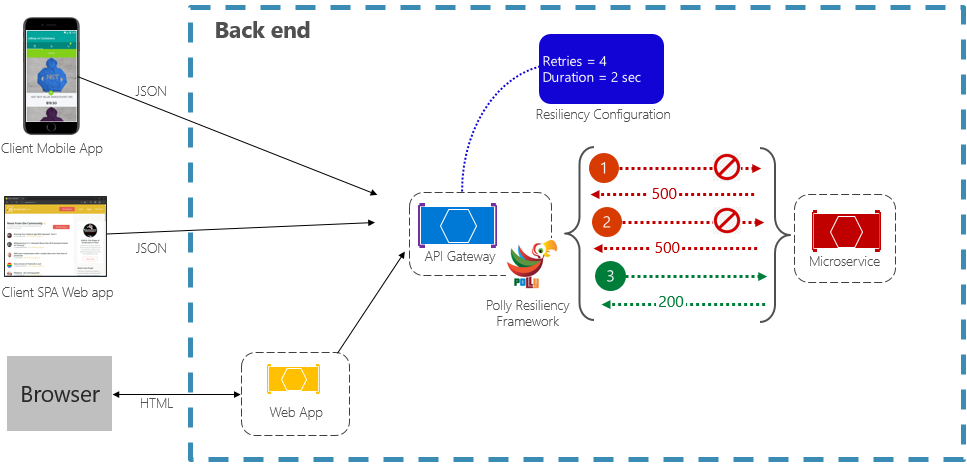

# Patrón Retry: Resumen para Clase

## **¿Qué es el Patrón Retry?**

El patrón **Retry** es un mecanismo de resilencia que **intenta ejecutar una operación fallida múltiples veces** antes de declararla como fallida definitivamente. Se basa en el principio de que muchos fallos son **temporales** y pueden resolverse con una nueva tentativa.

### Conceptos Fundamentales

#### 1. **Retry como Auto-Recuperación**
- Intenta automáticamente operaciones fallidas
- Asume que los fallos son frecuentemente temporales
- Reduce la necesidad de intervención manual

#### 2. **Tipos de Retry**
- **Fixed Delay**: Intervalos constantes entre intentos
- **Exponential Backoff**: Intervalos que aumentan exponencialmente
- **Exponential Backoff with Jitter**: Backoff con variación aleatoria
- **Linear Backoff**: Intervalos que aumentan linealmente
- **Immediate Retry**: Reintento inmediato (sin delay)

#### 3. **Condiciones de Retry**
- **Retryable Errors**: Errores que justifican reintentos
- **Non-Retryable Errors**: Errores que no deberían reintentarse
- **Max Attempts**: Límite máximo de intentos
- **Retry Window**: Tiempo total permitido para reintentos

#### 4. **Estrategias de Retry**
- **Idempotent Operations**: Reintentos seguros (múltiples ejecuciones = mismo resultado)
- **Circuit Breaker Integration**: Pausa reintentos cuando el sistema está degradado
- **Context-Aware Retry**: Decisiones basadas en contexto de negocio

<br>


---

## **Casos de Uso**

### 1. **Llamadas de Red**
- APIs HTTP que ocasionalmente fallan por congestión
- Servicios web que responden lentamente
- Conexiones a bases de datos distribuidas
- Comunicación con message brokers

### 2. **Operaciones de Base de Datos**
- Transacciones que fallan por locks temporales
- Consultas que timeout por carga del servidor
- Conexiones que se pierden ocasionalmente
- Operaciones de replicación en clusters

### 3. **Sistemas Distribuidos**
- Microservicios con disponibilidad variable
- Operaciones de consistencia eventual
- Comunicación asíncrona entre servicios
- Sistemas de alta disponibilidad

### 4. **Operaciones de Archivo**
- Acceso a sistemas de archivos remotos
- Operaciones de I/O que pueden fallar por locks
- Sincronización de archivos
- Operaciones de backup

### 5. **Servicios de Terceros**
- APIs de pago que ocasionalmente fallan
- Servicios de email con picos de carga
- Proveedores de SMS con latencia variable
- Servicios de cloud con disponibilidad variable

---

## **Ejemplos**

### Ejemplo 1: Retry Básico con Exponential Backoff

```java
import java.util.concurrent.*;
import java.util.function.Supplier;
import java.util.function.Predicate;
import java.util.Random;

public class RetryExecutor {
    
    private final Random random = new Random();
    
    public <T> T executeWithRetry(Supplier<T> operation, RetryPolicy retryPolicy) 
            throws RetryExhaustedException {
        
        int attempt = 0;
        Exception lastException = null;
        
        while (attempt < retryPolicy.getMaxAttempts()) {
            try {
                return operation.get();
            } catch (Exception e) {
                lastException = e;
                attempt++;
                
                // Verificar si el error es reintentable
                if (!retryPolicy.isRetryable(e) || attempt >= retryPolicy.getMaxAttempts()) {
                    throw new RetryExhaustedException(
                        "Operación falló después de " + attempt + " intentos", e);
                }
                
                // Calcular delay
                long delay = retryPolicy.calculateDelay(attempt);
                System.out.println("Intento " + attempt + " falló: " + e.getMessage() + 
                                 ". Reintentando en " + delay + "ms...");
                
                try {
                    Thread.sleep(delay);
                } catch (InterruptedException ie) {
                    Thread.currentThread().interrupt();
                    throw new RetryExhaustedException("Reintento interrumpido", ie);
                }
            }
        }
        
        throw new RetryExhaustedException("Reintentos agotados", lastException);
    }
    
    // Ejemplo de uso
    public static void main(String[] args) {
        RetryExecutor executor = new RetryExecutor();
        
        // Configurar política de retry
        RetryPolicy policy = new RetryPolicy.Builder()
            .withMaxAttempts(3)
            .withBaseDelay(1000) // 1 segundo
            .withMaxDelay(10000) // 10 segundos
            .withBackoffMultiplier(2.0)
            .withRetryableExceptions(TimeoutException.class, ConnectionException.class)
            .build();
        
        // Operación que falla algunas veces
        Supplier<String> unreliableOperation = () -> {
            if (random.nextDouble() < 0.7) { // 70% probabilidad de falla
                throw new TimeoutException("Servicio temporalmente no disponible");
            }
            return "Operación exitosa";
        };
        
        try {
            String result = executor.executeWithRetry(unreliableOperation, policy);
            System.out.println("Resultado final: " + result);
        } catch (RetryExhaustedException e) {
            System.out.println("Operación falló definitivamente: " + e.getMessage());
        }
    }
}

// Política de retry configurable
public static class RetryPolicy {
    private final int maxAttempts;
    private final long baseDelay;
    private final long maxDelay;
    private final double backoffMultiplier;
    private final Predicate<Exception> retryableChecker;
    
    private RetryPolicy(Builder builder) {
        this.maxAttempts = builder.maxAttempts;
        this.baseDelay = builder.baseDelay;
        this.maxDelay = builder.maxDelay;
        this.backoffMultiplier = builder.backoffMultiplier;
        this.retryableChecker = builder.retryableChecker;
    }
    
    public long calculateDelay(int attempt) {
        long delay = (long) (baseDelay * Math.pow(backoffMultiplier, attempt - 1));
        return Math.min(delay, maxDelay);
    }
    
    public boolean isRetryable(Exception e) {
        return retryableChecker.test(e);
    }
    
    public int getMaxAttempts() {
        return maxAttempts;
    }
    
    public static class Builder {
        private int maxAttempts = 3;
        private long baseDelay = 1000;
        private long maxDelay = 30000;
        private double backoffMultiplier = 2.0;
        private Predicate<Exception> retryableChecker = e -> true;
        
        public Builder withMaxAttempts(int maxAttempts) {
            this.maxAttempts = Math.max(1, maxAttempts);
            return this;
        }
        
        public Builder withBaseDelay(long baseDelay) {
            this.baseDelay = Math.max(0, baseDelay);
            return this;
        }
        
        public Builder withMaxDelay(long maxDelay) {
            this.maxDelay = Math.max(baseDelay, maxDelay);
            return this;
        }
        
        public Builder withBackoffMultiplier(double multiplier) {
            this.backoffMultiplier = Math.max(1.0, multiplier);
            return this;
        }
        
        public Builder withRetryableExceptions(Class<? extends Exception>... exceptionTypes) {
            this.retryableChecker = e -> {
                for (Class<? extends Exception> type : exceptionTypes) {
                    if (type.isInstance(e)) {
                        return true;
                    }
                }
                return false;
            };
            return this;
        }
        
        public RetryPolicy build() {
            return new RetryPolicy(this);
        }
    }
}

// Excepciones
class RetryExhaustedException extends Exception {
    public RetryExhaustedException(String message, Throwable cause) {
        super(message, cause);
    }
}

class TimeoutException extends Exception {
    public TimeoutException(String message) {
        super(message);
    }
}

class ConnectionException extends Exception {
    public ConnectionException(String message) {
        super(message);
    }
}
```

### Ejemplo 2: Retry con Jitter y Circuit Breaker Integration

```java
import java.util.concurrent.atomic.AtomicInteger;
import java.util.concurrent.atomic.AtomicLong;
import java.util.concurrent.ConcurrentHashMap;

public class AdvancedRetryExecutor {
    
    private final CircuitBreakerRegistry circuitBreakerRegistry;
    private final ConcurrentHashMap<String, RetryMetrics> metricsMap;
    
    public AdvancedRetryExecutor() {
        this.circuitBreakerRegistry = new CircuitBreakerRegistry();
        this.metricsMap = new ConcurrentHashMap<>();
    }
    
    public <T> T executeWithAdvancedRetry(String operationId, Supplier<T> operation, 
                                        RetryPolicy policy, CircuitBreakerConfig config) 
            throws RetryExhaustedException {
        
        CircuitBreaker circuitBreaker = circuitBreakerRegistry.getCircuitBreaker(operationId, config);
        
        // Verificar estado del circuit breaker
        if (!circuitBreaker.canExecute()) {
            throw new RetryExhaustedException("Circuit breaker abierto para operación: " + operationId);
        }
        
        RetryMetrics metrics = metricsMap.computeIfAbsent(operationId, k -> new RetryMetrics());
        metrics.incrementAttempt();
        
        int attempt = 0;
        Exception lastException = null;
        
        while (attempt < policy.getMaxAttempts()) {
            try {
                T result = operation.get();
                
                // Éxito: registrar en circuit breaker y métricas
                circuitBreaker.recordSuccess();
                metrics.recordSuccess(attempt + 1);
                
                return result;
                
            } catch (Exception e) {
                lastException = e;
                attempt++;
                
                // Verificar si el error es reintentable
                if (!policy.isRetryable(e) || attempt >= policy.getMaxAttempts()) {
                    circuitBreaker.recordFailure();
                    metrics.recordFailure(attempt);
                    
                    throw new RetryExhaustedException(
                        "Operación falló después de " + attempt + " intentos", e);
                }
                
                // Verificar circuit breaker antes del siguiente intento
                if (!circuitBreaker.canExecute()) {
                    throw new RetryExhaustedException(
                        "Circuit breaker activado durante reintentos para: " + operationId);
                }
                
                // Calcular delay con jitter
                long baseDelay = policy.calculateDelay(attempt);
                long jitteredDelay = calculateJitter(baseDelay, policy.getJitterFactor());
                
                System.out.println("Intento " + attempt + " falló: " + e.getMessage() + 
                                 ". Reintentando en " + jitteredDelay + "ms (base: " + baseDelay + "ms)...");
                
                try {
                    Thread.sleep(jitteredDelay);
                } catch (InterruptedException ie) {
                    Thread.currentThread().interrupt();
                    throw new RetryExhaustedException("Reintento interrumpido", ie);
                }
            }
        }
        
        throw new RetryExhaustedException("Reintentos agotados", lastException);
    }
    
    private long calculateJitter(long baseDelay, double jitterFactor) {
        if (jitterFactor <= 0) return baseDelay;
        
        long jitterRange = (long) (baseDelay * jitterFactor);
        long jitter = (long) (Math.random() * jitterRange - jitterRange / 2);
        
        return Math.max(0, baseDelay + jitter);
    }
    
    // Métricas de retry
    public RetryMetrics getMetrics(String operationId) {
        return metricsMap.get(operationId);
    }
}

// Circuit Breaker simplificado
class CircuitBreaker {
    private final CircuitBreakerConfig config;
    private final AtomicInteger failureCount = new AtomicInteger(0);
    private final AtomicLong lastFailureTime = new AtomicLong(0);
    private volatile CircuitState state = CircuitState.CLOSED;
    
    public CircuitBreaker(CircuitBreakerConfig config) {
        this.config = config;
    }
    
    public boolean canExecute() {
        switch (state) {
            case CLOSED:
                return true;
            case OPEN:
                return System.currentTimeMillis() - lastFailureTime.get() > config.getRecoveryTimeout();
            case HALF_OPEN:
                return true; // Permitir un intento de prueba
            default:
                return false;
        }
    }
    
    public void recordSuccess() {
        if (state == CircuitState.HALF_OPEN) {
            // Volver a CLOSED si el intento de prueba fue exitoso
            state = CircuitState.CLOSED;
            failureCount.set(0);
        }
    }
    
    public void recordFailure() {
        int failures = failureCount.incrementAndGet();
        lastFailureTime.set(System.currentTimeMillis());
        
        if (failures >= config.getFailureThreshold()) {
            state = CircuitState.OPEN;
            System.out.println("Circuit breaker ABIERTO después de " + failures + " fallos");
        } else if (state == CircuitState.HALF_OPEN) {
            // Si falla en HALF_OPEN, volver a OPEN
            state = CircuitState.OPEN;
            System.out.println("Circuit breaker ABIERTO después de fallo en HALF_OPEN");
        }
    }
}

enum CircuitState {
    CLOSED,    // Funcionamiento normal
    OPEN,      // Bloqueando todas las llamadas
    HALF_OPEN  // Permitiendo una llamada de prueba
}

class CircuitBreakerConfig {
    private final int failureThreshold;
    private final long recoveryTimeout;
    
    public CircuitBreakerConfig(int failureThreshold, long recoveryTimeout) {
        this.failureThreshold = failureThreshold;
        this.recoveryTimeout = recoveryTimeout;
    }
    
    public int getFailureThreshold() {
        return failureThreshold;
    }
    
    public long getRecoveryTimeout() {
        return recoveryTimeout;
    }
}

class CircuitBreakerRegistry {
    private final ConcurrentHashMap<String, CircuitBreaker> circuitBreakers;
    
    public CircuitBreakerRegistry() {
        this.circuitBreakers = new ConcurrentHashMap<>();
    }
    
    public CircuitBreaker getCircuitBreaker(String operationId, CircuitBreakerConfig config) {
        return circuitBreakers.computeIfAbsent(operationId, id -> new CircuitBreaker(config));
    }
}

// Métricas de retry
class RetryMetrics {
    private final AtomicInteger totalAttempts = new AtomicInteger(0);
    private final AtomicInteger totalSuccesses = new AtomicInteger(0);
    private final AtomicInteger totalFailures = new AtomicInteger(0);
    private final AtomicLong totalRetryDelay = new AtomicLong(0);
    
    public void incrementAttempt() {
        totalAttempts.incrementAndGet();
    }
    
    public void recordSuccess(int attempts) {
        totalSuccesses.incrementAndGet();
    }
    
    public void recordFailure(int attempts) {
        totalFailures.incrementAndGet();
    }
    
    public void recordRetryDelay(long delay) {
        totalRetryDelay.addAndGet(delay);
    }
    
    public double getSuccessRate() {
        int total = totalAttempts.get();
        if (total == 0) return 0.0;
        return (double) totalSuccesses.get() / total * 100;
    }
    
    public double getAverageRetryDelay() {
        int failures = totalFailures.get();
        if (failures == 0) return 0.0;
        return (double) totalRetryDelay.get() / failures;
    }
}
```

### Ejemplo 3: Retry Asíncrono con CompletableFuture

```java
import java.util.concurrent.*;
import java.util.function.Supplier;
import java.util.List;
import java.util.ArrayList;

public class AsyncRetryExecutor {
    
    private final ExecutorService executorService;
    
    public AsyncRetryExecutor(ExecutorService executorService) {
        this.executorService = executorService;
    }
    
    public <T> CompletableFuture<T> executeAsyncWithRetry(Supplier<T> operation, RetryPolicy policy) {
        return executeAsyncWithRetryInternal(operation, policy, 1);
    }
    
    private <T> CompletableFuture<T> executeAsyncWithRetryInternal(Supplier<T> operation, 
                                                                  RetryPolicy policy, int attempt) {
        return CompletableFuture.supplyAsync(operation, executorService)
            .thenApply(result -> {
                System.out.println("Operación exitosa en intento " + attempt);
                return result;
            })
            .exceptionally(throwable -> {
                System.out.println("Intento " + attempt + " falló: " + throwable.getMessage());
                
                if (attempt >= policy.getMaxAttempts() || !policy.isRetryable((Exception) throwable)) {
                    throw new CompletionException(throwable);
                }
                
                // Calcular delay y reintentar
                long delay = policy.calculateDelay(attempt);
                
                return CompletableFuture.delayedExecutor(delay, TimeUnit.MILLISECONDS)
                    .execute(() -> executeAsyncWithRetryInternal(operation, policy, attempt + 1))
                    .join();
            });
    }
    
    // Retry con múltiples operaciones en paralelo
    public <T> CompletableFuture<List<T>> executeParallelWithRetry(List<Supplier<T>> operations, 
                                                                  RetryPolicy policy) {
        List<CompletableFuture<T>> futures = operations.stream()
            .map(operation -> executeAsyncWithRetry(operation, policy))
            .collect(ArrayList::new, (list, future) -> list.add(future), ArrayList::addAll);
        
        return CompletableFuture.allOf(futures.toArray(new CompletableFuture[0]))
            .thenApply(v -> futures.stream()
                .map(CompletableFuture::join)
                .collect(ArrayList::new, ArrayList::add, ArrayList::addAll));
    }
    
    // Ejemplo de uso
    public static void demonstrateAsyncRetry() {
        ExecutorService executor = Executors.newFixedThreadPool(5);
        AsyncRetryExecutor asyncExecutor = new AsyncRetryExecutor(executor);
        
        RetryPolicy policy = new RetryPolicy.Builder()
            .withMaxAttempts(3)
            .withBaseDelay(500)
            .withBackoffMultiplier(2.0)
            .withRetryableExceptions(TimeoutException.class)
            .build();
        
        // Operación asíncrona que falla ocasionalmente
        Supplier<String> asyncOperation = () -> {
            try {
                Thread.sleep(100); // Simular trabajo asíncrono
                if (Math.random() < 0.6) { // 60% probabilidad de falla
                    throw new TimeoutException("Servicio no disponible");
                }
                return "Operación completada";
            } catch (InterruptedException e) {
                Thread.currentThread().interrupt();
                throw new RuntimeException("Interrumpido", e);
            }
        };
        
        // Ejecutar múltiples operaciones en paralelo
        List<Supplier<String>> operations = new ArrayList<>();
        for (int i = 0; i < 5; i++) {
            final int id = i;
            operations.add(() -> {
                System.out.println("Ejecutando operación " + id);
                return asyncOperation.get();
            });
        }
        
        asyncExecutor.executeParallelWithRetry(operations, policy)
            .thenAccept(results -> {
                System.out.println("Resultados obtenidos: " + results.size());
                results.forEach(result -> System.out.println(" - " + result));
            })
            .exceptionally(throwable -> {
                System.out.println("Operación falló definitivamente: " + throwable.getMessage());
                return null;
            });
        
        executor.shutdown();
    }
}
```

### Ejemplo 4: Retry con Spring Boot

```java
import org.springframework.stereotype.Service;
import org.springframework.retry.annotation.*;
import org.springframework.retry.support.RetryTemplate;
import org.springframework.context.annotation.Bean;
import org.springframework.context.annotation.Configuration;

@Service
public class RetryableUserService {
    
    @Retryable(
        value = {TimeoutException.class, ConnectionException.class},
        maxAttempts = 3,
        backoff = @Backoff(delay = 1000, multiplier = 2.0, maxDelay = 10000)
    )
    public User createUserWithRetry(User user) throws Exception {
        // Operación que puede fallar
        return externalUserService.createUser(user);
    }
    
    @Recover
    public User recoverCreateUser(Exception ex, User user) {
        logger.warn("No se pudo crear usuario después de reintentos: {}", user.getEmail(), ex);
        // Estrategia de recuperación - crear usuario localmente o enqueue para procesamiento posterior
        return createUserFallback(user);
    }
    
    private User createUserFallback(User user) {
        // Crear usuario en cache local o cola de mensajes
        return user.toBuilder().status(UserStatus.PENDING).build();
    }
    
    @Retryable(
        value = {TimeoutException.class},
        maxAttempts = 5,
        backoff = @Backoff(delay = 500, maxDelay = 5000)
    )
    @CircuitBreaker(name = "userService", fallbackMethod = "getUserFallback")
    public User getUserById(UUID userId) throws Exception {
        return externalUserService.getUserById(userId);
    }
    
    public User getUserFallback(UUID userId, Exception ex) {
        logger.warn("Circuit breaker activado para usuario {}", userId, ex);
        // Retornar datos desde cache local
        return localUserCache.get(userId);
    }
    
    private final ExternalUserService externalUserService;
    private final UserCache localUserCache;
    
    public RetryableUserService(ExternalUserService externalUserService, UserCache localUserCache) {
        this.externalUserService = externalUserService;
        this.localUserCache = localUserCache;
    }
}

// Configuración de Spring Retry
@Configuration
@EnableRetry
public class RetryConfiguration {
    
    @Bean
    public RetryTemplate retryTemplate() {
        RetryTemplate retryTemplate = new RetryTemplate();
        
        // Configurar política de retry
        SimpleRetryPolicy retryPolicy = new SimpleRetryPolicy();
        retryPolicy.setMaxAttempts(3);
        
        // Configurar backoff
        ExponentialBackOffPolicy backOffPolicy = new ExponentialBackOffPolicy();
        backOffPolicy.setInitialInterval(1000);
        backOffPolicy.setMultiplier(2.0);
        backOffPolicy.setMaxInterval(10000);
        
        retryTemplate.setRetryPolicy(retryPolicy);
        retryTemplate.setBackOffPolicy(backOffPolicy);
        
        return retryTemplate;
    }
    
    @Bean
    public RetryableUserService retryableUserService() {
        return new RetryableUserService(externalUserService(), localUserCache());
    }
}

// Interceptor personalizado para logging
@Component
public class RetryLoggingInterceptor implements RetryListener {
    
    private static final Logger logger = LoggerFactory.getLogger(RetryLoggingInterceptor.class);
    
    @Override
    public <T, E extends Throwable> boolean open(RetryContext context, RetryCallback<T, E> callback) {
        logger.info("Iniciando operación con retry, intento: {}", context.getRetryCount());
        return true;
    }
    
    @Override
    public <T, E extends Throwable> void close(RetryContext context, RetryCallback<T, E> callback, Throwable throwable) {
        logger.info("Completada operación con retry, intentos totales: {}", context.getRetryCount());
    }
    
    @Override
    public <T, E extends Throwable> void onError(RetryContext context, RetryCallback<T, E> callback, Throwable throwable) {
        logger.warn("Error en intento {} de operación: {}", context.getRetryCount(), throwable.getMessage());
    }
}
```

---

## **Ventajas**

### 1. **Manejo Automático de Fallos Temporales**
- Reduce la necesidad de lógica de retry manual
- Maneja automáticamente errores de red intermitentes
- Permite que el sistema se auto-recupere

### 2. **Mejora de Disponibilidad**
- Aumenta la tolerancia a fallos temporales
- Reduce el impacto de picos de carga
- Mantiene servicios funcionando durante problemas

### 3. **Optimización de Recursos**
- Evita crear múltiples instancias para manejar fallos
- Reduce la necesidad de circuit breakers prematuros
- Permite mejor utilización de recursos existentes

### 4. **Flexibilidad de Configuración**
- Políticas adaptables según el contexto
- Configuración por tipo de operación
- Ajustes dinámicos basados en métricas

### 5. **Integración con Observabilidad**
- Métricas detalladas de reintentos
- Logging estructurado para debugging
- Monitoreo de patrones de fallos

---

## **Desventajas**

### 1. **Riesgo de Amplificar Problemas**
- Múltiples reintentos pueden sobrecargar sistemas ya degradados
- Puede causar cascadas de fallos
- Incrementa la carga durante outages

### 2. **Complejidad de Implementación**
- Necesita lógica para evitar loops infinitos
- Configuración compleja de políticas
- Manejo cuidadoso de side effects

### 3. **Latencia Aumentada**
- Reintentos aumentan el tiempo total de operación
- Usuarios experimentan delays
- Impacta SLAs de respuesta

### 4. **Idempotency Requirements**
- Operaciones deben ser seguras para reintentar
- Riesgo de duplicación de efectos
- Complejidad adicional en diseño de APIs

### 5. **Dificultad de Debugging**
- Errores pueden manifestarse múltiples veces
- Stack traces complejos con múltiples niveles
- Estado inconsistente durante reintentos

---

## **Buenas Prácticas**

### 1. **Clasificación Apropiada de Errores**
```java
@Component
public class ErrorClassifier {
    
    private static final Set<Class<? extends Exception>> RETRYABLE_EXCEPTIONS = Set.of(
        TimeoutException.class,
        ConnectionException.class,
        ServiceUnavailableException.class,
        TransientDataAccessException.class
    );
    
    private static final Set<Class<? extends Exception>> NON_RETRYABLE_EXCEPTIONS = Set.of(
        AuthenticationException.class,
        AuthorizationException.class,
        ValidationException.class,
        IllegalArgumentException.class
    );
    
    public boolean isRetryable(Exception e) {
        // Verificar primero errores no reintentables
        for (Class<? extends Exception> nonRetryable : NON_RETRYABLE_EXCEPTIONS) {
            if (nonRetryable.isInstance(e)) {
                return false;
            }
        }
        
        // Verificar errores reintentables
        for (Class<? extends Exception> retryable : RETRYABLE_EXCEPTIONS) {
            if (retryable.isInstance(e)) {
                return true;
            }
        }
        
        // Por defecto, no reintentar errores no clasificados
        return false;
    }
}
```

### 2. **Exponential Backoff con Límites**
```java
public class SmartRetryPolicy {
    
    public long calculateDelay(int attempt, RetryContext context) {
        // Base delay con exponential backoff
        long baseDelay = 1000; // 1 segundo
        long maxDelay = 60000; // 1 minuto
        
        // Aumentar delay exponencialmente
        long exponentialDelay = (long) (baseDelay * Math.pow(2, attempt - 1));
        
        // Aplicar jitter para evitar thundering herd
        long jitterRange = (long) (exponentialDelay * 0.1);
        long jitter = (long) (Math.random() * jitterRange);
        
        // Límite máximo
        long finalDelay = Math.min(exponentialDelay + jitter, maxDelay);
        
        // Considerar contexto (ej: hora del día, carga del sistema)
        if (context.getTimeOfDay().isPeakHour()) {
            finalDelay *= 2; // Doublar delay en horas pico
        }
        
        return finalDelay;
    }
}
```

### 3. **Idempotency y Side Effects**
```java
@Service
public class IdempotentPaymentService {
    
    @Retryable(
        value = {TimeoutException.class, ConnectionException.class},
        maxAttempts = 3,
        backoff = @Backoff(delay = 2000, multiplier = 2.0)
    )
    public PaymentResult processPaymentWithRetry(PaymentRequest request) {
        // Verificar si ya se procesó (idempotency key)
        String idempotencyKey = generateIdempotencyKey(request);
        
        if (paymentRepository.existsByIdempotencyKey(idempotencyKey)) {
            return paymentRepository.findByIdempotencyKey(idempotencyKey);
        }
        
        try {
            PaymentResult result = externalPaymentGateway.charge(request);
            
            // Guardar resultado con idempotency key
            paymentRepository.save(result, idempotencyKey);
            
            return result;
            
        } catch (RetryablePaymentException e) {
            throw e; // Permitir retry
        }
    }
    
    private String generateIdempotencyKey(PaymentRequest request) {
        return "payment_" + request.getUserId() + "_" + 
               request.getAmount() + "_" + request.getTimestamp();
    }
}
```

### 4. **Métricas y Monitoreo**
```java
@Component
public class RetryMetricsCollector {
    
    private final MeterRegistry meterRegistry;
    private final Timer retryTimer;
    private final Counter retryCounter;
    private final Counter successAfterRetryCounter;
    private final DistributionSummary retryDelaySummary;
    
    public RetryMetricsCollector(MeterRegistry meterRegistry) {
        this.meterRegistry = meterRegistry;
        this.retryTimer = Timer.builder("retry.operations.duration")
            .description("Duración de operaciones con retry")
            .register(meterRegistry);
        this.retryCounter = Counter.builder("retry.operations.count")
            .description("Número de operaciones que requieren retry")
            .register(meterRegistry);
        this.successAfterRetryCounter = Counter.builder("retry.successes.count")
            .description("Operaciones exitosas después de retry")
            .register(meterRegistry);
        this.retryDelaySummary = DistributionSummary.builder("retry.delay.duration")
            .description("Distribución de delays de retry")
            .register(meterRegistry);
    }
    
    public <T> T recordRetryOperation(String operationType, Supplier<T> operation, 
                                    RetryPolicy policy, RetryContext context) {
        
        long startTime = System.currentTimeMillis();
        int attempts = 0;
        
        try {
            T result = operation.get();
            successAfterRetryCounter.increment(Tags.of("operation", operationType, "attempts", String.valueOf(attempts)));
            return result;
        } finally {
            long duration = System.currentTimeMillis() - startTime;
            retryTimer.record(duration, TimeUnit.MILLISECONDS, Tags.of("operation", operationType));
            
            if (attempts > 0) {
                retryCounter.increment(Tags.of("operation", operationType));
                retryDelaySummary.record(context.getTotalRetryDelay());
            }
        }
    }
}
```

### 5. **Testing Apropiado**
```java
@ExtendWith(MockitoExtension.class)
class RetryExecutorTest {
    
    @Mock
    private Supplier<String> operation;
    
    @InjectMocks
    private RetryExecutor retryExecutor;
    
    @Test
    void shouldSucceedOnSecondAttempt() throws Exception {
        // Given
        when(operation.get())
            .thenThrow(new TimeoutException("Service unavailable"))
            .thenReturn("success");
        
        RetryPolicy policy = new RetryPolicy.Builder()
            .withMaxAttempts(3)
            .withBaseDelay(100)
            .build();
        
        // When
        String result = retryExecutor.executeWithRetry(operation, policy);
        
        // Then
        assertThat(result).isEqualTo("success");
        verify(operation, times(2)).get();
    }
    
    @Test
    void shouldExhaustRetriesAndThrowException() throws Exception {
        // Given
        when(operation.get()).thenThrow(new TimeoutException("Service unavailable"));
        
        RetryPolicy policy = new RetryPolicy.Builder()
            .withMaxAttempts(2)
            .withBaseDelay(50)
            .build();
        
        // When & Then
        assertThatThrownBy(() -> retryExecutor.executeWithRetry(operation, policy))
            .isInstanceOf(RetryExhaustedException.class)
            .hasMessageContaining("Operación falló después de 2 intentos");
        
        verify(operation, times(2)).get();
    }
    
    @Test
    void shouldNotRetryNonRetryableException() throws Exception {
        // Given
        when(operation.get()).thenThrow(new IllegalArgumentException("Invalid input"));
        
        RetryPolicy policy = new RetryPolicy.Builder()
            .withMaxAttempts(3)
            .withRetryableExceptions(TimeoutException.class)
            .build();
        
        // When & Then
        assertThatThrownBy(() -> retryExecutor.executeWithRetry(operation, policy))
            .isInstanceOf(RetryExhaustedException.class)
            .hasCauseInstanceOf(IllegalArgumentException.class);
        
        verify(operation, times(1)).get(); // Solo un intento
    }
}
```

### 6. **Configuración por Entorno**
```yaml
# application.yml
app:
  retry:
    default:
      max-attempts: 3
      base-delay: 1000ms
      max-delay: 30000ms
      backoff-multiplier: 2.0
      jitter-factor: 0.1
    services:
      payment-service:
        max-attempts: 5
        base-delay: 2000ms
        retryable-exceptions:
          - TimeoutException
          - ConnectionException
      email-service:
        max-attempts: 2
        base-delay: 500ms
        max-delay: 5000ms
      cache-service:
        max-attempts: 1
        # No retry para cache - fail fast

---
# application-prod.yml (producción - más conservador)
app:
  retry:
    default:
      max-attempts: 2
      base-delay: 2000ms
      max-delay: 10000ms
    services:
      payment-service:
        max-attempts: 3

---
# application-dev.yml (desarrollo - más agresivo)
app:
  retry:
    default:
      max-attempts: 5
      base-delay: 500ms
      max-delay: 60000ms
```

---

## **Conclusión**

El patrón **Retry** es esencial para construir sistemas resilientes que:

### **Beneficios Clave:**
- **Auto-recuperación** de fallos temporales sin intervención manual
- **Mejor disponibilidad** del sistema durante problemas intermitentes
- **Optimización de recursos** mediante reutilización de conexiones
- **Flexibilidad** de configuración según contexto de negocio

### **Aplicaciones Recomendadas:**
- **Microservicios** con dependencias externas
- **Operaciones de red** susceptibles a timeouts
- **APIs de terceros** con disponibilidad variable
- **Sistemas distribuidos** con consistencia eventual

### **Consideraciones Críticas:**
1. **Clasificación precisa** de errores reintentables vs no reintentables
2. **Estrategias de backoff** apropiadas para evitar sobrecarga
3. **Idempotency** en operaciones con side effects
4. **Monitoreo continuo** de métricas de retry
5. **Integración con Circuit Breaker** para prevenir cascadas

### **Principios Fundamentales:**
- **Retry es para fallos temporales**, no permanentes
- **Exponential backoff** previene thundering herd
- **Límites estrictos** evitan loops infinitos
- **Context awareness** mejora la efectividad
- **Observabilidad** es crítica para optimización

El retry efectivo requiere **equilibrio** entre resilencia y eficiencia, asegurando que los sistemas se recuperen automáticamente sin crear nuevos problemas o sobrecarga adicional.

---

