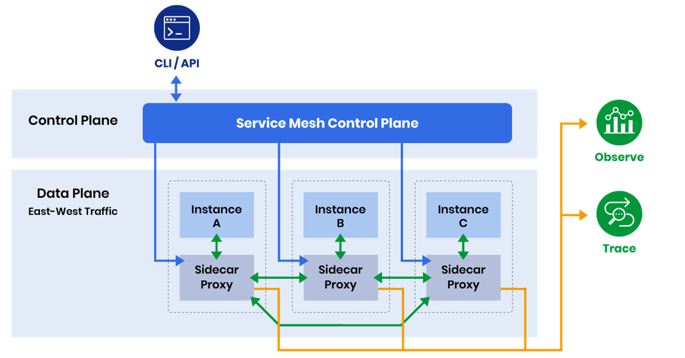
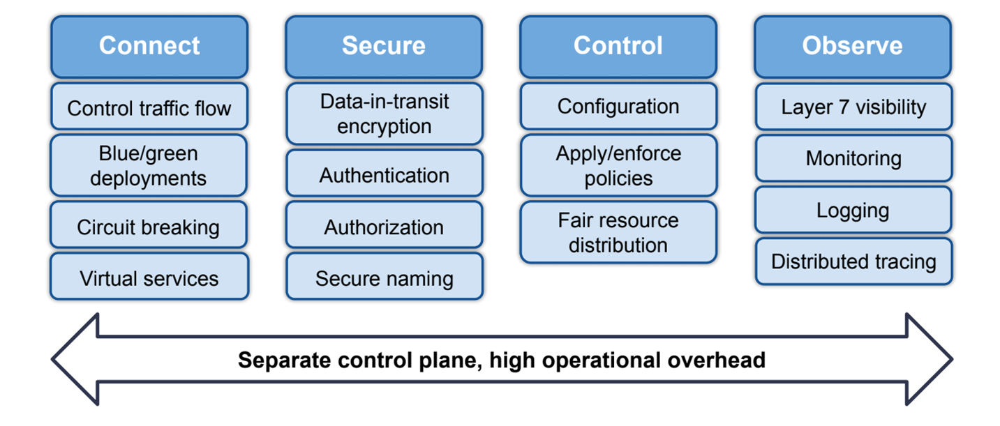

# Service Mesh

Un Service Mesh es una infraestructura dedicada para manejar la comunicación entre servicios en aplicaciones de microservicios. Proporciona capacidades avanzadas de networking, seguridad, observabilidad y gestión de tráfico sin modificar el código de las aplicaciones, utilizando un modelo de arquitectura basado en sidecars.

## **¿Qué es un Service Mesh?**

Un Service Mesh es una capa de infraestructura que se sitúa entre los servicios de una aplicación y la red, proporcionando funcionalidades como balanceo de carga, autenticación, autorización, observabilidad, y gestión de tráfico sin requerir cambios en el código de las aplicaciones.

<br>




### Características Principales

- **Sidecar proxy**: Proxy lateral que intercepta todo el tráfico de red
- **Control plane**: Componente central que gestiona la configuración y políticas
- **Data plane**: Proxies que manejan el tráfico real entre servicios
- **Zero-trust security**: Modelo de seguridad sin confianza implícita
- **Traffic management**: Control granular del tráfico entre servicios
- **Observability**: Métricas, logs y tracing sin instrumentación de código

<br>



## **Conceptos Clave**

### Sidecar Pattern
El **Sidecar Pattern** coloca un proxy junto a cada instancia de servicio:

```java
// Aplicación original sin Service Mesh
@RestController
public class UsuarioService {
    
    @GetMapping("/usuarios/{id}")
    public Usuario obtenerUsuario(@PathVariable Long id) {
        // Lógica de negocio
        return usuarioRepository.findById(id);
    }
}

// Con Service Mesh, la aplicación permanece igual
// El sidecar proxy maneja:
// - Load balancing
// - Circuit breaking
// - Retries
// - Timeouts
// - mTLS
// - Metrics collection
```

### Data Plane vs Control Plane
- **Data Plane**: Componentes que procesan tráfico (sidecars proxies)
- **Control Plane**: Componentes que gestionan configuración y políticas

### Traffic Management
Control granular del tráfico entre servicios:

```yaml
# Ejemplo de configuración de tráfico
apiVersion: networking.istio.io/v1beta1
kind: VirtualService
metadata:
  name: usuario-service-routing
spec:
  http:
  - match:
    - headers:
        x-canary:
          exact: "true"
    route:
    - destination:
        host: usuario-service
        subset: v2  # 10% del tráfico a v2
      weight: 10
  - route:
    - destination:
        host: usuario-service
        subset: v1  # 90% del tráfico a v1
      weight: 90
```

### Security Policies
Políticas de seguridad aplicadas a nivel de red:

```yaml
# Autorización de servicios
apiVersion: security.istio.io/v1beta1
kind: AuthorizationPolicy
metadata:
  name: usuario-service-authz
spec:
  selector:
    matchLabels:
      app: usuario-service
  rules:
  - from:
    - source:
        principals: ["cluster.local/ns/default/sa/pedido-service"]
    to:
    - operation:
        methods: ["GET", "POST"]
```

## **Casos de Uso**

### 1. Gestión de Microservicios
- **Discovery automático**: Descubrimiento de servicios sin configuración manual
- **Load balancing inteligente**: Balanceo basado en métricas de salud
- **Circuit breaking**: Protección automática contra servicios fallidos
- **Retry policies**: Reintentos automáticos con backoff exponencial

```java
// El servicio mesh maneja automáticamente:
@Service
public class PedidoService {
    
    @Autowired
    private RestTemplate usuarioServiceClient;
    
    @Autowired
    private RestTemplate inventarioServiceClient;
    
    public Pedido crearPedido(Long usuarioId, List<Item> items) {
        // El mesh maneja:
        // - Load balancing entre múltiples instancias
        // - Circuit breaking si el servicio no responde
        // - Retry con exponential backoff
        // - Timeout management
        Usuario usuario = usuarioServiceClient.getForObject(
            "http://usuario-service/usuarios/" + usuarioId, Usuario.class);
        
        List<ItemInventario> inventario = inventarioServiceClient.postForObject(
            "http://inventario-service/inventario/verificar", items, 
            new ParameterizedTypeReference<List<ItemInventario>>(){});
        
        return procesarPedido(usuario, inventario);
    }
}
```

### 2. Seguridad y Compliance
- **mTLS automático**: Cifrado automático entre servicios
- **Zero-trust networking**: Sin confianza implícita entre servicios
- **Policy enforcement**: Aplicación de políticas de acceso
- **Audit trails**: Rastreo de acceso a recursos

### 3. Observabilidad y Monitoreo
- **Metrics collection**: Métricas sin instrumentación de código
- **Distributed tracing**: Tracing distribuido automático
- **Access logging**: Logs de acceso detallados
- **Health monitoring**: Monitoreo de salud de servicios

### 4. Gestión de Tráfico
- **A/B testing**: División de tráfico para testing
- **Canary deployments**: Despliegues graduales seguros
- **Blue-green deployments**: Despliegues sin downtime
- **Traffic mirroring**: Mirroring de tráfico para testing

## **Ejemplos en Java**

### Configuración de Sidecar para Aplicación Java

```java
// Dockerfile de la aplicación con sidecar
FROM openjdk:11-jre-slim

WORKDIR /app

# Copiar aplicación
COPY target/usuario-service.jar app.jar

# Configuración para Service Mesh
ENV SPRING_PROFILES_ACTIVE=mesh
ENV MANAGEMENT_ENDPOINTS_WEB_EXPOSURE_INCLUDE=health,info,metrics

# Health check para el sidecar
HEALTHCHECK --interval=30s --timeout=3s --start-period=60s --retries=3 \
  CMD curl -f http://localhost:15020/healthz/ready || exit 1

EXPOSE 8080
EXPOSE 15090  # Proxy health endpoint

CMD ["java", "-jar", "app.jar"]
```

### Configuración de Aplicación para Service Mesh

```java
@SpringBootApplication
public class UsuarioServiceApplication {
    
    public static void main(String[] args) {
        SpringApplication.run(UsuarioServiceApplication.class, args);
    }
}

// Configuración de cliente HTTP para mesh
@Configuration
public class MeshClientConfig {
    
    @Bean
    @LoadBalanced
    public RestTemplate meshAwareRestTemplate() {
        RestTemplate restTemplate = new RestTemplate();
        
        // Configuración optimizada para Service Mesh
        SimpleClientHttpRequestFactory factory = new SimpleClientHttpRequestFactory();
        factory.setConnectTimeout(3000);
        factory.setReadTimeout(10000);
        restTemplate.setRequestFactory(factory);
        
        return restTemplate;
    }
    
    @Bean
    public WebClient meshAwareWebClient() {
        HttpClient httpClient = HttpClient.create()
            .responseTimeout(Duration.ofSeconds(10))
            .option(ChannelOption.CONNECT_TIMEOUT_MILLIS, 3000);
        
        return WebClient.builder()
            .clientConnector(new ReactorClientHttpConnector(httpClient))
            .build();
    }
}

// Health check endpoint para mesh
@Component
public class MeshHealthIndicator implements HealthIndicator {
    
    @Override
    public Health health() {
        // El mesh verificará este endpoint para determinar si el servicio está listo
        try {
            // Verificar dependencias críticas
            boolean databaseHealthy = checkDatabase();
            boolean cacheHealthy = checkCache();
            
            if (databaseHealthy && cacheHealthy) {
                return Health.up()
                    .withDetail("mesh", "ready")
                    .withDetail("database", "healthy")
                    .withDetail("cache", "healthy")
                    .build();
            } else {
                return Health.down()
                    .withDetail("mesh", "not_ready")
                    .withDetail("database", databaseHealthy ? "healthy" : "unhealthy")
                    .withDetail("cache", cacheHealthy ? "healthy" : "unhealthy")
                    .build();
            }
        } catch (Exception e) {
            return Health.down()
                .withException(e)
                .withDetail("mesh", "error")
                .build();
        }
    }
    
    private boolean checkDatabase() {
        try {
            // Verificar conectividad a base de datos
            return true; // Implementar verificación real
        } catch (Exception e) {
            return false;
        }
    }
    
    private boolean checkCache() {
        try {
            // Verificar conectividad a cache
            return true; // Implementar verificación real
        } catch (Exception e) {
            return false;
        }
    }
}
```

### Configuración de Métricas para Service Mesh

```java
// Endpoint de métricas compatible con mesh
@RestController
public class MetricsController {
    
    @Autowired
    private MeterRegistry meterRegistry;
    
    @GetMapping("/metrics")
    public Map<String, Object> getMetrics() {
        Map<String, Object> metrics = new HashMap<>();
        
        // Métricas personalizadas para mesh
        metrics.put("application_ready", true);
        metrics.put("database_connections_active", getActiveDatabaseConnections());
        metrics.put("cache_hit_rate", getCacheHitRate());
        metrics.put("requests_per_second", getRequestsPerSecond());
        
        return metrics;
    }
    
    @EventListener
    public void handleRequestProcessed(RequestProcessedEvent event) {
        // El mesh automáticamente recolecta estas métricas
        meterRegistry.counter("requests_total", 
            "service", "usuario-service",
            "method", event.getMethod(),
            "status", event.getStatusCode().toString())
            .increment();
            
        meterRegistry.timer("request_duration_seconds",
            "service", "usuario-service",
            "method", event.getMethod())
            .record(event.getDuration(), TimeUnit.MILLISECONDS);
    }
}
```

### Client Configuration para Service Mesh

```java
// Cliente HTTP configurado para service mesh
@Service
public class MeshAwareUsuarioClient {
    
    private final WebClient webClient;
    
    public MeshAwareUsuarioClient(WebClient webClient) {
        this.webClient = webClient;
    }
    
    public CompletableFuture<Usuario> getUsuarioAsync(Long id) {
        return webClient
            .get()
            .uri("http://usuario-service/usuarios/{id}", id)
            .retrieve()
            .onStatus(HttpStatus::is5xxServerError, response -> {
                // El mesh maneja circuit breaking y retries
                return Mono.error(new ServiceUnavailableException("Service temporarily unavailable"));
            })
            .bodyToMono(Usuario.class)
            .timeout(Duration.ofSeconds(5))
            .retryWhen(Retry.backoff(3, Duration.ofMillis(100))
                .filter(this::isRetryableError)
                .onRetryExhaustedThrow((backoff, retrySignal) -> {
                    throw new ServiceUnavailableException("Service failed after retries");
                }))
            .onErrorResume(throwable -> {
                // Fallback manejado por el mesh
                logger.warn("Service mesh fallback triggered for usuario {}", id, throwable);
                return Mono.just(getFallbackUsuario(id));
            })
            .toFuture();
    }
    
    private boolean isRetryableError(Throwable throwable) {
        return throwable instanceof TimeoutException ||
               throwable instanceof ConnectException ||
               (throwable instanceof HttpClientErrorException && 
                ((HttpClientErrorException) throwable).getStatusCode().is5xxServerError());
    }
    
    private Usuario getFallbackUsuario(Long id) {
        return Usuario.builder()
            .id(id)
            .nombre("Usuario Temporal")
            .email("temporal@example.com")
            .build();
    }
}
```

## **Ventajas y Desventajas**

### Ventajas
- **Código libre de preocupaciones**: Separación de lógica de negocio de networking
- **Seguridad automática**: mTLS y políticas de seguridad sin modificar código
- **Observabilidad unificada**: Métricas, logs y tracing consistentes
- **Gestión de tráfico avanzada**: A/B testing, canary deployments, traffic splitting
- **Zero-trust security**: Modelo de seguridad moderno y robusto
- **Vendor neutrality**: No dependiente de un proveedor específico
- **Escalabilidad**: Manejo automático de load balancing y circuit breaking
- **Consistency**: Políticas consistentes across todos los servicios

### Desventajas
- **Complejidad operacional**: Añade complejidad a la infraestructura
- **Overhead de recursos**: Proxies adicionales consumen CPU y memoria
- **Curva de aprendizaje**: Requiere conocimiento especializado
- **Vendor lock-in**: Algunos service mesh tienen dependencias específicas
- **Latencia adicional**: Cada request pasa por proxies adicionales
- **Debugging complexity**: Puede ser difícil debuggear problemas de red
- **Configuration overhead**: Requiere configuración extensa y detallada
- **Resource usage**: Sidecars consumen recursos adicionales

## **Buenas Prácticas**

### Diseño de Arquitectura
- **Servicios stateless**: Diseñar servicios para ser stateless cuando sea posible
- **Health endpoints**: Implementar health checks apropiados
- **Graceful shutdown**: Implementar shutdown graceful para evitar tráfico interrumpido
- **Circuit breaking**: Configurar circuit breaking en servicios críticos

```java
// Health endpoint optimizado para service mesh
@Component
public class MeshOptimizedHealthIndicator implements HealthIndicator {
    
    @Override
    public Health health() {
        Health.Builder healthBuilder = Health.up();
        
        // Verificar dependencias críticas de forma rápida
        try {
            // Database health check con timeout corto
            boolean dbHealthy = checkDatabaseHealth();
            healthBuilder.withDetail("database", dbHealthy ? "UP" : "DOWN");
            
            // Cache health check
            boolean cacheHealthy = checkCacheHealth();
            healthBuilder.withDetail("cache", cacheHealthy ? "UP" : "DOWN");
            
            // Memory usage
            MemoryMXBean memoryBean = ManagementFactory.getMemoryMXBean();
            long usedMemory = memoryBean.getHeapMemoryUsage().getUsed();
            long maxMemory = memoryBean.getHeapMemoryUsage().getMax();
            double memoryUsage = (double) usedMemory / maxMemory * 100;
            
            healthBuilder.withDetail("memory_usage_percent", memoryUsage);
            
            if (dbHealthy && cacheHealthy && memoryUsage < 90) {
                return healthBuilder.build();
            } else {
                return healthBuilder.down().build();
            }
            
        } catch (Exception e) {
            return healthBuilder.down().withException(e).build();
        }
    }
}
```

### Configuración de Servicios
- **Proper labels**: Usar labels apropiados para service discovery
- **Resource limits**: Configurar límites de recursos apropiados
- **Probes configurados**: Configurar liveness y readiness probes
- **Graceful degradation**: Implementar fallbacks apropiados

```yaml
# Deployment configurado para service mesh
apiVersion: apps/v1
kind: Deployment
metadata:
  name: usuario-service
  labels:
    app: usuario-service
    version: v1
spec:
  replicas: 3
  selector:
    matchLabels:
      app: usuario-service
  template:
    metadata:
      labels:
        app: usuario-service
        version: v1
      annotations:
        # Configuración para service mesh
        prometheus.io/scrape: "true"
        prometheus.io/port: "8080"
        prometheus.io/path: "/actuator/prometheus"
    spec:
      containers:
      - name: usuario-service
        image: empresa/usuario-service:1.0.0
        ports:
        - containerPort: 8080
        - containerPort: 15090  # Proxy health
        env:
        - name: SPRING_PROFILES_ACTIVE
          value: "mesh,production"
        - name: JAVA_OPTS
          value: "-Xms256m -Xmx512m"
        resources:
          requests:
            memory: "256Mi"
            cpu: "250m"
          limits:
            memory: "512Mi"
            cpu: "500m"
        livenessProbe:
          httpGet:
            path: /actuator/health/liveness
            port: 8080
          initialDelaySeconds: 60
          periodSeconds: 30
        readinessProbe:
          httpGet:
            path: /actuator/health/readiness
            port: 8080
          initialDelaySeconds: 30
          periodSeconds: 10
        volumeMounts:
        - name: mesh-certificates
          mountPath: /etc/certs
          readOnly: true
      volumes:
      - name: mesh-certificates
        secret:
          secretName: usuario-service-certs
```

### Seguridad
- **mTLS enforcement**: Habilitar mTLS para todos los servicios
- **Least privilege**: Aplicar principio de menor privilegio
- **Policy validation**: Validar políticas antes del deployment
- **Regular audits**: Auditar configuraciones de seguridad regularmente

```yaml
# Política de seguridad para service mesh
apiVersion: security.istio.io/v1beta1
kind: PeerAuthentication
metadata:
  name: default
  namespace: default
spec:
  mtls:
    mode: STRICT  # Requerir mTLS para todos los servicios

---
apiVersion: security.istio.io/v1beta1
kind: AuthorizationPolicy
metadata:
  name: usuario-service-policy
spec:
  selector:
    matchLabels:
      app: usuario-service
  rules:
  - from:
    - source:
        principals: 
        - "cluster.local/ns/default/sa/pedido-service"
        - "cluster.local/ns/default/sa/inventario-service"
    to:
    - operation:
        methods: ["GET", "POST"]
        paths: ["/usuarios/*"]
  - from:
    - source:
        principals: ["cluster.local/ns/default/sa/api-gateway"]
    to:
    - operation:
        methods: ["GET", "POST", "PUT", "DELETE"]
```

### Observabilidad
- **Custom metrics**: Definir métricas específicas del negocio
- **Tracing context**: Propagar contexto de tracing apropiadamente
- **Alerting rules**: Configurar alertas basadas en métricas de mesh
- **Dashboards**: Crear dashboards para monitorear la salud del mesh

```java
// Métricas personalizadas para service mesh
@Component
public class BusinessMetrics {
    
    private final MeterRegistry meterRegistry;
    private final Counter usuarioCreations;
    private final Timer databaseQueryTimer;
    
    public BusinessMetrics(MeterRegistry meterRegistry) {
        this.meterRegistry = meterRegistry;
        
        this.usuarioCreations = meterRegistry.counter("usuario_creations_total",
            "service", "usuario-service");
            
        this.databaseQueryTimer = meterRegistry.timer("database_query_duration_seconds",
            "service", "usuario-service",
            "operation", "user_lookup");
    }
    
    public void recordUsuarioCreation(Usuario usuario) {
        usuarioCreations.increment(
            "region", usuario.getRegion(),
            "user_type", usuario.getType().toString());
    }
    
    public <T> T recordDatabaseOperation(Supplier<T> operation, String operationName) {
        return databaseQueryTimer.record(() -> {
            T result = operation.get();
            return result;
        });
    }
}
```

### Gestión de Tráfico
- **Gradual rollouts**: Usar canary deployments para cambios importantes
- **Traffic mirroring**: Usar mirroring para testing en producción
- **Circuit breaking**: Configurar circuit breaking apropiadamente
- **Retry policies**: Configurar reintentos con backoff exponencial

```yaml
# Configuración de canary deployment
apiVersion: networking.istio.io/v1beta1
kind: VirtualService
metadata:
  name: usuario-service-canary
spec:
  http:
  - match:
    - headers:
        x-canary:
          exact: "true"
    route:
    - destination:
        host: usuario-service
        subset: v2
      weight: 20  # 20% del tráfico con header x-canary=true
  - route:
    - destination:
        host: usuario-service
        subset: v1
      weight: 80

---
apiVersion: networking.istio.io/v1beta1
kind: DestinationRule
metadata:
  name: usuario-service-subsets
spec:
  host: usuario-service
  subsets:
  - name: v1
    labels:
      version: v1
  - name: v2
    labels:
      version: v2
    trafficPolicy:
      connectionPool:
        tcp:
          maxConnections: 100
        http:
          http1MaxPendingRequests: 50
          maxRequestsPerConnection: 2
      circuitBreaker:
        consecutiveErrors: 5
        interval: 30s
        baseEjectionTime: 30s
        maxEjectionPercent: 50
```

---
## **Resilience4j** y el **patrón Sidecar** 


| Herramienta | Dónde actúa | Qué hace | Quién lo configura |
|------------|------------|--------|------------------|
| **Resilience4j** | **Dentro de tu código** (biblioteca en la app) | Aplica patrones de resiliencia: retry, circuit breaker, rate limiter, bulkhead | **Desarrolladores** (código o config) |
| **Sidecar (ej. Istio/Envoy)** | **Fuera de tu código**, en la red (proxy junto al Pod) | Aplica resiliencia a nivel de red: timeouts, retries, circuit breaking, TLS | **Operadores/Plataforma** (config de infraestructura) |

> **No son excluyentes**: uno actúa **en la app**, el otro **en la infraestructura**.

### ¿Cómo se relacionan? Tres escenarios

#### 1. **Se complementan: capas de resiliencia**

- **Sidecar (Istio)** maneja fallos a **nivel de red**:  
  - Timeout en la llamada HTTP.  
  - Reintento si hay error 5xx.  
  - Corta el circuito si un servicio está caído.

- **Resilience4j** maneja fallos a **nivel de lógica de negocio**:  
  - Reintenta una operación **solo si es idempotente**.  
  - Aplica rate limiting **por usuario o tenant**.  
  - Usa fallback con datos en caché o valores predeterminados.

> **Ejemplo en *misoroban***:  
> - Istio reintenta una llamada fallida al servicio de pagos.  
> - Si sigue fallando, Resilience4j activa un *fallback*: guarda la operación en una cola y muestra "Pago en proceso".

→ **Dos líneas de defensa**: red + negocio.


#### 2. **Se solapan: cuidado con los "reintentos en cascada" ⚠️**

Si **ambos** configuran *retry*:
- Tu app (Resilience4j) hace 3 reintentos.
- Istio también hace 3 reintentos.
→ **¡Hasta 9 llamadas reales al destino!** → puede saturar el servicio.

**Buena práctica**:  
- **Elige un nivel para el retry**.  
  - Si usas Istio, **desactiva el retry en Resilience4j** para llamadas externas.  
  - O viceversa: si confías en tu app, desactiva el retry en Istio.

>  **Regla**:  
> - **Retry en la red (Istio)**: para errores transitorios de red (timeout, conexión rechazada).  
> - **Retry en la app (Resilience4j)**: para errores de negocio que puedes corregir (ej.: actualizar token OAuth).


#### 3. **Casos donde solo uno aplica**

| Caso | Usa Resilience4j | Usa Sidecar (Istio) |
|------|------------------|---------------------|
| **Fallback con lógica personalizada** | ✅ Sí (ej.: devolver datos en caché) | ❌ No (solo puede reintentar o fallar) |
| **Bulkhead por tipo de operación** | ✅ Sí (ej.: hilos separados para lectura/escritura) | ⚠️ Parcial (solo a nivel de conexión HTTP) |
| **Proteger contra sobrecarga interna** | ✅ Sí (rate limiting por usuario) | ❌ No (solo ve tráfico entrante/saliente) |
| **Encriptación TLS mutuo** | ❌ No | ✅ Sí (automático con Istio) |
| **Timeout en llamada HTTP** | ✅ Sí (con WebClient, Feign, etc.) | ✅ Sí (más ligero, sin tocar código) |

---

## **Referencias Oficiales**

1. **Istio Documentation**: https://istio.io/latest/docs/
2. **Linkerd Documentation**: https://linkerd.io/2.13/
3. **Consul Connect Documentation**: https://www.consul.io/docs/connect
4. **Service Mesh Comparison**: https://layer5.io/service-mesh-landscape/
5. **CNCF Service Mesh WG**: https://github.com/cncf/servicemeshwg