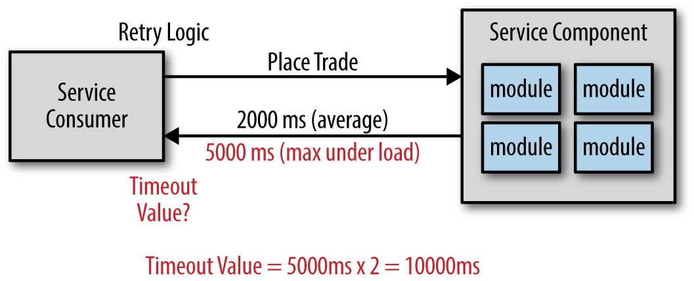

# Patrón Timeout: Resumen para Clase

## **¿Qué es el Patrón Timeout?**

El patrón **Timeout** es un mecanismo de resilencia que **limita el tiempo máximo** que una operación puede tardar en ejecutarse. Si la operación no se completa dentro del tiempo especificado, se cancela automáticamente y se devuelve un resultado alternativo.

### Conceptos Fundamentales

#### 1. **Timeout como Protección**
- Previene que operaciones lentas bloqueen el sistema
- Define un límite temporal máximo para ejecuciones
- Permite recuperación elegante ante demoras

<br>


#### 2. **Tipos de Timeout**
- **Fixed Timeout**: Tiempo fijo predeterminado
- **Dynamic Timeout**: Tiempo que se ajusta según condiciones
- **Cascading Timeout**: Timeouts que se propagan a operaciones dependientes

#### 3. **Estrategias de Timeout**
- **Fail Fast**: Falla inmediatamente al alcanzar el timeout
- **Graceful Degradation**: Proporciona funcionalidad reducida
- **Fallback**: Ejecuta una operación alternativa
- **Circuit Breaker Integration**: Se combina con otros patrones

#### 4. **Niveles de Timeout**
- **Request Level**: Por petición individual
- **Service Level**: Por servicio específico
- **System Level**: A nivel de toda la aplicación


---

## **Casos de Uso**

### 1. **Llamadas a Servicios Externos**
- APIs de terceros que pueden ser lentas
- Microservicios en sistemas distribuidos
- Servicios de base de datos remotos
- Integraciones con sistemas legacy

### 2. **Operaciones de Red**
- Llamadas HTTP a servicios web
- Consultas a bases de datos distribuidas
- Operaciones de filesystem remoto
- Comunicación con message queues

### 3. **Procesamiento Asíncrono**
- Tareas en background que no deben bloquear
- Jobs que pueden ejecutarse por mucho tiempo
- Procesamiento de archivos grandes
- Operaciones de machine learning

### 4. **Interfaz de Usuario**
- Búsquedas que no deben hacer esperar al usuario
- Carga de datos para dashboards
- Operaciones de drag & drop
- Validaciones en tiempo real

### 5. **Sistemas de Alta Frecuencia**
- Trading systems que requieren respuestas rápidas
- Sistemas de gaming en tiempo real
- Aplicaciones IoT con dispositivos limitados
- Sistemas de monitoreo que no pueden bloquearse

---

## **Ejemplos**

### Ejemplo 1: Timeout Básico con Future

```java
import java.util.concurrent.*;

public class TimeoutExample {
    
    // Método con timeout usando CompletableFuture
    public static <T> T executeWithTimeout(Supplier<T> operation, long timeoutSeconds) {
        ExecutorService executor = Executors.newSingleThreadExecutor();
        
        try {
            CompletableFuture<T> future = CompletableFuture.supplyAsync(operation, executor);
            
            return future.get(timeoutSeconds, TimeUnit.SECONDS);
            
        } catch (TimeoutException e) {
            throw new RuntimeException("Operación excedió el timeout de " + timeoutSeconds + " segundos", e);
        } catch (ExecutionException | InterruptedException e) {
            Thread.currentThread().interrupt();
            throw new RuntimeException("Error durante la ejecución", e);
        } finally {
            executor.shutdown();
        }
    }
    
    // Ejemplo de uso
    public static void main(String[] args) {
        // Operación que simula procesamiento
        Supplier<String> slowOperation = () -> {
            try {
                Thread.sleep(5000); // 5 segundos
                return "Operación completada";
            } catch (InterruptedException e) {
                Thread.currentThread().interrupt();
                return "Operación interrumpida";
            }
        };
        
        // Ejecutar con timeout de 2 segundos
        try {
            String result = executeWithTimeout(slowOperation, 2);
            System.out.println("Resultado: " + result);
        } catch (RuntimeException e) {
            System.out.println("Timeout o error: " + e.getMessage());
        }
    }
}
```

### Ejemplo 2: Timeout Configurable para Servicios HTTP

```java
import java.net.http.*;
import java.net.URI;
import java.time.Duration;

public class HttpTimeoutService {
    
    private final HttpClient httpClient;
    private final Duration timeoutDuration;
    
    public HttpTimeoutService(Duration timeoutDuration) {
        this.timeoutDuration = timeoutDuration;
        this.httpClient = HttpClient.newBuilder()
            .connectTimeout(timeoutDuration)
            .build();
    }
    
    public String fetchDataWithTimeout(String url) throws TimeoutException, ServiceUnavailableException {
        try {
            HttpRequest request = HttpRequest.newBuilder()
                .uri(URI.create(url))
                .timeout(timeoutDuration)
                .GET()
                .build();
            
            HttpResponse<String> response = httpClient.send(request, 
                HttpResponse.BodyHandlers.ofString());
            
            if (response.statusCode() >= 400) {
                throw new ServiceUnavailableException("Servicio no disponible: " + response.statusCode());
            }
            
            return response.body();
            
        } catch (HttpTimeoutException e) {
            throw new TimeoutException("Timeout al acceder a: " + url, e);
        } catch (Exception e) {
            throw new ServiceUnavailableException("Error en servicio: " + e.getMessage(), e);
        }
    }
    
    // Factory method con configuración predeterminada
    public static HttpTimeoutService createDefault() {
        return new HttpTimeoutService(Duration.ofSeconds(5));
    }
    
    public static void main(String[] args) {
        HttpTimeoutService service = HttpTimeoutService.createDefault();
        
        try {
            String data = service.fetchDataWithTimeout("https://api.example.com/data");
            System.out.println("Datos recibidos: " + data);
        } catch (TimeoutException e) {
            System.out.println("Timeout: " + e.getMessage());
        } catch (ServiceUnavailableException e) {
            System.out.println("Servicio no disponible: " + e.getMessage());
        }
    }
}

// Excepciones personalizadas
class TimeoutException extends Exception {
    public TimeoutException(String message, Throwable cause) {
        super(message, cause);
    }
}

class ServiceUnavailableException extends Exception {
    public ServiceUnavailableException(String message) {
        super(message);
    }
    
    public ServiceUnavailableException(String message, Throwable cause) {
        super(message, cause);
    }
}
```

### Ejemplo 3: Timeout con ExecutorService Personalizado

```java
import java.util.concurrent.*;

public class AdvancedTimeoutExecutor {
    
    private final ThreadPoolExecutor threadPool;
    private final Duration defaultTimeout;
    
    public AdvancedTimeoutExecutor(int corePoolSize, int maximumPoolSize, 
                                 long keepAliveTime, TimeUnit timeUnit, 
                                 Duration defaultTimeout) {
        this.defaultTimeout = defaultTimeout;
        this.threadPool = new ThreadPoolExecutor(
            corePoolSize, maximumPoolSize,
            keepAliveTime, timeUnit,
            new LinkedBlockingQueue<>()
        );
    }
    
    public <T> CompletableFuture<T> executeAsync(Supplier<T> operation) {
        return CompletableFuture.supplyAsync(operation, threadPool);
    }
    
    public <T> T executeSync(Supplier<T> operation, Duration timeout) 
            throws TimeoutException, ExecutionException, InterruptedException {
        
        CompletableFuture<T> future = CompletableFuture.supplyAsync(operation, threadPool);
        
        try {
            return future.get(timeout.toMillis(), TimeUnit.MILLISECONDS);
        } catch (TimeoutException e) {
            future.cancel(true);
            throw e;
        }
    }
    
    public <T> Optional<T> executeWithFallback(Supplier<T> operation, 
                                             Supplier<T> fallback, 
                                             Duration timeout) {
        try {
            T result = executeSync(operation, timeout);
            return Optional.of(result);
        } catch (TimeoutException | ExecutionException | InterruptedException e) {
            System.out.println("Operación falló, ejecutando fallback: " + e.getMessage());
            return Optional.ofNullable(fallback.get());
        }
    }
    
    public void shutdown() {
        threadPool.shutdown();
        try {
            if (!threadPool.awaitTermination(60, TimeUnit.SECONDS)) {
                threadPool.shutdownNow();
            }
        } catch (InterruptedException e) {
            threadPool.shutdownNow();
            Thread.currentThread().interrupt();
        }
    }
    
    // Ejemplo de uso con múltiples timeouts
    public static void demonstrateTimeouts() {
        AdvancedTimeoutExecutor executor = new AdvancedTimeoutExecutor(
            2, 4, 60L, TimeUnit.SECONDS, 
            Duration.ofSeconds(3)
        );
        
        try {
            // Operación principal
            Supplier<String> slowService = () -> {
                try {
                    Thread.sleep(2000); // 2 segundos
                    return "Datos del servicio principal";
                } catch (InterruptedException e) {
                    Thread.currentThread().interrupt();
                    return "Servicio interrumpido";
                }
            };
            
            // Fallback más rápido
            Supplier<String> fastFallback = () -> {
                try {
                    Thread.sleep(500); // 0.5 segundos
                    return "Datos del cache/fallback";
                } catch (InterruptedException e) {
                    Thread.currentThread().interrupt();
                    return "Fallback interrumpido";
                }
            };
            
            // Probar con timeout de 1 segundo (debería usar fallback)
            Optional<String> result1 = executor.executeWithFallback(
                slowService, fastFallback, Duration.ofSeconds(1));
            System.out.println("Resultado con timeout corto: " + result1.orElse("Sin resultado"));
            
            // Probar con timeout de 3 segundos (debería funcionar)
            Optional<String> result2 = executor.executeWithFallback(
                slowService, fastFallback, Duration.ofSeconds(3));
            System.out.println("Resultado con timeout largo: " + result2.orElse("Sin resultado"));
            
        } finally {
            executor.shutdown();
        }
    }
}
```

### Ejemplo 4: Timeout Manager con Configuración Dinámica

```java
import java.time.Duration;
import java.util.Map;
import java.util.concurrent.ConcurrentHashMap;

public class TimeoutManager {
    
    private final Map<String, Duration> serviceTimeouts;
    private final Duration defaultTimeout;
    
    public TimeoutManager(Duration defaultTimeout) {
        this.defaultTimeout = defaultTimeout;
        this.serviceTimeouts = new ConcurrentHashMap<>();
    }
    
    public void setServiceTimeout(String serviceName, Duration timeout) {
        serviceTimeouts.put(serviceName, timeout);
    }
    
    public Duration getTimeoutForService(String serviceName) {
        return serviceTimeouts.getOrDefault(serviceName, defaultTimeout);
    }
    
    public <T> T executeServiceCall(String serviceName, ServiceCall<T> call) 
            throws TimeoutException, ServiceException {
        
        Duration timeout = getTimeoutForService(serviceName);
        
        try {
            return call.execute(timeout);
        } catch (TimeoutException e) {
            throw new TimeoutException(
                "Timeout al llamar servicio '" + serviceName + "' después de " + timeout, e);
        } catch (Exception e) {
            throw new ServiceException("Error en servicio '" + serviceName + "': " + e.getMessage(), e);
        }
    }
    
    // Configuración de ejemplo
    public static void configureTimeouts() {
        TimeoutManager timeoutManager = new TimeoutManager(Duration.ofSeconds(5));
        
        // Configurar timeouts específicos por servicio
        timeoutManager.setServiceTimeout("user-service", Duration.ofSeconds(2));
        timeoutManager.setServiceTimeout("payment-service", Duration.ofSeconds(10));
        timeoutManager.setServiceTimeout("email-service", Duration.ofSeconds(3));
        timeoutManager.setServiceTimeout("cache-service", Duration.ofSeconds(1));
        
        // Ejemplo de uso
        ServiceCall<String> userServiceCall = (timeout) -> {
            // Simular llamada al servicio de usuarios
            try {
                Thread.sleep(1500); // 1.5 segundos
                return "User data";
            } catch (InterruptedException e) {
                Thread.currentThread().interrupt();
                throw new RuntimeException("Interrumpido", e);
            }
        };
        
        try {
            String result = timeoutManager.executeServiceCall("user-service", userServiceCall);
            System.out.println("Resultado: " + result);
        } catch (TimeoutException e) {
            System.out.println("Timeout: " + e.getMessage());
        } catch (ServiceException e) {
            System.out.println("Error de servicio: " + e.getMessage());
        }
    }
}

// Interfaces funcionales
@FunctionalInterface
interface ServiceCall<T> {
    T execute(Duration timeout) throws Exception;
}

class ServiceException extends Exception {
    public ServiceException(String message, Throwable cause) {
        super(message, cause);
    }
}
```

### Ejemplo 5: Timeout con Spring Boot Configuration

```java
import org.springframework.boot.context.properties.ConfigurationProperties;
import org.springframework.stereotype.Component;

import java.time.Duration;
import java.util.Map;

@ConfigurationProperties(prefix = "app.timeouts")
@Component
public class TimeoutConfiguration {
    
    private Duration defaultTimeout = Duration.ofSeconds(5);
    private Map<String, Duration> services;
    private Duration databaseTimeout = Duration.ofSeconds(3);
    private Duration externalApiTimeout = Duration.ofSeconds(10);
    private Duration cacheTimeout = Duration.ofSeconds(1);
    
    // Getters y setters
    public Duration getDefaultTimeout() {
        return defaultTimeout;
    }
    
    public void setDefaultTimeout(Duration defaultTimeout) {
        this.defaultTimeout = defaultTimeout;
    }
    
    public Map<String, Duration> getServices() {
        return services;
    }
    
    public void setServices(Map<String, Duration> services) {
        this.services = services;
    }
    
    public Duration getDatabaseTimeout() {
        return databaseTimeout;
    }
    
    public void setDatabaseTimeout(Duration databaseTimeout) {
        this.databaseTimeout = databaseTimeout;
    }
    
    public Duration getExternalApiTimeout() {
        return externalApiTimeout;
    }
    
    public void setExternalApiTimeout(Duration externalApiTimeout) {
        this.externalApiTimeout = externalApiTimeout;
    }
    
    public Duration getCacheTimeout() {
        return cacheTimeout;
    }
    
    public void setCacheTimeout(Duration cacheTimeout) {
        this.cacheTimeout = cacheTimeout;
    }
}

// Servicio que utiliza la configuración
@Component
public class ConfigurableTimeoutService {
    
    private final TimeoutConfiguration config;
    
    public ConfigurableTimeoutService(TimeoutConfiguration config) {
        this.config = config;
    }
    
    public <T> T executeWithTimeout(String operationType, Callable<T> operation) 
            throws TimeoutException, Exception {
        
        Duration timeout = getTimeoutForOperation(operationType);
        
        try {
            return operation.call();
        } catch (Exception e) {
            if (e instanceof TimeoutException) {
                throw e;
            }
            throw new Exception("Error en operación '" + operationType + "': " + e.getMessage(), e);
        }
    }
    
    private Duration getTimeoutForOperation(String operationType) {
        return config.getServices().getOrDefault(operationType, config.getDefaultTimeout());
    }
}
```

---

## **Ventajas**

### 1. **Prevención de Bloqueos**
- Evita que operaciones lentas congelen la aplicación
- Mantiene la responsividad del sistema
- Permite continuar con otras tareas

### 2. **Mejora de la Experiencia de Usuario**
- Respuestas más predecibles en interfaces
- Evita timeouts de navegador
- Permite mostrar estados de carga apropiados

### 3. **Gestión de Recursos**
- Libera threads bloqueados
- Previene acumulación de conexiones
- Controla el uso de memoria

### 4. **Observabilidad**
- Facilita la detección de problemas de performance
- Permite métricas sobre tiempos de respuesta
- Ayuda en debugging y optimización

### 5. **Integración con Otros Patrones**
- Se combina naturalmente con Retry
- Funciona con Circuit Breaker
- Apoya estrategias de Fallback

---

## **Desventajas**

### 1. **Complejidad Adicional**
- Requiere configuración cuidadosa de valores
- Múltiples timeouts pueden ser difíciles de coordinar
- Aumenta la complejidad del código

### 2. **Configuración Desafiadora**
- Valores muy bajos pueden causar errores falsos
- Valores muy altos no proporcionan beneficio
- Requiere conocimiento del comportamiento esperado

### 3. **Eventual Consistency**
- Operaciones pueden fallar incluso si completarían exitosamente
- Datos pueden no estar completamente actualizados
- Requiere manejo de estados inconsistentes

### 4. **Overhead Operacional**
- Hilos adicionales para timeouts
- Monitoreo de múltiples temporizadores
- Gestión de cancelaciones

### 5. **Debugging Complejo**
- Errores intermitentes difíciles de reproducir
- Stack traces que incluyen lógica de timeout
- Estados de cancelación difíciles de rastrear

---

## **Buenas Prácticas**

### 1. **Configuración Apropiada**
```java
// ✅ Timeouts basados en requisitos de negocio
@Configuration
public class TimeoutConfig {
    
    @Bean
    public TimeoutManager timeoutManager() {
        TimeoutManager manager = new TimeoutManager(Duration.ofSeconds(5));
        
        // Configurar según SLA reales
        manager.setServiceTimeout("critical-api", Duration.ofSeconds(1));
        manager.setServiceTimeout("background-job", Duration.ofSeconds(30));
        manager.setServiceTimeout("report-generation", Duration.ofSeconds(120));
        
        return manager;
    }
}

// ❌ Timeouts arbitrarios
public static final Duration BAD_TIMEOUT = Duration.ofSeconds(999); // ¿Por qué 999?
```

### 2. **Logging Apropiado**
```java
@Component
public class TimedOperationExecutor {
    
    private static final Logger logger = LoggerFactory.getLogger(TimedOperationExecutor.class);
    
    public <T> T executeWithTimeout(String operationName, Callable<T> operation, Duration timeout) 
            throws TimeoutException, Exception {
        
        long startTime = System.currentTimeMillis();
        logger.info("Iniciando operación '{}' con timeout de {} ms", operationName, timeout.toMillis());
        
        try {
            T result = operation.call();
            long duration = System.currentTimeMillis() - startTime;
            logger.info("Operación '{}' completada exitosamente en {} ms", operationName, duration);
            return result;
        } catch (TimeoutException e) {
            long duration = System.currentTimeMillis() - startTime;
            logger.warn("Timeout en operación '{}' después de {} ms", operationName, duration);
            throw e;
        } catch (Exception e) {
            long duration = System.currentTimeMillis() - startTime;
            logger.error("Error en operación '{}' después de {} ms: {}", operationName, duration, e.getMessage());
            throw e;
        }
    }
}
```

### 3. **Métricas y Monitoreo**
```java
@Component
public class TimeoutMetrics {
    
    private final MeterRegistry meterRegistry;
    private final Timer operationTimer;
    private final Counter timeoutCounter;
    private final Counter errorCounter;
    
    public TimeoutMetrics(MeterRegistry meterRegistry) {
        this.meterRegistry = meterRegistry;
        this.operationTimer = Timer.builder("operations.duration")
            .description("Duración de operaciones")
            .register(meterRegistry);
        this.timeoutCounter = Counter.builder("operations.timeouts")
            .description("Número de timeouts")
            .register(meterRegistry);
        this.errorCounter = Counter.builder("operations.errors")
            .description("Número de errores")
            .register(meterRegistry);
    }
    
    public <T> T recordOperation(String operationName, Callable<T> operation, Duration timeout) {
        return operationTimer.record(() -> {
            try {
                return operation.call();
            } catch (TimeoutException e) {
                timeoutCounter.increment(Tags.of("operation", operationName));
                throw e;
            } catch (Exception e) {
                errorCounter.increment(Tags.of("operation", operationName));
                throw e;
            }
        });
    }
}
```

### 4. **Graceful Degradation**
```java
@Service
public class UserService {
    
    private final UserRepository primaryRepository;
    private final UserCacheRepository cacheRepository;
    private final TimeoutManager timeoutManager;
    
    public User getUserWithTimeout(UUID userId) throws ServiceException {
        try {
            // Intentar con repositorio principal con timeout corto
            return timeoutManager.executeServiceCall("primary-db", 
                (timeout) -> primaryRepository.findById(userId));
        } catch (TimeoutException e) {
            logger.warn("Timeout en BD primaria, intentando cache", e);
            
            try {
                // Fallback a cache con timeout más corto
                return timeoutManager.executeServiceCall("cache", 
                    (timeout) -> cacheRepository.findById(userId));
            } catch (TimeoutException cacheTimeout) {
                // Último fallback: datos por defecto
                logger.warn("Timeout en cache, retornando datos por defecto");
                return createDefaultUser(userId);
            }
        }
    }
    
    private User createDefaultUser(UUID userId) {
        return new User(userId, "Usuario", "default@example.com");
    }
}
```

### 5. **Testing Apropiado**
```java
@ExtendWith(MockitoExtension.class)
class TimeoutServiceTest {
    
    @Mock
    private ExternalService externalService;
    
    @InjectMocks
    private TimeoutService timeoutService;
    
    @Test
    void shouldReturnResultWhenOperationCompletesInTime() throws Exception {
        // Given
        when(externalService.slowOperation()).thenReturn("success");
        
        // When
        String result = timeoutService.executeWithTimeout("test-operation", 
            externalService::slowOperation, Duration.ofSeconds(5));
        
        // Then
        assertThat(result).isEqualTo("success");
    }
    
    @Test
    void shouldThrowTimeoutExceptionWhenOperationExceedsLimit() throws Exception {
        // Given
        when(externalService.slowOperation()).thenAnswer(invocation -> {
            Thread.sleep(2000);
            return "success";
        });
        
        // When & Then
        assertThatThrownBy(() -> timeoutService.executeWithTimeout("test-operation", 
            externalService::slowOperation, Duration.ofSeconds(1)))
            .isInstanceOf(TimeoutException.class);
    }
    
    @Test
    void shouldUseFallbackWhenTimeoutOccurs() throws Exception {
        // Given
        when(externalService.slowOperation()).thenThrow(new TimeoutException("Timeout"));
        
        // When
        String result = timeoutService.executeWithFallback("test-operation", 
            externalService::slowOperation, 
            () -> "fallback-result", 
            Duration.ofSeconds(1));
        
        // Then
        assertThat(result).isEqualTo("fallback-result");
    }
}
```

### 6. **Configuración por Entorno**
```yaml
# application.yml
app:
  timeouts:
    default: 5s
    services:
      user-service: 2s
      payment-service: 10s
      email-service: 3s
      cache-service: 500ms
    database: 3s
    external-api: 10s
    report-generation: 120s

---
# application-dev.yml (desarrollo - timeouts más largos)
app:
  timeouts:
    default: 10s
    services:
      user-service: 5s
      payment-service: 30s

---
# application-prod.yml (producción - timeouts optimizados)
app:
  timeouts:
    default: 3s
    services:
      user-service: 1s
      payment-service: 5s
```

---

## **Conclusión**

El patrón **Timeout** es fundamental para construir sistemas resilientes que:

### **Beneficios Clave:**
- **Protección contra operaciones lentas** que pueden bloquear el sistema
- **Mejora de la experiencia del usuario** con respuestas predecibles
- **Gestión eficiente de recursos** del sistema
- **Observabilidad mejorada** para debugging y optimización

### **Aplicaciones Recomendadas:**
- **Sistemas de alta disponibilidad** que no pueden permitir bloqueos
- **Microservicios** con dependencias externas
- **Interfaces de usuario responsivas** que requieren feedback rápido
- **Sistemas distribuidos** con llamadas de red

### **Consideraciones Importantes:**
1. **Configuración cuidadosa** basada en SLAs reales
2. **Monitoreo constante** de tiempos de respuesta
3. **Testing exhaustivo** de escenarios de timeout
4. **Estrategias de fallback** para degradación elegante
5. **Integración con otros patrones** de resilencia

El timeout efectivo requiere equilibrio entre **protección** y **funcionalidad**, asegurando que los sistemas permanezcan responsivos sin sacrificar la integridad de los datos o la experiencia del usuario.

