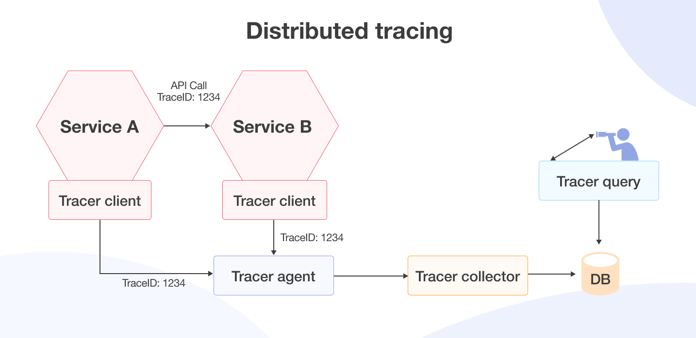

# Trazabilidad Distribuida

## **¿Qué es la Trazabilidad Distribuida?**

La **trazabilidad distribuida** es la capacidad de rastrear y correlacionar requests a través de múltiples servicios y sistemas en una arquitectura de microservicios. Permite seguir el flujo completo de una transacción desde el request inicial hasta las múltiples llamadas de servicios que se ejecutan para satisfacerlo.

<br>

<br>
<br>

**Concepto clave**: Un **trace** representa el viaje completo de un request a través del sistema, mientras que un **span** representa una operación individual dentro de ese trace.


---

## **Conceptos Fundamentales**

### Componentes Principales

#### 1. Trace
Un trace es una representación del camino completo que toma una solicitud a través del sistema distribuido.

```java
// Representación conceptual de un trace
public class Trace {
    private String traceId;              // Identificador único del trace
    private String spanId;               // Identificador del span actual
    private Map<String, String> baggage; // Datos que viajan con el trace
    private List<Span> spans;            // Lista de spans en el trace
    
    public Trace(String traceId) {
        this.traceId = traceId;
        this.spanId = IdGenerator.generate();
        this.baggage = new HashMap<>();
        this.spans = new ArrayList<>();
    }
}
```

#### 2. Span
Un span representa una operación individual en el trace, con información sobre su duración, tags y logs.

```java
public class Span {
    private String traceId;
    private String spanId;
    private String parentSpanId;  // null para spans raíz
    private String operationName;
    
    private long startTimeMicros;
    private long endTimeMicros;
    
    private Map<String, String> tags;    // Metadatos estructurados
    private List<LogEntry> logs;         // Eventos con timestamps
    private Map<String, String> baggage; // Datos contextuales
    
    public Span(String traceId, String spanId, String operationName) {
        this.traceId = traceId;
        this.spanId = spanId;
        this.operationName = operationName;
        this.tags = new HashMap<>();
        this.logs = new ArrayList<>();
        this.baggage = new HashMap<>();
        this.startTimeMicros = System.currentTimeMillis() * 1000;
    }
    
    public void finish() {
        this.endTimeMicros = System.currentTimeMillis() * 1000;
    }
}
```

#### 3. Context Propagation
La propagación del contexto asegura que la información del trace viaje con cada request.

```java
@Component
public class TraceContext {
    
    private static final ThreadLocal<TraceContext> CURRENT_CONTEXT = 
            new ThreadLocal<>();
    
    public static TraceContext getCurrent() {
        return CURRENT_CONTEXT.get();
    }
    
    public static void setCurrent(TraceContext context) {
        CURRENT_CONTEXT.set(context);
    }
    
    public static void clear() {
        CURRENT_CONTEXT.remove();
    }
    
    private String traceId;
    private String spanId;
    private boolean sampled;
    private Map<String, String> baggage;
    
    // Constructor y métodos
}
```

---

## **Arquitectura de Trazabilidad**

### 1. Instrumentación
La instrumentación es el proceso de agregar código de tracing a la aplicación.

#### Instrumentación Automática
```java
@Configuration
@EnableAutoConfiguration
public class TracingConfig {
    
    @Bean
    public Tracing tracing() {
        return Tracing.newBuilder()
                .localServiceName("user-service")
                .addSpanHandler(ZipkinSpanHandler.create(zipkin()))
                .addSpanHandler(LoggingSpanHandler.create(LoggingLevel.FINEST))
                .propagationPropagation(Propagation3)
                .build();
.B    }
    
    @Bean
    public Tracer tracer(Tracing tracing) {
        return tracing.tracer();
    }
    
    @Bean
    public Brave brave(Tracing tracing) {
        return tracing;
    }
    
    @Bean
    public RestTemplate restTemplate() {
        RestTemplate restTemplate = new RestTemplate();
        
        // Instrumentar RestTemplate automáticamente
        BraveTracing interceptor = BraveTracing.create(tracing);
        restTemplate.setInterceptors(Collections.singletonList(interceptor));
        
        return restTemplate;
    }
}
```

#### Instrumentación Manual
```java
@RestController
@RequestMapping("/api/users")
public class UserController {
    
    @Autowired
    private Tracer tracer;
    
    @GetMapping("/{userId}")
    public ResponseEntity<User> getUser(@PathVariable String userId) {
        
        // Crear span para la operación HTTP
        Span span = tracer.nextSpan()
                .name("GET /api/users/{userId}")
                .tag("http.method", "GET")
                .tag("http.path", "/api/users/" + userId)
                .tag("user.id", userId)
                .start();
        
        try (Tracer.SpanInScope ws = tracer.withSpanInScope(span)) {
            
            // Log de inicio
            span.annotate("Request received");
            
            // Lógica de negocio
            User user = userService.getUserById(userId);
            
            // Tag con información adicional
            span.tag("http.status_code", "200");
            span.tag("user.found", user != null);
            
            return ResponseEntity.ok(user);
            
        } catch (Exception e) {
            // Tag de error
            span.tag("error", "true");
            span.tag("error.message", e.getMessage());
            
            log.error("Error getting user {}", userId, e);
            throw e;
            
        } finally {
            span.finish();
        }
    }
}
```

### 2. Propagación de Contexto

#### HTTP Headers
```java
@Component
public class TracePropagationInterceptor implements HandlerInterceptor {
    
    @Autowired
    private Tracer tracer;
    
    @Override
    public boolean preHandle(HttpServletRequest request, 
                           HttpServletResponse response, 
                           Object handler) {
        
        // Extraer contexto de headers HTTP
        Map<String, String> headers = extractTraceHeaders(request);
        
        // Propagar contexto al tracer
        if (!headers.isEmpty()) {
            tracer.nextSpan(ExtraFieldPropagation.newBuilder(tracing())
                    .addTraceIdHeaders(headers.keySet())
                    .build());
        }
        
        return true;
    }
    
    private Map<String, String> extractTraceHeaders(HttpServletRequest request) {
        Map<String, String> headers = new HashMap<>();
        
        // B3 headers (Zipkin)
        String b3 = request.getHeader("B3");
        if (b3 != null) {
            headers.put("B3", b3);
        }
        
        // W3C Trace Context
        String traceparent = request.getHeader("traceparent");
        if (traceparent != null) {
            headers.put("traceparent", traceparent);
        }
        
        return headers;
    }
}
```

#### Mensajería
```java
@Component
public class TraceMessageProducer {
    
    @Autowired
    private RabbitTemplate rabbitTemplate;
    
    @Autowired
    private Tracer tracer;
    
    public void sendMessage(String exchange, String routingKey, Object message) {
        
        // Crear span para la operación de mensajería
        Span span = tracer.nextSpan()
                .name("send_message")
                .tag("message.exchange", exchange)
                .tag("message.routing_key", routingKey)
                .start();
        
        try (Tracer.SpanInScope ws = tracer.withSpanInScope(span)) {
            
            // Agregar headers de tracing al mensaje
            MessageProperties properties = new MessageProperties();
            
            // Propagar trace context en headers
            propagateTraceToHeaders(span.context(), properties);
            
            // Convertir y enviar mensaje
            Message amqpMessage = MessageBuilder
                    .withBody(serialize(message))
                    .andProperties(properties)
                    .build();
            
            rabbitTemplate.send(exchange, routingKey, amqpMessage);
            
            span.annotate("Message sent");
            
        } finally {
            span.finish();
        }
    }
    
    private void propagateTraceToHeaders(TraceContext context, MessageProperties properties) {
        // B3 propagation
        String b3Header = String.format("%s-%s-%s", 
                context.traceIdString(), 
                context.spanIdString(),
                context.sampled() ? "1" : "0");
        properties.setHeader("B3", b3Header);
        
        // Custom headers
        properties.setHeader("X-Trace-Id", context.traceIdString());
        properties.setHeader("X-Span-Id", context.spanIdString());
    }
}
```

#### gRPC
```java
@Component
public class TraceGrpcInterceptor implements ServerInterceptor {
    
    @Autowired
    private Tracer tracer;
    
    @Override
    public <ReqT, RespT> ServerCall.Listener<ReqT> interceptCall(
            ServerCall<ReqT, RespT> call,
            Metadata headers,
            ServerCallHandler<ReqT, RespT> next) {
        
        // Extraer contexto de gRPC metadata
        TraceContext context = extractContextFromMetadata(headers);
        
        // Crear span para la llamada RPC
        Span span = tracer.nextSpan(context)
                .name("grpc.call")
                .tag("grpc.method", call.getMethodDescriptor().getFullMethodName())
                .tag("grpc.service", call.getMethodDescriptor().getServiceName())
                .start();
        
        return new ForwardingServerCallListener<ReqT>() {
            
            @Override
            public void onMessage(ReqT message) {
                try (Tracer.SpanInScope ws = tracer.withSpanInScope(span)) {
                    span.annotate("Message received");
                    delegate.onMessage(message);
                }
            }
            
            @Override
            public void onHalfClose() {
                try (Tracer.SpanInScope ws = tracer.withSpanInScope(span)) {
                    span.annotate("Call completed");
                    delegate.onHalfClose();
                }
            }
            
            @Override
            public void onCancel() {
                try (Tracer.SpanInScope ws = tracer.withSpanInScope(span)) {
                    span.annotate("Call cancelled");
                    span.tag("grpc.cancelled", "true");
                    delegate.onCancel();
                }
            }
            
            @Override
            public void onComplete() {
                try (Tracer.SpanInScope ws = tracer.withSpanInScope(span)) {
                    delegate.onComplete();
                } finally {
                    span.finish();
                }
            }
            
            private ServerCall.Listener<ReqT> delegate = next.startCall(call, headers);
        };
    }
    
    private TraceContext extractContextFromMetadata(Metadata headers) {
        // Extraer B3 headers de gRPC metadata
        BytesField b3Header = headers.get(BytesField.key("b3"));
        if (b3Header != null) {
            return parseB3Header(b3Header.get());
        }
        
        return null;
    }
}
```

### 3. Almacenamiento y Visualización

#### Backend de Almacenamiento
```java
@Configuration
public class ZipkinConfig {
    
    @Bean
    public ZipkinSpanHandler zipkin() {
        return ZipkinSpanHandler.newBuilder()
                .endpoint(zipkinUrl())
                .build();
    }
    
    @Bean
    public InMemorySpanHandler inMemory() {
        return InMemorySpanHandler.create(10000); // Mantener últimos 10,000 spans
    }
    
    private String zipkinUrl() {
        return "http://zipkin-server:9411/api/v2/spans";
    }
}
```

#### Consultas Personalizadas
```java
@Service
public class TraceQueryService {
    
    @Autowired
    private Tracing tracing;
    
    public List<TraceInfo> findTracesByUserId(String userId, LocalDateTime from, LocalDateTime to) {
        return tracing.tracer().spans()
                .stream()
                .filter(span -> {
                    String spanName = span.name();
                    return spanName.contains("user-service") || 
                           spanName.contains("order-service");
                })
                .filter(span -> {
                    String userTag = span.tag("user.id");
                    return userId.equals(userTag);
                })
                .filter(span -> {
                    long spanTime = span.startTimestamp().toEpochMicrosecond();
                    long fromMicros = from.atZone(ZoneId.systemDefault()).toInstant().toEpochMilli() * 1000;
                    long toMicros = to.atZone(ZoneId.systemDefault()).toInstant().toEpochMilli() * 1000;
                    return spanTime >= fromMicros && spanTime <= toMicros;
                })
                .collect(groupingBy(span -> span.traceId()))
                .entrySet()
                .stream()
                .map(entry -> buildTraceInfo(entry.getKey(), entry.getValue()))
                .sorted(Comparator.comparing(TraceInfo::getStartTime).reversed())
                .collect(Collectors.toList());
    }
    
    public List<TraceInfo> findSlowTraces(Duration minDuration) {
        return tracing.tracer().spans()
                .stream()
                .filter(span -> {
                    long duration = span.finishTimestamp().minus(span.startTimestamp()).toEpochMicrosecond();
                    return duration >= minDuration.toMicros();
                })
                .collect(groupingBy(span -> span.traceId()))
                .entrySet()
                .stream()
                .map(entry -> buildTraceInfo(entry.getKey(), entry.getValue()))
                .sorted(Comparator.comparing(TraceInfo::getTotalDuration).reversed())
                .collect(Collectors.toList());
    }
    
    private TraceInfo buildTraceInfo(String traceId, List<Span> spans) {
        return TraceInfo.builder()
                .traceId(traceId)
                .spans(spans.stream()
                        .map(this::buildSpanInfo)
                        .collect(Collectors.toList()))
                .startTime(spans.stream()
                        .map(span -> span.startTimestamp().toInstant())
                        .min(Comparator.naturalOrder())
                        .orElse(Instant.now()))
                .endTime(spans.stream()
                        .map(span -> span.finishTimestamp().toInstant())
                        .max(Comparator.naturalOrder())
                        .orElse(Instant.now()))
                .totalDuration(Duration.between(
                        spans.stream().map(span -> span.startTimestamp().toInstant()).min(Comparator.naturalOrder()).orElse(Instant.now()),
                        spans.stream().map(span -> span.finishTimestamp().toInstant()).max(Comparator.naturalOrder()).orElse(Instant.now())))
                .serviceNames(spans.stream()
                        .map(span -> span.tag("service.name"))
                        .filter(Objects::nonNull)
                        .distinct()
                        .collect(Collectors.toSet()))
                .build();
    }
}
```

---

## **Implementación con Librerías Populares**

### 1. OpenTelemetry
```xml
<!-- Dependencies -->
<dependency>
    <groupId>io.opentelemetry</groupId>
    <artifactId>opentelemetry-api</artifactId>
    <version>1.0.0</version>
</dependency>
<dependency>
    <groupId>io.opentelemetry</groupId>
    <artifactId>opentelemetry-sdk</artifactId>
    <version>1.0.0</version>
</dependency>
<dependency>
    <groupId>io.opentelemetry</groupId>
    <artifactId>opentelemetry-exporter-jaeger</artifactId>
    <version>1.0.0</version>
</dependency>
<dependency>
    <groupId>io.opentelemetry</groupId>
    <artifactId>opentelemetry-spring-boot-autoconfigure</artifactId>
    <version>1.0.0</version>
</dependency>
```

```java
@Configuration
@EnableConfigurationProperties(OpenTelemetryProperties.class)
public class OpenTelemetryConfig {
    
    @Bean
    public OpenTelemetry openTelemetry() {
        // Configurar Jaeger exporter
        JaegerGrpcSpanExporter jaegerExporter = JaegerGrpcSpanExporter.builder()
                .setEndpoint("http://jaeger-collector:14250")
                .build();
        
        // Configurar spans processors
        SpanProcessor spanProcessor = BatchSpanProcessor.builder(jaegerExporter)
                .setMaxExportBatchSize(512)
                .setExportTimeout(10, TimeUnit.SECONDS)
                .build();
        
        // Crear tracer provider
        SdkTracerProvider tracerProvider = SdkTracerProvider.builder()
                .addSpanProcessor(spanProcessor)
                .setResource(Resource.getDefault()
                        .merge(Resource.create(Attributes.of(
                                ResourceAttributes.SERVICE_NAME, "user-service",
                                ResourceAttributes.DEPLOYMENT_ENVIRONMENT, "production"
                        ))))
                .build();
        
        // Crear OpenTelemetry instance
        OpenTelemetry openTelemetry = OpenTelemetrySdk.builder()
                .setTracerProvider(tracerProvider)
                .build();
        
        return openTelemetry;
    }
    
    @Bean
    public Tracer tracer(OpenTelemetry openTelemetry) {
        return openTelemetry.getTracer("com.example.userservice", "1.0.0");
    }
}
```

```java
@RestController
public class UserController {
    
    @Autowired
    private Tracer tracer;
    
    @GetMapping("/{userId}")
    public ResponseEntity<User> getUser(@PathVariable String userId) {
        
        // Crear span
        Span span = tracer.spanBuilder("GET /api/users/{userId}")
                .setAttribute("http.method", "GET")
                .setAttribute("http.url", "/api/users/" + userId)
                .setAttribute("user.id", userId)
                .startSpan();
        
        try (Scope scope = span.makeCurrent()) {
            
            span.addEvent("Request received");
            
            User user = userService.getUserById(userId);
            
            span.setAttribute("http.status_code", 200)
                    .setAttribute("user.found", user != null);
            
            return ResponseEntity.ok(user);
            
        } catch (Exception e) {
            span.setAttribute("error", true)
                    .setAttribute("error.message", e.getMessage());
            
            log.error("Error getting user {}", userId, e);
            throw e;
            
        } finally {
            span.end();
        }
    }
}
```

### 2. Jaeger
```yaml
# docker-compose.yml para Jaeger
version: '3.1'
services:
  jaeger-collector:
    image: jaegertracing/jaeger-collector
    ports:
      - "14268:14268"
      - "14250:14250"
    environment:
      - SPAN_STORAGE_TYPE=elasticsearch
      - ES_SERVER_URLS=http://elasticsearch:9200
      - ES_NUM_SHARDS=1
      - ES_NUM_REPLICAS=0
  
  jaeger-query:
    image: jaegertracing/jaeger-query
    ports:
      - "16686:16686"
    environment:
      - SPAN_STORAGE_TYPE=elasticsearch
      - ES_SERVER_URLS=http://elasticsearch:9200
    depends_on:
      - elasticsearch
  
  elasticsearch:
    image: elasticsearch:7.13.0
    environment:
      - discovery.type=single-node
      - "ES_JAVA_OPTS=-Xms512m -Xmx512m"
    ports:
      - "9200:9200"
  
  zipkin:
    image: openzipkin/zipkin
    ports:
      - "9411:9411"
```

```java
@Configuration
public class JaegerConfig {
    
    @Bean
    public io.jaegertracing.thrift.internal.senders.HttpSender jaegerHttpSender() {
        return new io.jaegertracing.thrift.internal.senders.HttpSender("http://jaeger-collector:14268/api/traces");
    }
    
    @Bean
    public Tracer jaegerTracer(io.jaegertracing.thrift.internal.senders.HttpSender httpSender) {
        return Configuration.fromEnv("userservice")
                .getTracer();
    }
}
```

### 3. Zipkin
```yaml
# docker-compose.yml para Zipkin
version: '3.1'
services:
  zipkin:
    image: openzipkin/zipkin
    ports:
      - "9411:9411"
    environment:
      - STORAGE_TYPE=elasticsearch
      - ES_HOSTS=elasticsearch:9200
      - ES_INDEX_PREFIX=zipkin
    depends_on:
      - elasticsearch
  
  elasticsearch:
    image: elasticsearch:7.13.0
    environment:
      - discovery.type=single-node
      - "ES_JAVA_OPTS=-Xms512m -Xmx512m"
    ports:
      - "9200:9200"
```

```java
@Configuration
public class ZipkinConfig {
    
    @Bean
    public Tracing zipkinTracing() {
        return Tracing.newBuilder()
                .localServiceName("user-service")
                .addSpanHandler(ZipkinSpanHandler.create("http://zipkin:9411/api/v2/spans"))
                .propagationPropagation(Propagation.B3)
                .build();
    }
    
    @Bean
    public Tracer tracer(Tracing tracing) {
        return tracing.tracer();
    }
}
```

---

## **Casos de Uso Avanzados**

### 1. Tracing en Bases de Datos
```java
@Component
public class TraceDataSourceProxy {
    
    @Autowired
    private DataSource targetDataSource;
    
    @Autowired
    private Tracer tracer;
    
    @Bean
    public DataSource dataSource() {
        return new TracingDataSource(targetDataSource, tracer);
    }
}

public class TracingDataSource implements DataSource {
    
    private final DataSource target;
    private final Tracer tracer;
    
    public TracingDataSource(DataSource target, Tracer tracer) {
        this.target = target;
        this.tracer = tracer;
    }
    
    @Override
    public Connection getConnection() throws SQLException {
        Connection connection = target.getConnection();
        return new TracingConnection(connection, tracer);
    }
    
    @Override
    public Connection getConnection(String username, String password) throws SQLException {
        Connection connection = target.getConnection(username, password);
        return new TracingConnection(connection, tracer);
    }
}

public class TracingConnection implements Connection {
    
    private final Connection target;
    private final Tracer tracer;
    
    public TracingConnection(Connection target, Tracer tracer) {
        this.target = target;
        this.tracer = tracer;
    }
    
    @Override
    public Statement createStatement() throws SQLException {
        return new TracingStatement(target.createStatement(), tracer);
    }
    
    @Override
    public PreparedStatement prepareStatement(String sql) throws SQLException {
        return new TracingPreparedStatement(target.prepareStatement(sql), tracer, sql);
    }
    
    // Implementar otros métodos delegando al target...
}
```

### 2. Tracing en Cache
```java
@Component
public class TraceableRedisTemplate<K, V> {
    
    private final RedisTemplate<K, V> redisTemplate;
    private final Tracer tracer;
    
    public TraceableRedisTemplate(RedisTemplate<K, V> redisTemplate, Tracer tracer) {
        this.redisTemplate = redisTemplate;
        this.tracer = tracer;
    }
    
    public V get(K key) {
        Span span = tracer.nextSpan()
                .name("redis.get")
                .tag("redis.key", key.toString())
                .start();
        
        try (Tracer.SpanInScope ws = tracer.withSpanInScope(span)) {
            V value = redisTemplate.opsForValue().get(key);
            span.tag("redis.hit", value != null);
            return value;
        } finally {
            span.finish();
        }
    }
    
    public void set(K key, V value, Duration ttl) {
        Span span = tracer.nextSpan()
                .name("redis.set")
                .tag("redis.key", key.toString())
                .tag("redis.ttl", ttl.toString())
                .start();
        
        try (Tracer.SpanInScope ws = tracer.withSpanInScope(span)) {
            redisTemplate.opsForValue().set(key, value, ttl);
            span.annotate("Cache set");
        } finally {
            span.finish();
        }
    }
}
```

### 3. Tracing en Mensajería Asíncrona
```java
@Component
public class TraceableRabbitTemplate {
    
    private final RabbitTemplate rabbitTemplate;
    private final Tracer tracer;
    
    public TraceableRabbitTemplate(RabbitTemplate rabbitTemplate, Tracer tracer) {
        this.rabbitTemplate = rabbitTemplate;
        this.tracer = tracer;
    }
    
    public void convertAndSend(String exchange, String routingKey, Object object) {
        Span span = tracer.nextSpan()
                .name("rabbit.send")
                .tag("rabbit.exchange", exchange)
                .tag("rabbit.routing_key", routingKey)
                .start();
        
        try (Tracer.SpanInScope ws = tracer.withSpanInScope(span)) {
            
            // Crear mensaje con headers de tracing
            MessageProperties properties = new MessageProperties();
            propagateTraceHeaders(span.context(), properties);
            
            Message message = MessageBuilder
                    .withBody(serialize(object))
                    .andProperties(properties)
                    .build();
            
            rabbitTemplate.send(exchange, routingKey, message);
            span.annotate("Message sent");
            
        } finally {
            span.finish();
        }
    }
}

@Component
public class TraceableMessageListenerAdapter implements MessageListener {
    
    private final MessageListener target;
    private final Tracer tracer;
    
    public TraceableMessageListenerAdapter(MessageListener target, Tracer tracer) {
        this.target = target;
        this.tracer = tracer;
    }
    
    @Override
    public void onMessage(Message message) {
        // Extraer contexto de tracing de los headers
        TraceContext context = extractTraceContext(message.getMessageProperties());
        
        Span span = tracer.nextSpan(context)
                .name("rabbit.receive")
                .tag("rabbit.consumer_tag", message.getMessageProperties().getConsumerTag())
                .start();
        
        try (Tracer.SpanInScope ws = tracer.withSpanInScope(span)) {
            span.annotate("Message received");
            target.onMessage(message);
            span.annotate("Message processed");
        } finally {
            span.finish();
        }
    }
    
    private TraceContext extractTraceContext(MessageProperties properties) {
        // Implementar extracción de contexto de headers
        return null; // Simplified
    }
    
    private void propagateTraceHeaders(TraceContext context, MessageProperties properties) {
        // Implementar propagación de headers
    }
}
```

---

## **Análisis y Observabilidad**

### 1. Métricas de Tracing
```java
@Component
public class TraceMetrics {
    
    private final MeterRegistry meterRegistry;
    private final Timer spanDurationTimer;
    private final Counter totalSpansCounter;
    private final Counter errorSpansCounter;
    private final DistributionSummary traceSizeDistribution;
    
    public TraceMetrics(MeterRegistry meterRegistry) {
        this.meterRegistry = meterRegistry;
        this.spanDurationTimer = Timer.builder("trace.span.duration")
                .description("Duration of spans")
                .register(meterRegistry);
        
        this.totalSpansCounter = Counter.builder("trace.spans.total")
                .description("Total number of spans")
                .register(meterRegistry);
        
        this.errorSpansCounter = Counter.builder("trace.spans.errors")
                .description("Number of spans with errors")
                .register(meterRegistry);
        
        this.traceSizeDistribution = DistributionSummary.builder("trace.spans.count")
                .description("Number of spans per trace")
                .register(meterRegistry);
    }
    
    public void recordSpan(Span span) {
        Duration duration = Duration.between(span.startTimestamp(), span.finishTimestamp());
        
        spanDurationTimer.record(duration, 
                Tags.of("service", span.tag("service.name"),
                        "operation", span.name(),
                        "error", Boolean.toString(span.tag("error") != null)));
        
        totalSpansCounter.increment(
                Tags.of("service", span.tag("service.name"),
                        "operation", span.name()));
        
        if (span.tag("error") != null) {
            errorSpansCounter.increment(
                    Tags.of("service", span.tag("service.name"),
                            "operation", span.name(),
                            "error.type", span.tag("error.kind")));
        }
    }
    
    public void recordTraceSize(String traceId, int spanCount) {
        traceSizeDistribution.record(spanCount, 
                Tags.of("trace.id", traceId.substring(0, 8))); // Hash parcial para tags
    }
}
```

### 2. Alertas Automáticas
```java
@Service
public class TraceAlertingService {
    
    @Autowired
    private TraceQueryService traceQueryService;
    
    @Autowired
    private AlertingService alertingService;
    
    @Scheduled(fixedDelay = 30000) // Cada 30 segundos
    public void checkForSlowTraces() {
        Duration threshold = Duration.ofSeconds(5);
        List<TraceInfo> slowTraces = traceQueryService.findTracesSlowerThan(threshold);
        
        if (!slowTraces.isEmpty()) {
            String message = String.format("Found %d traces slower than %s", 
                    slowTraces.size(), threshold);
            
            alertingService.sendAlert("SLOW_TRACES", message, slowTraces);
        }
    }
    
    @Scheduled(fixedDelay = 60000) // Cada minuto
    public void checkForErrorSpans() {
        Duration window = Duration.ofMinutes(1);
        List<SpanInfo> errorSpans = traceQueryService.findErrorSpansInWindow(window);
        
        double errorRate = calculateErrorRate(errorSpans);
        
        if (errorRate > 0.05) { // Más del 5% de error
            String message = String.format("High error rate detected: %.2f%%", errorRate * 100);
            alertingService.sendAlert("HIGH_ERROR_RATE", message, errorSpans);
        }
    }
    
    private double calculateErrorRate(List<SpanInfo> errorSpans) {
        long totalSpans = traceQueryService.getTotalSpansInWindow(Duration.ofMinutes(1));
        return totalSpans > 0 ? (double) errorSpans.size() / totalSpans : 0.0;
    }
}
```

### 3. Análisis de Performance
```java
@Component
public class TraceAnalyzer {
    
    @Autowired
    private TraceQueryService traceQueryService;
    
    public TraceAnalysis analyzeTracePerformance(String traceId) {
        TraceInfo trace = traceQueryService.getTraceById(traceId);
        
        if (trace == null) {
            return null;
        }
        
        // Análisis de cuellos de botella
        List<SpanInfo> spans = trace.getSpans();
        
        // Encontrar el span más lento
        SpanInfo slowestSpan = spans.stream()
                .max(Comparator.comparing(SpanInfo::getDuration))
                .orElse(null);
        
        // Encontrar servicios con mayor latencia
        Map<String, Duration> serviceLatencies = spans.stream()
                .collect(Collectors.groupingBy(
                        SpanInfo::getServiceName,
                        Collectors.reducing(
                                Duration.ZERO,
                                SpanInfo::getDuration,
                                Duration::plus)));
        
        // Análisis de dependencias
        Map<String, Set<String>> dependencies = buildDependencyGraph(spans);
        
        // Análisis de paralelismo
        ParallelismAnalysis parallelismAnalysis = analyzeParallelism(spans);
        
        return TraceAnalysis.builder()
                .traceId(traceId)
                .slowestSpan(slowestSpan)
                .serviceLatencies(serviceLatencies)
                .dependencies(dependencies)
                .parallelismAnalysis(parallelismAnalysis)
                .totalDuration(trace.getTotalDuration())
                .spanCount(spans.size())
                .serviceCount(trace.getServiceNames().size())
                .build();
    }
    
    private Map<String, Set<String>> buildDependencyGraph(List<SpanInfo> spans) {
        Map<String, Set<String>> dependencies = new HashMap<>();
        
        for (SpanInfo span : spans) {
            String service = span.getServiceName();
            String parentService = span.getParentService();
            
            if (parentService != null && !parentService.equals(service)) {
                dependencies.computeIfAbsent(service, k -> new HashSet<>())
                          .add(parentService);
            }
        }
        
        return dependencies;
    }
    
    private ParallelismAnalysis analyzeParallelism(List<SpanInfo> spans) {
        // Encontrar spans que se ejecutan en paralelo
        Set<String> parallelGroups = new HashSet<>();
        
        for (SpanInfo span : spans) {
            // Lógica para detectar paralelismo basada en timestamps y dependencias
            List<SpanInfo> overlappingSpans = spans.stream()
                    .filter(other -> other != span)
                    .filter(other -> spansOverlap(span, other))
                    .filter(other -> !hasDirectDependency(span, other))
                    .collect(Collectors.toList());
            
            if (!overlappingSpans.isEmpty()) {
                parallelGroups.add("Group_" + span.getSpanId());
            }
        }
        
        return ParallelismAnalysis.builder()
                .parallelGroups(parallelGroups)
                .parallelismScore(calculateParallelismScore(spans))
                .build();
    }
    
    private boolean spansOverlap(SpanInfo span1, SpanInfo span2) {
        return !span1.getEndTime().isBefore(span2.getStartTime()) &&
               !span2.getEndTime().isBefore(span1.getStartTime());
    }
    
    private boolean hasDirectDependency(SpanInfo span1, SpanInfo span2) {
        return span1.getParentSpanId().equals(span2.getSpanId()) ||
               span2.getParentSpanId().equals(span1.getSpanId());
    }
    
    private double calculateParallelismScore(List<SpanInfo> spans) {
        if (spans.size() <= 1) return 1.0;
        
        long totalSequentialTime = calculateSequentialTime(spans);
        long actualTotalTime = calculateActualTotalTime(spans);
        
        return (double) actualTotalTime / totalSequentialTime;
    }
}
```

---

## **Mejores Prácticas**

### 1. Principios de Naming
```java
@RestController
public class NamingBestPractices {
    
    @GetMapping("/api/orders/{orderId}")
    public ResponseEntity<Order> getOrder(@PathVariable String orderId) {
        
        // ✅ BUEN nombre de span
        Span span = tracer.nextSpan()
                .name("GET /api/orders/{orderId}")  // Patrón HTTP claro
                .tag("http.method", "GET")
                .tag("http.path", "/api/orders/" + orderId)
                .start();
        
        // ❌ MAL nombre de span
        // .name("getOrder")  // Too generic
        // .name("order-service-get")  // Includes service name (redundant)
        // .name("GET")  // Too short
        
        try (Scope scope = tracer.withSpanInScope(span)) {
            // Lógica del método
            return ResponseEntity.ok(orderService.getOrder(orderId));
        } finally {
            span.finish();
        }
    }
}
```

### 2. Tagging Strategy
```java
@Component
public class TaggingStrategy {
    
    // Tags estándar HTTP
    public void addHttpTags(Span span, HttpServletRequest request) {
        span.tag("http.method", request.getMethod())
            .tag("http.url", request.getRequestURI())
            .tag("http.scheme", request.getScheme())
            .tag("http.host", request.getServerName())
            .tag("http.port", String.valueOf(request.getServerPort()));
    }
    
    // Tags estándar de base de datos
    public void addDbTags(Span span, String statement, String type) {
        span.tag("db.statement", sanitizeStatement(statement))
            .tag("db.type", type)
            .tag("db.user", getCurrentDbUser());
    }
    
    // Tags de mensajería
    public void addMessagingTags(Span span, String destination, String operation) {
        span.tag("messaging.destination", destination)
            .tag("messaging.operation", operation)
            .tag("messaging.system", "rabbitmq");
    }
    
    private String sanitizeStatement(String statement) {
        // Remover parámetros sensibles del statement
        return statement.replaceAll("\\?[0-9]+", "?");
    }
}
```

### 3. Sampling Strategy
```java
@Configuration
public class SamplingConfig {
    
    @Bean
    public Sampler traceSampler() {
        // Sampling probabilístico: 10% de traces
        return Sampler.probabilistic(0.1f);
    }
    
    @Bean
    public CustomSampler customSampler() {
        return new CustomSampler();
    }
}

public class CustomSampler implements Sampler {
    
    @Override
    public SamplingStatus sample(SamplingParameters parameters) {
        String operation = parameters.getOperation();
        Map<String, String> tags = parameters.getTags();
        
        // Always sample critical operations
        if (operation.contains("/api/payments/") ||
            operation.contains("/api/orders/")) {
            return SamplingStatus.recordAndSample();
        }
        
        // Sample based on user tier
        String userTier = tags.get("user.tier");
        if ("premium".equals(userTier)) {
            return SamplingStatus.recordAndSample();
        }
        
        // Default sampling rate
        return Sampler.probabilistic(0.1f).sample(parameters);
    }
}
```

### 4. Context Management
```java
@Component
public class TraceContextManager {
    
    private static final ThreadLocal<TraceContext> CURRENT_CONTEXT = 
            new ThreadLocal<>();
    
    public static void setContext(TraceContext context) {
        CURRENT_CONTEXT.set(context);
    }
    
    public static TraceContext getContext() {
        return CURRENT_CONTEXT.get();
    }
    
    public static void clear() {
        CURRENT_CONTEXT.remove();
    }
    
    // Crear nuevo contexto para requests externos
    public TraceContext createNewContext(String traceId) {
        TraceContext context = TraceContext.newBuilder()
                .traceId(traceId)
                .spanId(IdGenerator.generate())
                .sampled(true)
                .build();
        
        setContext(context);
        return context;
    }
    
    // Continuar contexto existente
    public TraceContext continueContext(String traceId, String parentSpanId) {
        TraceContext context = TraceContext.newBuilder()
                .traceId(traceId)
                .spanId(IdGenerator.generate())
                .parentId(parentSpanId)
                .sampled(true)
                .build();
        
        setContext(context);
        return context;
    }
}
```

### 5. Error Handling
```java
@RestControllerAdvice
public class TraceErrorHandler {
    
    @Autowired
    private Tracer tracer;
    
    @ExceptionHandler(Exception.class)
    public ResponseEntity<ErrorResponse> handleException(
            Exception ex, 
            HttpServletRequest request) {
        
        Span currentSpan = tracer.nextSpan().start();
        
        try (Tracer.SpanInScope ws = tracer.withSpanInScope(currentSpan)) {
            
            currentSpan.tag("error", "true")
                    .tag("error.kind", ex.getClass().getSimpleName())
                    .tag("error.message", ex.getMessage())
                    .tag("http.status_code", "500");
            
            // Log error con contexto de trace
            log.error("Error in request {} - TraceId: {}, SpanId: {}", 
                    request.getRequestURI(),
                    currentSpan.context().traceIdString(),
                    currentSpan.context().spanIdString(),
                    ex);
            
            ErrorResponse errorResponse = ErrorResponse.builder()
                    .error("INTERNAL_ERROR")
                    .message("An unexpected error occurred")
                    .traceId(currentSpan.context().traceIdString())
                    .build();
            
            return ResponseEntity
                    .status(HttpStatus.INTERNAL_SERVER_ERROR)
                    .body(errorResponse);
                    
        } finally {
            currentSpan.finish();
        }
    }
}
```

---

## **Desafíos y Soluciones**

### 1. Overhead de Performance
```java
// Problema: Overhead excesivo de tracing
@Component
public class PerformanceOptimizedTracing {
    
    private final Tracer tracer;
    private final boolean tracingEnabled;
    
    public PerformanceOptimizedTracing(Tracer tracer) {
        this.tracer = tracer;
        this.tracingEnabled = System.getenv("TRACING_ENABLED") != null;
    }
    
    public Span startSpan(String name) {
        if (!tracingEnabled) {
            return NoopSpan.create();
        }
        
        return tracer.nextSpan().name(name).start();
    }
    
    public void withSpan(Span span, Runnable operation) {
        if (!tracingEnabled) {
            operation.run();
            return;
        }
        
        try (Tracer.SpanInScope ws = tracer.withSpanInScope(span)) {
            operation.run();
        }
    }
}

// Sampling adaptativo
@Component
public class AdaptiveSampler {
    
    private volatile float currentSampleRate = 0.1f;
    private final AtomicInteger recentErrorCount = new AtomicInteger(0);
    private final AtomicInteger recentTotalCount = new AtomicInteger(0);
    
    @Scheduled(fixedDelay = 10000)
    public void adjustSamplingRate() {
        int errors = recentErrorCount.get();
        int total = recentTotalCount.get();
        
        if (total > 0) {
            double errorRate = (double) errors / total;
            
            // Incrementar sampling si hay muchos errores
            if (errorRate > 0.05) {
                currentSampleRate = Math.min(1.0f, currentSampleRate * 1.5f);
            } else if (errorRate < 0.01) {
                currentSampleRate = Math.max(0.01f, currentSampleRate * 0.8f);
            }
        }
        
        // Reset counters
        recentErrorCount.set(0);
        recentTotalCount.set(0);
    }
    
    public boolean shouldSample() {
        recentTotalCount.incrementAndGet();
        return Math.random() < currentSampleRate;
    }
}
```

### 2. Context Loss
```java
// Problema: Pérdida de contexto en operaciones asíncronas
@Service
public class AsyncOperationService {
    
    @Autowired
    private ExecutorService executorService;
    
    @Autowired
    private Tracer tracer;
    
    public void processAsyncOperation(String data) {
        // ❌ INCORRECTO: Contexto se pierde
        executorService.submit(() -> {
            // Este código no tendrá acceso al trace context
            processData(data);
        });
        
        // ✅ CORRECTO: Capturar y propagar contexto
        TraceContext currentContext = tracer.nextSpan().context();
        executorService.submit(() -> {
            try (Tracer.SpanInScope ws = tracer.withSpanInScope(
                    tracer.nextSpan(currentContext).name("async.process").start())) {
                processData(data);
            }
        });
    }
    
    // Usar @Async con propagación automática
    @Async("traceAwareExecutor")
    public void processWithAsyncAnnotation(@SpanTag("data") String data) {
        // El contexto se propaga automáticamente
        processData(data);
    }
}

@Configuration
public class AsyncConfig {
    
    @Bean("traceAwareExecutor")
    public Executor traceAwareExecutor() {
        return ContextExecutorWrapper.wrap(
                Executors.newFixedThreadPool(10),
                tracer -> // Wrapper que propaga trace context
        );
    }
}
```

### 3. Memory Usage
```java
// Problema: Uso excesivo de memoria para spans
@Component
public class MemoryEfficientTracing {
    
    private final int maxSpansInMemory = 10000;
    private final BlockingQueue<Span> spanQueue = new LinkedBlockingQueue<>(maxSpansInMemory);
    
    @EventListener
    public void handleSpanFinished(SpanFinishedEvent event) {
        Span span = event.getSpan();
        
        // Almacenar solo spans importantes en memoria
        if (isImportantSpan(span)) {
            if (!spanQueue.offer(span)) {
                // Queue está llena, remover el span más antiguo
                spanQueue.poll();
                spanQueue.offer(span);
            }
        }
        
        // Enviar spans menos importantes directamente al backend
        sendToBackend(span);
    }
    
    private boolean isImportantSpan(Span span) {
        return span.tag("error") != null ||  // Errores
               span.tag("sla.exceeded") != null ||  // SLA violations
               span.duration().toMillis() > 1000; // Spans lentos
    }
    
    private void sendToBackend(Span span) {
        // Envío directo al backend de tracing
        tracingBackend.exportSpan(span);
    }
}
```

---

## **Integración con Sistemas de Observabilidad**

### 1. Métricas de Tracing
```java
@Component
public class TracingMetricsExporter {
    
    private final MeterRegistry meterRegistry;
    private final Counter traceCounter;
    private final Timer traceDurationTimer;
    
    public TracingMetricsExporter(MeterRegistry meterRegistry) {
        this.meterRegistry = meterRegistry;
        this.traceCounter = Counter.builder("traces.total")
                .description("Total number of traces")
                .register(meterRegistry);
        
        this.traceDurationTimer = Timer.builder("trace.duration")
                .description("Total duration of traces")
                .register(meterRegistry);
    }
    
    @EventListener
    public void handleTraceCompleted(TraceCompletedEvent event) {
        TraceInfo trace = event.getTrace();
        
        traceCounter.increment(
                Tags.of("service", trace.getServiceName(),
                        "operation", trace.getOperationName()));
        
        traceDurationTimer.record(trace.getDuration(),
                Tags.of("service", trace.getServiceName(),
                        "operation", trace.getOperationName()));
    }
}
```

### 2. Logs Correlacionados
```java
@Component
public class CorrelatedLogger {
    
    private static final Logger logger = LoggerFactory.getLogger(CorrelatedLogger.class);
    
    @Autowired
    private Tracer tracer;
    
    public void logInfo(String message) {
        Span currentSpan = tracer.nextSpan().start();
        try (Tracer.SpanInScope ws = tracer.withSpanInScope(currentSpan)) {
            logger.info("[traceId={}] {}", 
                    currentSpan.context().traceIdString(), 
                    message);
        } finally {
            currentSpan.finish();
        }
    }
    
    public void logError(String message, Throwable error) {
        Span currentSpan = tracer.nextSpan().start();
        try (Tracer.SpanInScope ws = tracer.withSpanInScope(currentSpan)) {
            logger.error("[traceId={}] {}", 
                    currentSpan.context().traceIdString(), 
                    message, 
                    error);
        } finally {
            currentSpan.finish();
        }
    }
}
```

### 3. Dashboard Integration
```java
@RestController
@RequestMapping("/api/monitoring")
public class TraceDashboardController {
    
    @Autowired
    private TraceQueryService traceQueryService;
    
    @GetMapping("/traces/summary")
    public ResponseEntity<TraceSummary> getTraceSummary(
            @RequestParam(defaultValue = "PT1H") Duration window) {
        
        TraceSummary summary = traceQueryService.getSummary(window);
        return ResponseEntity.ok(summary);
    }
    
    @GetMapping("/traces/{traceId}")
    public ResponseEntity<TraceDetail> getTraceDetail(@PathVariable String traceId) {
        TraceDetail detail = traceQueryService.getDetailedTrace(traceId);
        
        if (detail == null) {
            return ResponseEntity.notFound().build();
        }
        
        return ResponseEntity.ok(detail);
    }
    
    @GetMapping("/traces/slowest")
    public ResponseEntity<List<TraceSummary>> getSlowestTraces(
            @RequestParam(defaultValue = "10") int limit) {
        
        List<TraceSummary> slowestTraces = traceQueryService.getSlowestTraces(limit);
        return ResponseEntity.ok(slowestTraces);
    }
}
```

---

## **Herramientas de Visualización**

### 1. Jaeger UI Queries
```java
@Service
public class JaegerQueryService {
    
    @Value("${jaeger.query.url}")
    private String jaegerQueryUrl;
    
    public List<Trace> searchTraces(String serviceName, String operation, 
                                   LocalDateTime startTime, LocalDateTime endTime) {
        
        Map<String, String> queryParams = Map.of(
                "service", serviceName,
                "operation", operation,
                "start", String.valueOf(startTime.toInstant().toEpochMilli()),
                "end", String.valueOf(endTime.toInstant().toEpochMilli())
        );
        
        String url = buildQueryUrl("/api/services/" + serviceName + "/traces", queryParams);
        
        return restTemplate.getForObject(url, new ParameterizedTypeReference<List<Trace>>() {});
    }
    
    public Trace getTrace(String traceId) {
        String url = jaegerQueryUrl + "/api/traces/" + traceId;
        return restTemplate.getForObject(url, Trace.class);
    }
}
```

### 2. Custom Trace Visualization
```java
@Component
public class TraceVisualizationService {
    
    public String generateTraceGraph(TraceInfo trace) {
        StringBuilder graph = new StringBuilder();
        graph.append("digraph TraceGraph {\n");
        graph.append("  rankdir=LR;\n");
        graph.append("  node [shape=box];\n\n");
        
        for (SpanInfo span : trace.getSpans()) {
            String color = getColorByService(span.getServiceName());
            String style = span.getError() != null ? "style=filled fillcolor=red" : "";
            
            graph.append(String.format("  %s [label=\"%s\\n%s\\n%dms\" %s color=%s];\n",
                    span.getSpanId(),
                    span.getServiceName(),
                    span.getOperationName(),
                    span.getDuration().toMillis(),
                    style,
                    color));
            
            if (span.getParentSpanId() != null) {
                graph.append(String.format("  %s -> %s;\n", 
                        span.getParentSpanId(), span.getSpanId()));
            }
        }
        
        graph.append("}\n");
        return graph.toString();
    }
    
    private String getColorByService(String serviceName) {
        Map<String, String> colors = Map.of(
                "user-service", "lightblue",
                "order-service", "lightgreen",
                "payment-service", "lightyellow",
                "notification-service", "lightpink"
        );
        return colors.getOrDefault(serviceName, "lightgray");
    }
}
```

---

## **Pros y Contras**

### Ventajas

1. **Visibilidad Completa**: Capacidad de ver el flujo completo de requests a través del sistema
2. **Debugging Eficiente**: Identificación rápida de problemas y cuellos de botella
3. **Performance Optimization**: Análisis detallado de latencias y dependencias
4. **SLA Monitoring**: Verificación de cumplimiento de acuerdos de nivel de servicio
5. **Dependency Mapping**: Comprensión automática de dependencias entre servicios
6. **Root Cause Analysis**: Identificación precisa de la causa raíz de problemas
7. **Business Process Tracking**: Seguimiento de procesos de negocio completos

### Desventajas

1. **Overhead de Performance**: Impacto en la latencia y throughput del sistema
2. **Complejidad Operacional**: Requiere infraestructura adicional (colectores, almacenamiento)
3. **Overhead de Desarrollo**: Tiempo adicional para instrumentar aplicaciones
4. **Storage Costs**: Costos significativos para almacenar y procesar grandes volúmenes de traces
5. **Privacy Concerns**: Posible exposición de datos sensibles en spans
6. **Sampling Complexity**: Dificultad para balancear cobertura vs. performance
7. **Tool Integration**: Complejidad en la integración con sistemas existentes

---

## **Patrones Relacionados**

### 1. Observabilidad
```java
@Component
public class ObservabilityOrchestrator {
    
    @Autowired
    private TraceAnalyzer traceAnalyzer;
    
    @Autowired
    private MetricsCollector metricsCollector;
    
    @Autowired
    private LogAggregator logAggregator;
    
    public ObservabilityReport generateReport(String traceId) {
        TraceAnalysis traceAnalysis = traceAnalyzer.analyzeTracePerformance(traceId);
        MetricsReport metricsReport = metricsCollector.getMetricsForTrace(traceId);
        LogsReport logsReport = logAggregator.getLogsForTrace(traceId);
        
        return ObservabilityReport.builder()
                .traceAnalysis(traceAnalysis)
                .metricsReport(metricsReport)
                .logsReport(logsReport)
                .build();
    }
}
```

### 2. Distributed Transaction Tracing
```java
@Component
public class DistributedTransactionTracer {
    
    public void startDistributedTransaction(String transactionId) {
        Span transactionSpan = tracer.nextSpan()
                .name("distributed.transaction")
                .tag("transaction.id", transactionId)
                .start();
        
        // Crear sub-spans para cada participante
        createParticipantSpans(transactionId, transactionSpan.context());
    }
    
    private void createParticipantSpans(String transactionId, TraceContext context) {
        List<String> participants = getTransactionParticipants(transactionId);
        
        for (String participant : participants) {
            Span participantSpan = tracer.nextSpan(context)
                    .name("transaction.participant")
                    .tag("participant.service", participant)
                    .tag("transaction.id", transactionId)
                    .start();
            
            // El participantSpan se completará cuando el servicio participante termine
        }
    }
}
```

### 3. Event-Driven Tracing
```java
@Component
public class EventTracePropagation {
    
    @EventListener
    public void handleUserRegistered(UserRegisteredEvent event) {
        Span eventSpan = tracer.nextSpan()
                .name("user.registered.event")
                .tag("event.type", "UserRegistered")
                .tag("user.id", event.getUserId())
                .start();
        
        try (Tracer.SpanInScope ws = tracer.withSpanInScope(eventSpan)) {
            
            // Propagar contexto en el evento
            event.setTraceContext(tracer.nextSpan().context());
            
            // Trigger otras acciones basadas en el evento
            triggerWelcomeEmail(event);
            triggerAnalytics(event);
            triggerFraudCheck(event);
            
            eventSpan.annotate("Event processing completed");
            
        } finally {
            eventSpan.finish();
        }
    }
}
```

---

## **Casos de Uso Reales**

### 1. E-commerce Order Processing
```java
@RestController
@RequestMapping("/api/orders")
public class OrderController {
    
    @PostMapping
    public ResponseEntity<OrderResponse> createOrder(@RequestBody CreateOrderRequest request) {
        
        // Crear trace para todo el proceso de orden
        Span orderSpan = tracer.nextSpan()
                .name("POST /api/orders")
                .tag("user.id", request.getUserId())
                .tag("order.total", request.getTotalAmount().toString())
                .start();
        
        try (Tracer.SpanInScope ws = tracer.withSpanInScope(orderSpan)) {
            
            orderSpan.annotate("Order creation started");
            
            // Validar orden
            Span validationSpan = tracer.nextSpan()
                    .name("order.validation")
                    .start();
            
            try {
                validateOrder(request);
                validationSpan.tag("validation.status", "success");
            } finally {
                validationSpan.finish();
            }
            
            // Verificar inventario
            Span inventorySpan = tracer.nextSpan()
                    .name("inventory.check")
                    .start();
            
            try {
                checkInventory(request.getItems());
                inventorySpan.tag("inventory.available", "true");
            } finally {
                inventorySpan.finish();
            }
            
            // Procesar pago
            Span paymentSpan = tracer.nextSpan()
                    .name("payment.processing")
                    .tag("payment.method", request.getPaymentMethod())
                    .start();
            
            try {
                PaymentResult payment = paymentService.processPayment(request);
                paymentSpan.tag("payment.status", payment.getStatus().toString());
                
                if (payment.isSuccessful()) {
                    // Crear orden
                    Order order = orderService.createOrder(request);
                    
                    // Enviar confirmación
                    Span confirmationSpan = tracer.nextSpan()
                            .name("order.confirmation")
                            .start();
                    
                    try {
                        notificationService.sendOrderConfirmation(order);
                        confirmationSpan.tag("notification.sent", "true");
                    } finally {
                        confirmationSpan.finish();
                    }
                    
                    orderSpan.annotate("Order created successfully");
                    
                    return ResponseEntity.ok(OrderResponse.success(order));
                } else {
                    paymentSpan.tag("payment.error", payment.getErrorMessage());
                    return ResponseEntity.badRequest()
                            .body(OrderResponse.failure("Payment failed"));
                }
            } finally {
                paymentSpan.finish();
            }
            
        } finally {
            orderSpan.finish();
        }
    }
}
```

### 2. Banking Transaction Processing
```java
@Service
public class BankingTransactionService {
    
    public TransactionResult processTransfer(TransferRequest request) {
        
        // Trace principal de la transferencia
        Span transferSpan = tracer.nextSpan()
                .name("bank.transfer")
                .tag("transaction.type", "transfer")
                .tag("amount", request.getAmount().toString())
                .tag("source.account", request.getFromAccount())
                .tag("destination.account", request.getToAccount())
                .start();
        
        try (Tracer.SpanInScope ws = tracer.withSpanInScope(transferSpan)) {
            
            transferSpan.annotate("Transfer initiated");
            
            // Verificar saldo de origen
            Span balanceCheckSpan = tracer.nextSpan()
                    .name("balance.check")
                    .start();
            
            try {
                BigDecimal sourceBalance = accountService.getBalance(request.getFromAccount());
                balanceCheckSpan.tag("source.balance", sourceBalance.toString());
                
                if (sourceBalance.compareTo(request.getAmount()) < 0) {
                    transferSpan.tag("transfer.reason", "insufficient_funds");
                    return TransactionResult.failure("Insufficient funds");
                }
            } finally {
                balanceCheckSpan.finish();
            }
            
            // Retener fondos
            Span holdSpan = tracer.nextSpan()
                    .name("funds.hold")
                    .start();
            
            try {
                accountService.holdFunds(request.getFromAccount(), request.getAmount());
                holdSpan.annotate("Funds held successfully");
            } finally {
                holdSpan.finish();
            }
            
            // Procesar transferencia en batches pequeños para rastreo
            List<TransferStep> steps = createTransferSteps(request);
            
            for (TransferStep step : steps) {
                Span stepSpan = tracer.nextSpan()
                        .name("transfer.step")
                        .tag("step.type", step.getType())
                        .tag("step.sequence", String.valueOf(step.getSequence()))
                        .start();
                
                try {
                    processTransferStep(step);
                    stepSpan.tag("step.status", "completed");
                } catch (Exception e) {
                    stepSpan.tag("error", "true")
                            .tag("error.message", e.getMessage());
                    throw e;
                } finally {
                    stepSpan.finish();
                }
            }
            
            transferSpan.annotate("Transfer completed");
            return TransactionResult.success();
            
        } catch (Exception e) {
            transferSpan.tag("error", "true")
                    .tag("error.message", e.getMessage());
            
            // Rollback actions
            rollbackTransfer(request);
            
            throw e;
            
        } finally {
            transferSpan.finish();
        }
    }
}
```

---

## **Conclusión**

La trazabilidad distribuida es fundamental para comprender y optimizar sistemas de microservicios complejos. Proporciona:

### Beneficios Clave
1. **Visibilidad Operacional**: Visión completa del flujo de requests
2. **Debugging Avanzado**: Identificación precisa de problemas
3. **Performance Optimization**: Análisis detallado de cuellos de botella
4. **Business Intelligence**: Comprensión de procesos de negocio end-to-end
5. **Compliance**: Auditoría y seguimiento para requisitos regulatorios

### Implementación Exitosa
Una implementación exitosa de trazabilidad distribuida requiere:

1. **Estrategia de Instrumentación**: Decidir qué instrumentar y cómo
2. **Propagación de Contexto**: Asegurar que el contexto viaje correctamente
3. **Sampling Strategy**: Balancear cobertura vs. performance
4. **Storage & Query**: Infraestructura para almacenar y consultar traces
5. **Team Training**: Educación del equipo sobre el uso efectivo del tracing
6. **Continuous Monitoring**: Monitoreo continuo de la efectividad del tracing

### Herramientas Recomendadas
- **OpenTelemetry**: Estándar open-source más popular
- **Jaeger**: Sistema de tracing robusto con UI excelente
- **Zipkin**: Alternativa ligera con buena integración
- **AWS X-Ray**: Solución managed en AWS
- **Datadog APM**: Solución comercial integral

La trazabilidad distribuida no es solo una herramienta técnica, sino un cambio fundamental en cómo entendemos y operamos sistemas distribuidos. Permite pasar de la intuición a la evidencia concreta en la optimización y debugging de aplicaciones complejas.