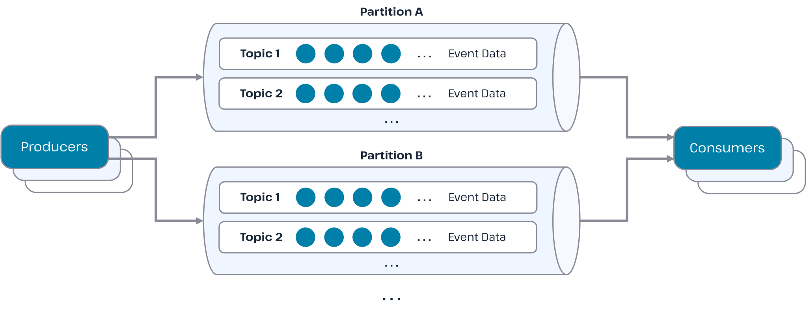
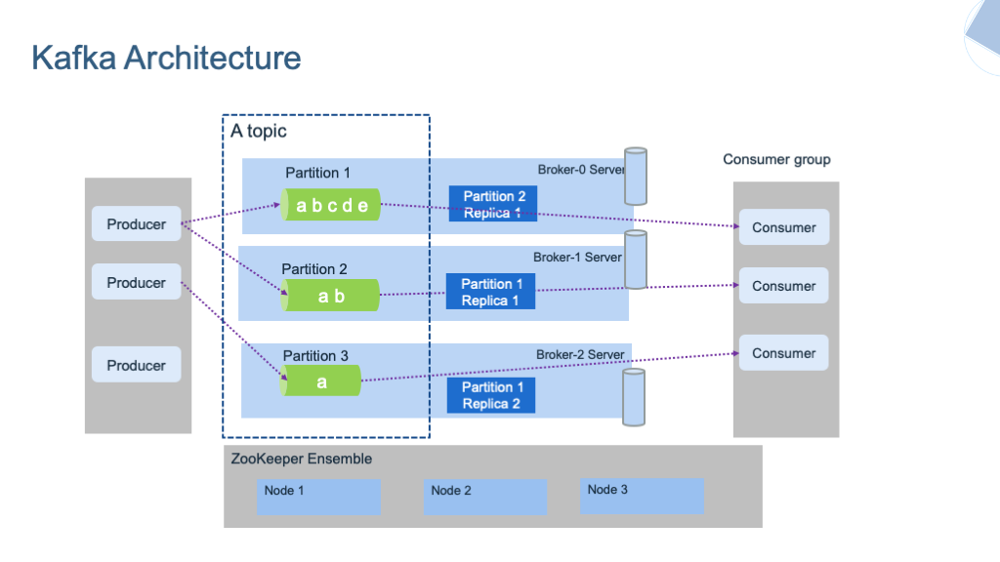

# Apache Kafka

## ¿Qué es Apache Kafka?

**Apache Kafka** es una plataforma de streaming de eventos distribuida que permite publicar, suscribirse, almacenar y procesar flujos de registros en tiempo real. Diseñado para manejar altos volúmenes de datos con baja latencia y alta disponibilidad, Kafka es fundamental para arquitecturas de microservicios y sistemas event-driven.

<br>



### Conceptos Fundamentales

**Topic**: Canal lógico donde se publican y consumen mensajes. Los topics se dividen en particiones para escalabilidad.

**Partition**: División de un topic que permite el paralelismo y la escalabilidad horizontal. Cada mensaje va a una partición específica.

**Producer**: Aplicación que publica mensajes en topics de Kafka.

**Consumer**: Aplicación que se suscribe a topics y procesa mensajes.

**Consumer Group**: Conjunto de consumers que cooperan para consumir mensajes de un topic.

**Broker**: Servidor Kafka individual que almacena y sirve mensajes.

**Cluster**: Conjunto de brokers que trabajan juntos.

<br>


---

## **Componentes Principales**

### **Topics y Particiones**
```java
// Configuración de topic con múltiples particiones
Properties props = new Properties();
props.put(ProducerConfig.BOOTSTRAP_SERVERS_CONFIG, "localhost:9092");
props.put("key.serializer", "org.apache.kafka.common.serialization.StringSerializer");
props.put("value.serializer", "org.apache.kafka.common.serialization.StringSerializer");
props.put("num.partitions", 3); // 3 particiones para escalabilidad
```

### **Zookeeper/KRaft**
- **Zookeeper**: Coordinación de brokers y configuración de clusters (legacy)
- **KRaft**: Protocolo de consenso integrado para simplificar la arquitectura

---

## **Casos de Uso**

### **Microservicios y Event Streaming**
- Comunicación asíncrona entre servicios
- Replicación de datos entre bases de datos
- Implementación de Event Sourcing

### **Análisis de Datos en Tiempo Real**
- Métricas de aplicaciones y monitoreo
- Análisis de logs y trazas
- Detección de fraudes

### **Pipeline de Datos**
- ETL (Extract, Transform, Load) en tiempo real
- Sincronización entre sistemas
- Arquitecturas Lambda y Kappa

### **Event Sourcing**
- Almacenamiento de eventos como fuente de verdad
- Reconstrucción de estado por replay
- Auditoría y compliance

### **Sistema de Mensajería**
- Cola de mensajes de alto rendimiento
- Integración entre sistemas legacy
- Buffer de eventos

---

## **Ventajas y Desventajas**

### **Ventajas**

**Alto Rendimiento**
- Throughput elevado (millones de mensajes por segundo)
- Baja latencia (milisegundos)
- Compresión nativa de mensajes

**Escalabilidad**
- Particionado horizontal
- Consumer groups para paralelismo
- Scaling dinámico de brokers

**Persistencia**
- Almacenamiento durable de eventos
- Retención configurable
- Compaction para optimizar almacenamiento

**Tolerancia a Fallos**
- Replicación de datos
- Failover automático
- Rebalanceo dinámico de partitions

**Ecosistema Rico**
- Conectores para sistemas externos
- Streams API para procesamiento
- Schema Registry para gestión de esquemas

### **Desventajas**

**Complejidad Operacional**
- Configuración y tuning complejos
- Monitoreo avanzado requerido
- Gestión de clusters distribuida

**Latencia**
- Overhead de red y disco
- No apto para operaciones que requieren microsegundos
- Sincronización eventual

**Curva de Aprendizaje**
- Conceptos avanzados (partitions, offsets, etc.)
- Debugging complejo en sistemas distribuidos
- Gestión de configuración extensa

---

## **Buenas Prácticas**

### **Diseño de Topics**

**Naming Convention**
```java
// ✅ Nomenclatura clara y descriptiva
String ORDER_EVENTS_TOPIC = "ecommerce.orders.events";
String USER_ACTIVITY_TOPIC = "social.users.activity";
String SYSTEM_METRICS_TOPIC = "monitoring.system.metrics";

// ❌ Evitar nombres genéricos
String TOPIC1 = "topic1";
String EVENTS = "events";
```

**Particionado Estratégico**
```java
// Particionar por orderId para mantener orden por orden
String orderKey = order.getId(); // Mismo orden = misma partición

// Evitar particiones desbalanceadas
// ❌ Particionar por timestamp
// ✅ Particionar por business key
```

### **Configuración de Productores**

```java
Properties producerProps = new Properties();
producerProps.put(ProducerConfig.BOOTSTRAP_SERVERS_CONFIG, "localhost:9092");
producerProps.put(ProducerConfig.KEY_SERIALIZER_CLASS_CONFIG, StringSerializer.class);
producerProps.put(ProducerConfig.VALUE_SERIALIZER_CLASS_CONFIG, JsonSerializer.class);

// Configuración para idempotencia
producerProps.put(ProducerConfig.ENABLE_IDEMPOTENCE_CONFIG, "true");
producerProps.put(ProducerConfig.RETRIES_CONFIG, "3");
producerProps.put(ProducerConfig.MAX_IN_FLIGHT_REQUESTS_PER_CONNECTION, "5");

// Configuración para throughput
producerProps.put(ProducerConfig.BATCH_SIZE_CONFIG, "16384");
producerProps.put(ProducerConfig.LINGER_MS_CONFIG, "5");
producerProps.put(ProducerConfig.COMPRESSION_TYPE_CONFIG, "snappy");
```

### **Configuración de Consumidores**

```java
Properties consumerProps = new Properties();
consumerProps.put(ConsumerConfig.BOOTSTRAP_SERVERS_CONFIG, "localhost:9092");
consumerProps.put(ConsumerConfig.KEY_DESERIALIZER_CLASS_CONFIG, StringDeserializer.class);
consumerProps.put(ConsumerConfig.VALUE_DESERIALIZER_CLASS_CONFIG, JsonDeserializer.class);
consumerProps.put(ConsumerConfig.GROUP_ID_CONFIG, "order-processor-group");
consumerProps.put(ConsumerConfig.AUTO_OFFSET_RESET_CONFIG, "earliest");
consumerProps.put(ConsumerConfig.ENABLE_AUTO_COMMIT_CONFIG, "false"); // Manual commit

// Configuración para procesamiento confiable
consumerProps.put(ConsumerConfig.MAX_POLL_RECORDS_CONFIG, "100");
consumerProps.put(ConsumerConfig.MAX_POLL_INTERVAL_MS_CONFIG, "300000");
```

---

## **Ejemplos en Java**

### **Productor con Spring Kafka**

```java
@Configuration
@EnableKafka
public class KafkaProducerConfig {
    
    @Value("${spring.kafka.bootstrap-servers}")
    private String bootstrapServers;
    
    @Bean
    public ProducerFactory<String, Object> producerFactory() {
        Map<String, Object> configProps = new HashMap<>();
        configProps.put(ProducerConfig.BOOTSTRAP_SERVERS_CONFIG, bootstrapServers);
        configProps.put(ProducerConfig.KEY_SERIALIZER_CLASS_CONFIG, StringSerializer.class);
        configProps.put(ProducerConfig.VALUE_SERIALIZER_CLASS_CONFIG, JsonSerializer.class);
        configProps.put(ProducerConfig.RETRIES_CONFIG, "3");
        configProps.put(ProducerConfig.ENABLE_IDEMPOTENCE_CONFIG, "true");
        return new DefaultKafkaProducerFactory<>(configProps);
    }
    
    @Bean
    public KafkaTemplate<String, Object> kafkaTemplate() {
        return new KafkaTemplate<>(producerFactory());
    }
}

// Servicio productor
@Service
public class OrderEventService {
    
    @Autowired
    private KafkaTemplate<String, Object> kafkaTemplate;
    
    private static final String ORDER_EVENTS_TOPIC = "ecommerce.orders.events";
    
    public void publishOrderPlaced(Order order) {
        OrderPlacedEvent event = new OrderPlacedEvent(
            order.getId(),
            order.getCustomerId(),
            order.getTotalAmount(),
            order.getItems()
        );
        
        // Usar orderId como key para mantener orden por orden
        ListenableFuture<SendResult<String, Object>> future = 
            kafkaTemplate.send(ORDER_EVENTS_TOPIC, order.getId(), event);
        
        future.addCallback(new ListenableFutureCallback<SendResult<String, Object>>() {
            @Override
            public void onSuccess(SendResult<String, Object> result) {
                log.info("Event published successfully: {}", event);
            }
            
            @Override
            public void onFailure(Throwable ex) {
                log.error("Failed to publish event: {}", event, ex);
                // Implementar retry logic o dead letter queue
            }
        });
    }
}
```

### **Consumidor con Spring Kafka**

```java
@Configuration
@EnableKafka
public class KafkaConsumerConfig {
    
    @Value("${spring.kafka.bootstrap-servers}")
    private String bootstrapServers;
    
    @Bean
    public ConsumerFactory<String, Object> consumerFactory() {
        Map<String, Object> props = new HashMap<>();
        props.put(ConsumerConfig.BOOTSTRAP_SERVERS_CONFIG, bootstrapServers);
        props.put(ConsumerConfig.KEY_DESERIALIZER_CLASS_CONFIG, StringDeserializer.class);
        props.put(ConsumerConfig.VALUE_DESERIALIZER_CLASS_CONFIG, JsonDeserializer.class);
        props.put(ConsumerConfig.GROUP_ID_CONFIG, "inventory-service-group");
        props.put(ConsumerConfig.AUTO_OFFSET_RESET_CONFIG, "earliest");
        props.put(ConsumerConfig.ENABLE_AUTO_COMMIT_CONFIG, "false");
        return new DefaultKafkaConsumerFactory<>(props);
    }
}

// Consumidor principal
@Component
public class OrderEventConsumer {
    
    @Autowired
    private InventoryService inventoryService;
    
    @KafkaListener(topics = "ecommerce.orders.events", groupId = "inventory-service-group")
    public void handleOrderPlaced(
            ConsumerRecord<String, OrderPlacedEvent> record,
            @Header(KafkaHeaders.RECEIVED_TOPIC) String topic,
            @Header(KafkaHeaders.RECEIVED_PARTITION_ID) int partition,
            @Header(KafkaHeaders.OFFSET) long offset) {
        
        OrderPlacedEvent event = record.value();
        String orderId = record.key();
        
        try {
            log.info("Processing order event: {} from partition {} offset {}", 
                    orderId, partition, offset);
            
            // Procesar evento con manejo de errores
            inventoryService.reserveInventory(event);
            
            log.info("Successfully processed order event: {}", orderId);
            
        } catch (Exception e) {
            log.error("Error processing order event: {}", orderId, e);
            // Implementar estrategia de retry o dead letter queue
            throw e; // Para que Kafka reintente según configuración
        }
    }
}
```

### **Kafka Streams - Procesamiento en Tiempo Real**

```java
@Configuration
@EnableKafkaStreams
public class KafkaStreamsConfig {
    
    @Bean
    public KStream<String, OrderPlacedEvent> kStream(StreamsBuilder streamsBuilder) {
        KStream<String, OrderPlacedEvent> orderStream = streamsBuilder
            .stream("ecommerce.orders.events", Consumed.with(Serdes.String(), orderEventSerde));
        
        // Agregar órdenes por cliente
        KTable<String, Long> ordersByCustomer = orderStream
            .groupBy((key, event) -> event.getCustomerId())
            .count(Materialized.as("orders-by-customer"));
        
        // Escribir resultado a topic
        ordersByCustomer.toStream()
            .to("analytics.orders.by-customer", Produced.with(Serdes.String(), Serdes.Long()));
        
        // Filtrar órdenes grandes
        orderStream
            .filter((key, event) -> event.getTotalAmount().compareTo(BigDecimal.valueOf(1000)) > 0)
            .to("analytics.large-orders");
        
        return orderStream;
    }
}

// Servicio para estadísticas en tiempo real
@Service
public class RealTimeAnalyticsService {
    
    @Autowired
    private KafkaStreams kafkaStreams;
    
    public void getOrdersByCustomer(String customerId) {
        ReadOnlyKeyValueStore<String, Long> store = 
            kafkaStreams.store("orders-by-customer", QueryableStoreTypes.keyValueStore());
        
        Long count = store.get(customerId);
        return count != null ? count : 0;
    }
}
```

### **Dead Letter Queue Implementation**

```java
@Component
public class EventProcessorWithDLQ {
    
    private static final String MAIN_TOPIC = "ecommerce.orders.events";
    private static final String DLQ_TOPIC = "ecommerce.orders.events.dlq";
    
    @KafkaListener(topics = MAIN_TOPIC, groupId = "order-processor-group")
    public void processOrder(ConsumerRecord<String, OrderPlacedEvent> record) {
        try {
            OrderPlacedEvent event = record.value();
            processOrderLogic(event);
            
        } catch (SerializationException e) {
            // Error de deserialización - enviar a DLQ
            sendToDLQ(record, e);
        } catch (BusinessException e) {
            // Error de negocio - reintentar o enviar a DLQ
            if (shouldRetry(record)) {
                retryWithBackoff(record);
            } else {
                sendToDLQ(record, e);
            }
        }
    }
    
    private void sendToDLQ(ConsumerRecord<String, ?> record, Exception error) {
        DLQEvent dlqEvent = new DLQEvent(
            record.key(),
            record.value(),
            record.topic(),
            record.partition(),
            record.offset(),
            error.getMessage(),
            System.currentTimeMillis()
        );
        
        kafkaTemplate.send(DLQ_TOPIC, record.key(), dlqEvent);
        log.warn("Event sent to DLQ: {}", dlqEvent);
    }
}
```

---

## **Configuración de Producción**

### **Server Properties**
```properties
# Broker configuration
broker.id=1
listeners=PLAINTEXT://kafka-broker-1:9092
log.dirs=/data/kafka-logs
num.network.threads=8
num.io.threads=16
socket.send.buffer.bytes=102400
socket.receive.buffer.bytes=102400
socket.request.max.bytes=104857600

# Partition configuration
num.partitions=3
default.replication.factor=3
min.insync.replicas=2

# Retention configuration
log.retention.hours=168
log.retention.bytes=1073741824
log.segment.bytes=268435456
log.retention.check.interval.ms=300000

# Compression
compression.type=snappy

# Connection configuration
max.connections.per.ip=2147483647
connections.max.idle.ms=600000
```

### **Monitoring con Prometheus**
```java
@Component
public class KafkaMetricsCollector {
    
    private final MeterRegistry meterRegistry;
    private final Counter messagesSent;
    private final Timer messageProcessingTime;
    
    public KafkaMetricsCollector(MeterRegistry meterRegistry) {
        this.meterRegistry = meterRegistry;
        this.messagesSent = Counter.builder("kafka.messages.sent")
            .description("Number of messages sent to Kafka")
            .register(meterRegistry);
        this.messageProcessingTime = Timer.builder("kafka.processing.time")
            .description("Time spent processing messages")
            .register(meterRegistry);
    }
    
    public void recordMessageSent(String topic) {
        messagesSent.increment(Tags.of("topic", topic));
    }
    
    public Timer.Sample startProcessingTimer() {
        return Timer.start(meterRegistry);
    }
}
```

---

## **Referencias Oficiales**

1. **Apache Kafka Documentation**  
   https://kafka.apache.org/documentation/

2. **Kafka Streams Documentation**  
   https://kafka.apache.org/documentation/streams/

3. **Spring Kafka Reference**  
   https://docs.spring.io/spring-kafka/reference/html/

4. **Confluent Kafka Documentation**  
   https://docs.confluent.io/

5. **Kafka Improvement Proposals (KIPs)**  
   https://cwiki.apache.org/confluence/display/KAFKA/Kafka+Improvement+Proposals