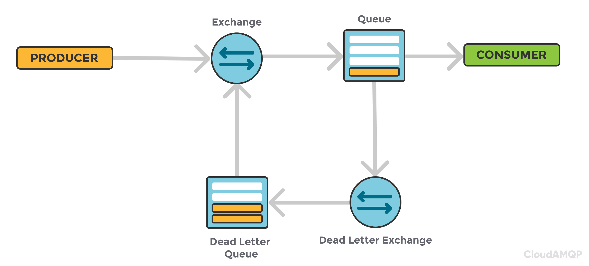

# Dead Letter Queue (Cola de Cartas Muertas)

## ¿Qué es Dead Letter Queue?

Una **Dead Letter Queue (DLQ)** es una cola especial donde se envían mensajes que no pueden ser procesados exitosamente por el sistema principal. Actúa como una "caja de seguridad" para mensajes problemáticos, permitiendo que el sistema continúe procesando otros mensajes mientras se manejan los errores de forma controlada.

<br>



### Conceptos Fundamentales

**Mensaje Fallido**: Mensaje que no pudo ser procesado después de múltiples intentos o por errores irrecoverables.

**Redirección Automática**: Mecanismo que envía automáticamente mensajes fallidos a la DLQ.

**Análisis Post-Mortem**: Proceso de investigar y entender por qué los mensajes llegaron a la DLQ.

**Re-Procesamiento**: Capacidad de re-enviar mensajes desde la DLQ para un nuevo intento de procesamiento.

---

## **Casos de Uso**

### **Manejo de Errores en Sistemas Distribuidos**
- Fallos temporales en servicios dependientes
- Timeouts de servicios externos
- Errores de conectividad

### **Validación de Datos**
- Mensajes con formato incorrecto
- Datos faltantes o inconsistentes
- Violaciones de esquema

### **Procesamiento Asíncrono**
- Reintentos con backoff exponencial
- Mensajes que requieren intervención manual
- Auditoría de errores de negocio

### **Sistemas de Integración**
- Fallos en transformaciones de datos
- Errores de serialización/deserialización
- Incompatibilidad de versiones

### **Compliance y Auditoría**
- Almacenamiento de mensajes problemáticos para revisión
- Análisis de patrones de errores
- Cumplimiento regulatorio

---

## **Ventajas y Desventajas**

### **Ventajas**

**Continuidad del Servicio**
- El sistema principal no se detiene por mensajes problemáticos
- Procesamiento continuo de mensajes válidos
- Disponibilidad mejorada

**Observabilidad**
- Visibilidad clara de errores de procesamiento
- Métricas y alertas sobre mensajes fallidos
- Análisis de tendencias de errores

**Recuperación Controlada**
- Capacidad de re-procesar mensajes manualmente
- Corregir problemas y re-intentar
- Minimización de pérdida de datos

**Diagnóstico**
- Información detallada sobre errores
- Contexto completo del fallo
- Facilita debugging y troubleshooting

### **Desventajas**

**Complejidad Operacional**
- Gestión adicional de colas DLQ
- Procesos para monitoreo y limpieza
- Configuración de alertas y métricas

**Latencia**
- Tiempo adicional para identificar y redirigir errores
- Overhead de procesamiento adicional
- Posible acumulación de mensajes

**Costo de Almacenamiento**
- Almacenamiento adicional para mensajes fallidos
- Costos de retención prolongados
- Gestión de lifecycle de datos

**Sobrecarga de Desarrollo**
- Lógica adicional para manejo de DLQ
- Configuraciones complejas
- Testing adicional

---

## **Buenas Prácticas**

### **Diseño de DLQ**

**Naming Convention**
```java
// ✅ Nomenclatura clara
String MAIN_QUEUE = "orders.processing";
String DLQ_QUEUE = "orders.processing.dlq";
String RETRY_QUEUE = "orders.processing.retry";

// ❌ Evitar nombres genéricos
String QUEUE1 = "queue1";
String ERROR_QUEUE = "error";
```

**Información Contextual**
```java
public class DLQMessage {
    private String originalMessageId;
    private String originalQueue;
    private String originalMessageBody;
    private String errorMessage;
    private String errorType;
    private long timestamp;
    private int retryCount;
    private Map<String, Object> context;
}
```

### **Criterios de Envío a DLQ**

```java
@Component
public class DLQDecisionHandler {
    
    public boolean shouldSendToDLQ(Exception error, int retryCount) {
        // Errores permanentes - enviar a DLQ inmediatamente
        if (isPermanentError(error)) {
            return true;
        }
        
        // Errores temporales - reintentar hasta límite
        if (isTemporaryError(error) && retryCount < MAX_RETRIES) {
            return false;
        }
        
        // Límite de reintentos alcanzado
        return true;
    }
    
    private boolean isPermanentError(Exception error) {
        return error instanceof ValidationException ||
               error instanceof SchemaValidationException ||
               error instanceof BusinessLogicException;
    }
    
    private boolean isTemporaryError(Exception error) {
        return error instanceof TimeoutException ||
               error instanceof ConnectionException ||
               error instanceof ServiceUnavailableException;
    }
}
```

### **Retención y Limpieza**

```java
@Configuration
public class DLQRetentionConfig {
    
    @Scheduled(fixedRate = 3600000) // Cada hora
    public void cleanupOldDLQMessages() {
        LocalDateTime cutoff = LocalDateTime.now().minusDays(30);
        
        List<DLQMessage> oldMessages = dlqRepository
            .findByTimestampBefore(cutoff)
            .stream()
            .filter(msg -> !msg.isReprocessed())
            .collect(Collectors.toList());
        
        for (DLQMessage message : oldMessages) {
            if (shouldArchive(message)) {
                archiveMessage(message);
            } else {
                permanentlyDelete(message);
            }
        }
    }
    
    private boolean shouldArchive(DLQMessage message) {
        // Archivar mensajes con errores críticos
        return message.getErrorType().equals("CRITICAL") ||
               message.getRetryCount() > 10;
    }
}
```

---

## **Ejemplos en Java**

### **Implementación con RabbitMQ**

```java
@Configuration
public class DLQRabbitMQConfig {
    
    @Value("${rabbitmq.host}")
    private String host;
    
    @Bean
    public ConnectionFactory connectionFactory() {
        ConnectionFactory factory = new ConnectionFactory();
        factory.setHost(host);
        return factory;
    }
    
    @Bean
    public RabbitTemplate rabbitTemplate() {
        return new RabbitTemplate(connectionFactory());
    }
    
    @Bean
    public Queue mainQueue() {
        Map<String, Object> args = new HashMap<>();
        args.put("x-dead-letter-exchange", "dlx");
        args.put("x-dead-letter-routing-key", "dlq");
        args.put("x-message-ttl", 30000); // 30 segundos
        return new Queue("orders.main", true, false, false, args);
    }
    
    @Bean
    public Queue dlqQueue() {
        return new Queue("orders.main.dlq", true, false, false);
    }
    
    @Bean
    public TopicExchange dlxExchange() {
        return new TopicExchange("dlx");
    }
    
    @Bean
    public Binding dlqBinding() {
        return BindingBuilder.bind(dlqQueue())
            .to(dlxExchange())
            .with("dlq");
    }
}

// Productor con manejo de DLQ
@Service
public class OrderProcessingService {
    
    @Autowired
    private RabbitTemplate rabbitTemplate;
    
    private static final String MAIN_QUEUE = "orders.main";
    private static final int MAX_RETRIES = 3;
    
    public void processOrder(OrderMessage orderMessage) {
        try {
            processOrderLogic(orderMessage);
            
        } catch (Exception e) {
            handleProcessingError(orderMessage, e);
        }
    }
    
    private void handleProcessingError(OrderMessage message, Exception error) {
        int currentRetries = getRetryCount(message.getMessageId());
        
        if (currentRetries < MAX_RETRIES) {
            // Reenviar a cola principal con incremento de reintentos
            message.incrementRetryCount();
            rabbitTemplate.convertAndSend(MAIN_QUEUE, message);
            
        } else {
            // Enviar a DLQ
            sendToDLQ(message, error, currentRetries);
        }
    }
    
    private void sendToDLQ(OrderMessage message, Exception error, int retryCount) {
        DLQMessage dlqMessage = new DLQMessage(
            message.getMessageId(),
            MAIN_QUEUE,
            message,
            error.getMessage(),
            error.getClass().getSimpleName(),
            retryCount,
            LocalDateTime.now()
        );
        
        rabbitTemplate.convertAndSend("orders.main.dlq", dlqMessage);
        log.warn("Message sent to DLQ: {}", dlqMessage);
    }
}

// Consumidor de DLQ
@Component
public class DLQConsumer {
    
    @Autowired
    private OrderProcessingService orderService;
    
    @RabbitListener(queues = "orders.main.dlq")
    public void handleDLQMessage(DLQMessage dlqMessage) {
        try {
            log.info("Processing DLQ message: {}", dlqMessage);
            
            // Opciones de manejo:
            // 1. Corrección manual y reenvío
            // 2. Transformación de datos
            // 3. Notificación a equipos
            
            handleDLQMessageManually(dlqMessage);
            
        } catch (Exception e) {
            log.error("Failed to handle DLQ message: {}", dlqMessage, e);
            // Enviar a cola de errores críticos o crear alerta
        }
    }
    
    private void handleDLQMessageManually(DLQMessage dlqMessage) {
        // Implementar lógica específica según el tipo de error
        switch (dlqMessage.getErrorType()) {
            case "ValidationException":
                correctValidationError(dlqMessage);
                break;
            case "TimeoutException":
                retryWithIncreasedTimeout(dlqMessage);
                break;
            default:
                notifyOperationsTeam(dlqMessage);
        }
    }
}
```

### **Implementación con Apache Kafka**

```java
@Configuration
public class DLQKafkaConfig {
    
    @Bean
    public ProducerFactory<String, Object> kafkaProducerFactory() {
        Map<String, Object> props = new HashMap<>();
        props.put(ProducerConfig.BOOTSTRAP_SERVERS_CONFIG, "localhost:9092");
        props.put(ProducerConfig.KEY_SERIALIZER_CLASS_CONFIG, StringSerializer.class);
        props.put(ProducerConfig.VALUE_SERIALIZER_CLASS_CONFIG, JsonSerializer.class);
        return new DefaultKafkaProducerFactory<>(props);
    }
    
    @Bean
    public KafkaTemplate<String, Object> kafkaTemplate() {
        return new KafkaTemplate<>(kafkaProducerFactory());
    }
}

// Productor con DLQ
@Service
public class OrderEventProcessor {
    
    @Autowired
    private KafkaTemplate<String, Object> kafkaTemplate;
    
    private static final String MAIN_TOPIC = "orders.events";
    private static final String DLQ_TOPIC = "orders.events.dlq";
    private static final int MAX_RETRIES = 3;
    
    @KafkaListener(topics = MAIN_TOPIC, groupId = "order-processor-group")
    public void processOrder(ConsumerRecord<String, OrderEvent> record) {
        String orderId = record.key();
        OrderEvent event = record.value();
        
        try {
            processOrderLogic(event);
            
        } catch (Exception e) {
            handleProcessingError(orderId, event, e, record);
        }
    }
    
    private void handleProcessingError(String orderId, OrderEvent event, 
                                     Exception error, ConsumerRecord<String, ?> record) {
        int retryCount = getRetryCount(orderId);
        
        if (retryCount < MAX_RETRIES) {
            // Reintentar con backoff
            retryWithBackoff(orderId, event, retryCount);
            
        } else {
            // Enviar a DLQ
            sendToDLQ(orderId, event, error, record, retryCount);
        }
    }
    
    private void sendToDLQ(String orderId, OrderEvent event, Exception error,
                          ConsumerRecord<String, ?> record, int retryCount) {
        DLQRecord dlqRecord = new DLQRecord(
            orderId,
            event,
            MAIN_TOPIC,
            record.partition(),
            record.offset(),
            error.getMessage(),
            error.getClass().getSimpleName(),
            retryCount,
            LocalDateTime.now()
        );
        
        kafkaTemplate.send(DLQ_TOPIC, orderId, dlqRecord);
        
        log.warn("Order {} sent to DLQ after {} retries", orderId, retryCount);
        
        // Métricas
        dlqMetrics.incrementDLQMessages(error.getClass().getSimpleName());
    }
}

// Service para reprocesamiento
@Service
public class DLQReprocessService {
    
    @Autowired
    private KafkaTemplate<String, Object> kafkaTemplate;
    
    public void reprocessFromDLQ(String dlqMessageId) {
        DLQRecord dlqRecord = dlqRepository.findById(dlqMessageId);
        
        if (dlqRecord == null) {
            throw new DLQMessageNotFoundException("DLQ message not found: " + dlqMessageId);
        }
        
        try {
            // Aplicar correcciones si es necesario
            OrderEvent correctedEvent = applyCorrections(dlqRecord.getOriginalEvent());
            
            // Re-enviar a topic principal
            kafkaTemplate.send(MAIN_TOPIC, dlqRecord.getOrderId(), correctedEvent);
            
            // Marcar como procesado
            dlqRecord.setReprocessed(true);
            dlqRecord.setReprocessedAt(LocalDateTime.now());
            dlqRepository.save(dlqRecord);
            
            log.info("Successfully reprocessed DLQ message: {}", dlqMessageId);
            
        } catch (Exception e) {
            log.error("Failed to reprocess DLQ message: {}", dlqMessageId, e);
            throw new ReprocessingFailedException("Failed to reprocess message", e);
        }
    }
}
```

### **Implementación con AWS SQS**

```java
@Configuration
public class DLQSQSConfig {
    
    @Bean
    public AmazonSQS amazonSQS() {
        return AmazonSQSClientBuilder.defaultClient();
    }
    
    @Bean
    public SQSQueueMessagingTemplate sqsMessagingTemplate() {
        return new SQSQueueMessagingTemplate(amazonSQS());
    }
}

// Handler con SQS DLQ
@Service
public class SQSOrderProcessor {
    
    @Autowired
    private SQSQueueMessagingTemplate messagingTemplate;
    
    private static final String MAIN_QUEUE_URL = "https://sqs.region.amazonaws.com/account/orders-main";
    private static final String DLQ_QUEUE_URL = "https://sqs.region.amazonaws.com/account/orders-main-dlq";
    private static final int MAX_RECEIVE_COUNT = 3;
    
    @SqsListener(value = "orders-main", deletionPolicy = SqsMessageDeletionPolicy.NEVER)
    public void processOrderMessage(Message message) {
        try {
            OrderMessage orderMessage = objectMapper.readValue(
                message.getBody(), OrderMessage.class);
            
            processOrderLogic(orderMessage);
            
        } catch (Exception e) {
            handleProcessingError(message, e);
        }
    }
    
    private void handleProcessingError(Message sqsMessage, Exception error) {
        int receiveCount = getReceiveCount(sqsMessage);
        
        if (receiveCount >= MAX_RECEIVE_COUNT) {
            // AWS SQS automáticamente envía a DLQ cuando se alcanza el límite
            log.warn("Message will be sent to DLQ by SQS: {}", sqsMessage.getMessageId());
            
            // Opcional: procesar en DLQ inmediatamente
            processInDLQ(sqsMessage);
            
        } else {
            // El mensaje volverá a estar disponible para re-procesamiento
            log.info("Message will be retried: {} (attempt {})", 
                    sqsMessage.getMessageId(), receiveCount + 1);
        }
    }
}
```

### **Monitoreo y Métricas**

```java
@Component
public class DLQMonitoringService {
    
    private final MeterRegistry meterRegistry;
    private final Counter dlqMessageCounter;
    private final Timer dlqProcessingTimer;
    
    public DLQMonitoringService(MeterRegistry meterRegistry) {
        this.meterRegistry = meterRegistry;
        this.dlqMessageCounter = Counter.builder("dlq.messages.total")
            .description("Total number of messages sent to DLQ")
            .tag("error.type", "none")
            .register(meterRegistry);
        this.dlqProcessingTimer = Timer.builder("dlq.processing.time")
            .description("Time spent processing DLQ messages")
            .register(meterRegistry);
    }
    
    public void recordDLQMessage(String errorType) {
        dlqMessageCounter.increment(Tags.of("error.type", errorType));
    }
    
    public Timer.Sample startDLQProcessingTimer() {
        return Timer.start(meterRegistry);
    }
    
    @EventListener
    public void handleDLQEvent(DLQEvent event) {
        recordDLQMessage(event.getErrorType());
        
        // Alertas
        if (shouldTriggerAlert(event)) {
            alertService.sendDLQAlert(event);
        }
    }
    
    private boolean shouldTriggerAlert(DLQEvent event) {
        return event.getErrorType().equals("CRITICAL") ||
               event.getRetryCount() > 5 ||
               isUnusualErrorPattern(event);
    }
}

// Job de limpieza automática
@Component
public class DLQCleanupJob {
    
    @Scheduled(cron = "0 0 2 * * ?") // Diariamente a las 2 AM
    public void cleanupOldDLQMessages() {
        LocalDateTime retentionDate = LocalDateTime.now().minusDays(7);
        
        long cleanedCount = dlqService.cleanupOldMessages(retentionDate);
        
        log.info("Cleaned up {} old DLQ messages", cleanedCount);
        
        // Métricas de limpieza
        cleanupMetrics.recordCleanedMessages(cleanedCount);
    }
}
```

---

## **Estrategias de Manejo**

### **Retry con Backoff**
```java
@Component
public class RetryWithBackoffService {
    
    public void processWithBackoff(String messageId, OrderMessage message, int attempt) {
        long delayMillis = calculateBackoffDelay(attempt);
        
        if (delayMillis < MAX_RETRY_DELAY) {
            ScheduledExecutorService executor = Executors.newScheduledThreadPool(1);
            executor.schedule(() -> retryMessage(messageId, message, attempt + 1), 
                             delayMillis, TimeUnit.MILLISECONDS);
        } else {
            sendToDLQ(messageId, message, "Max retries exceeded");
        }
    }
    
    private long calculateBackoffDelay(int attempt) {
        // Backoff exponencial con jitter
        long baseDelay = 1000L; // 1 segundo
        long exponentialDelay = baseDelay * (1L << (attempt - 1));
        long jitter = ThreadLocalRandom.current().nextLong(exponentialDelay / 2);
        return exponentialDelay + jitter;
    }
}
```

### **Validación de Mensajes**
```java
@Component
public class MessageValidationService {
    
    public ValidationResult validateMessage(OrderMessage message) {
        List<String> errors = new ArrayList<>();
        
        // Validación de campos requeridos
        if (message.getOrderId() == null || message.getOrderId().trim().isEmpty()) {
            errors.add("Order ID is required");
        }
        
        if (message.getCustomerId() == null) {
            errors.add("Customer ID is required");
        }
        
        if (message.getItems() == null || message.getItems().isEmpty()) {
            errors.add("Order items are required");
        }
        
        // Validación de negocio
        if (message.getTotalAmount().compareTo(BigDecimal.ZERO) <= 0) {
            errors.add("Total amount must be positive");
        }
        
        // Validación de formato
        if (!isValidEmailFormat(message.getCustomerEmail())) {
            errors.add("Invalid email format");
        }
        
        return new ValidationResult(errors);
    }
}
```

---

## **Referencias Oficiales**

1. **AWS SQS Dead Letter Queue**  
   https://docs.aws.amazon.com/AWSSimpleQueueService/latest/SQSDeveloperGuide/sqs-dead-letter-queues.html

2. **RabbitMQ Dead Letter Exchanges**  
   https://www.rabbitmq.com/dlx.html

3. **Apache Kafka Dead Letter Topic**  
   https://kafka.apache.org/documentation/#deadlettertopic

4. **Azure Service Bus Dead Letter Queues**  
   https://docs.microsoft.com/en-us/azure/service-bus-messaging/service-bus-dead-letter-queues

5. **Google Cloud Pub/Sub Dead Letter Topics**  
   https://cloud.google.com/pubsub/docs/dead-letter-topics