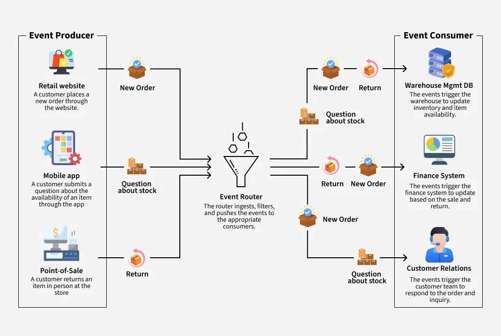

# Event-Driven Architecture (Arquitectura Dirigida por Eventos)

## ¿Qué es Event-Driven Architecture?

La **Event-Driven Architecture (EDA)** es un patrón de diseño de software donde el sistema está organizado para detectar, producir, consumir y reaccionar ante eventos. Un evento representa un cambio de estado significativo en el sistema o en el dominio del negocio.


<br>


### Conceptos Clave

**Evento**: Un cambio de estado que ocurre en el sistema. Puede ser algo que ha sucedido (past tense) como "OrderPlaced", "PaymentProcessed", "UserRegistered".

**Productor de Eventos (Event Publisher)**: Componente que detecta y publica eventos cuando ocurre un cambio de estado.

**Consumidor de Eventos (Event Subscriber)**: Componente que recibe y procesa eventos de interés.

**Bus de Eventos (Event Bus)**: Infraestructura que facilita la comunicación entre productores y consumidores de eventos.

**Mediador**: Componente que coordina eventos complejos, determina el orden de procesamiento y maneja errores.

---

## **Tipos de Eventos**

### **Eventos Simples (Event Notification)**
- Notifican que algo ha ocurrido
- No contienen datos detallados
- Los consumidores pueden solicitar más información si es necesario

### **Eventos de Estado (Event-Carried State Transfer)**
- Incluyen el estado completo del objeto afectado
- Los consumidores pueden operar sin consultar al productor
- Ideal para sistemas distribuidos

### **Eventos de Comando (Command Query Events)**
- Representan la intención de realizar una acción
- Pueden incluir información adicional para el procesamiento

---

## **Casos de Uso**

### **Microservicios**
- Comunicación asíncrona entre servicios
- Reducción del acoplamiento temporal
- Escalabilidad independiente

### **Sistemas de Tiempo Real**
- Procesamiento de transacciones financieras
- Sistemas de monitoreo y alertas
- Actualizaciones en tiempo real de dashboards

### **Sistemas de Procesamiento de Datos**
- Pipelines de ETL
- Sistemas de analytics
- Machine Learning en tiempo real

### **E-commerce**
- Procesamiento de pedidos
- Gestión de inventario
- Notificaciones de usuarios

### **IoT y Sistemas Conectados**
- Procesamiento de datos de sensores
- Sistemas de alertas
- Automatización de procesos

---

## **Ventajas y Desventajas**

### **Ventajas**

**Desacoplamiento**
- Los productores no necesitan conocer los consumidores
- Los servicios pueden evolucionar independientemente
- Facilidad para agregar nuevos consumidores

**Escalabilidad**
- Procesamiento asíncrono permite manejar picos de carga
- Distribución horizontal de consumidores
- Balanceo de carga natural

**Flexibilidad**
- Fácil adición de nuevos casos de uso
- Respuesta rápida a cambios de negocio
- Extensibilidad del sistema

**Resiliencia**
- Los eventos pueden persistirse y re-procesarse
- Tolerancia a fallos temporales
- Recuperación automática

### **Desventajas**

**Complejidad**
- Dificultad para rastrear el flujo de datos
- Debugging más complejo
- Gestión de consistencia eventual

**Latencia**
- Procesamiento asíncrono puede introducir retrasos
- No apto para operaciones que requieren respuesta inmediata

**Transacciones Distribuidas**
- Complejidad en garantizar consistencia ACID
- Manejo de transacciones complejas requiere patrones adicionales

---

## **Buenas Prácticas**

### **Diseño de Eventos**

**Naming Convention**
```java
// ✅ Buen ejemplo: usar tiempo pasado
OrderPlacedEvent
PaymentProcessedEvent
UserRegisteredEvent

// ❌ Evitar: tiempo presente/futuro
OrderPlacingEvent
PaymentWillProcessEvent
```

**Estructura de Eventos**
```java
public abstract class BaseEvent {
    private String eventId;
    private long timestamp;
    private String eventType;
}

public class OrderPlacedEvent extends BaseEvent {
    private String orderId;
    private String customerId;
    private List<OrderItem> items;
    private BigDecimal totalAmount;
}
```

### **Manejo de Errores**

```java
@Component
public class EventHandler {
    
    @EventListener
    @Async
    public void handleOrderPlaced(OrderPlacedEvent event) {
        try {
            processOrder(event);
        } catch (Exception e) {
            // Log del error
            log.error("Error processing order: {}", event.getOrderId(), e);
            
            // Implementar estrategia de reintento
            retryWithBackoff(event);
        }
    }
}
```

### **Gestión de Estado**

```java
@Service
public class OrderEventHandler {
    
    @EventListener
    public void handleOrderPlaced(OrderPlacedEvent event) {
        // Verificar estado antes de procesar
        Order order = orderRepository.findById(event.getOrderId());
        
        if (order != null && order.getStatus() == OrderStatus.PENDING) {
            // Procesar evento
            processOrder(order);
        }
    }
}
```

---

## **Ejemplos en Java**

### **Implementación con Spring Events**

```java
// Definición del evento
public class OrderPlacedEvent extends ApplicationEvent {
    private final String orderId;
    private final String customerId;
    private final BigDecimal amount;
    
    public OrderPlacedEvent(Object source, String orderId, String customerId, BigDecimal amount) {
        super(source);
        this.orderId = orderId;
        this.customerId = customerId;
        this.amount = amount;
    }
    
    // Getters
    public String getOrderId() { return orderId; }
    public String getCustomerId() { return customerId; }
    public BigDecimal getAmount() { return amount; }
}

// Productor de eventos
@Service
public class OrderService {
    
    @Autowired
    private ApplicationEventPublisher eventPublisher;
    
    public void placeOrder(Order order) {
        // Lógica de negocio
        order.setStatus(OrderStatus.PLACED);
        orderRepository.save(order);
        
        // Publicar evento
        OrderPlacedEvent event = new OrderPlacedEvent(
            this, 
            order.getId(), 
            order.getCustomerId(), 
            order.getTotalAmount()
        );
        eventPublisher.publishEvent(event);
    }
}

// Consumidor de eventos
@Component
public class OrderEventHandler {
    
    @Autowired
    private InventoryService inventoryService;
    
    @Autowired
    private NotificationService notificationService;
    
    @EventListener
    public void handleOrderPlaced(OrderPlacedEvent event) {
        // Procesar inventario
        inventoryService.reserveItems(event.getOrderId());
        
        // Enviar notificación
        notificationService.sendOrderConfirmation(event.getCustomerId(), event.getOrderId());
    }
}
```

### **Implementación con Kafka**

```java
// Configuración de Kafka
@Configuration
@EnableKafka
public class KafkaConfig {
    
    @Bean
    public ProducerFactory<String, Object> producerFactory() {
        Map<String, Object> configProps = new HashMap<>();
        configProps.put(ProducerConfig.BOOTSTRAP_SERVERS_CONFIG, "localhost:9092");
        configProps.put(ProducerConfig.KEY_SERIALIZER_CLASS_CONFIG, StringSerializer.class);
        configProps.put(ProducerConfig.VALUE_SERIALIZER_CLASS_CONFIG, JsonSerializer.class);
        return new DefaultKafkaProducerFactory<>(configProps);
    }
    
    @Bean
    public KafkaTemplate<String, Object> kafkaTemplate() {
        return new KafkaTemplate<>(producerFactory());
    }
}

// Productor de eventos
@Service
public class OrderEventProducer {
    
    @Autowired
    private KafkaTemplate<String, Object> kafkaTemplate;
    
    public void publishOrderPlaced(Order order) {
        OrderPlacedEvent event = new OrderPlacedEvent(
            order.getId(), 
            order.getCustomerId(), 
            order.getTotalAmount()
        );
        
        kafkaTemplate.send("order-events", order.getId(), event);
    }
}

// Consumidor de eventos
@Component
public class InventoryEventConsumer {
    
    @KafkaListener(topics = "order-events", groupId = "inventory-service")
    public void handleOrderPlaced(ConsumerRecord<String, OrderPlacedEvent> record) {
        OrderPlacedEvent event = record.value();
        
        try {
            inventoryService.reserveItems(event.getOrderId());
        } catch (Exception e) {
            // Manejar error - podría enviar a dead letter queue
            log.error("Error processing order: {}", event.getOrderId(), e);
        }
    }
}
```

---

## **Patrones de Integración**

### **Request-Response con Eventos**
```java
@Service
public class OrderService {
    
    @Autowired
    private EventGateway eventGateway;
    
    public CompletableFuture<OrderConfirmation> placeOrder(Order order) {
        OrderPlacedEvent event = new OrderPlacedEvent(order);
        
        return eventGateway.requestResponse("order-events", event, OrderConfirmation.class)
            .orTimeout(Duration.ofSeconds(30));
    }
}
```

### **Aggregator Pattern**
```java
@Component
public class OrderAggregator {
    
    private final Map<String, OrderState> orderStates = new ConcurrentHashMap<>();
    
    @EventListener
    public void handlePaymentProcessed(PaymentProcessedEvent event) {
        OrderState state = orderStates.get(event.getOrderId());
        if (state != null) {
            state.setPaymentProcessed(true);
            checkAndCompleteOrder(event.getOrderId(), state);
        }
    }
    
    @EventListener
    public void handleInventoryReserved(InventoryReservedEvent event) {
        OrderState state = orderStates.get(event.getOrderId());
        if (state != null) {
            state.setInventoryReserved(true);
            checkAndCompleteOrder(event.getOrderId(), state);
        }
    }
}
```

---

## **Referencias Oficiales**

1. **Martin Fowler - Event Sourcing**  
   https://martinfowler.com/eaaDev/EventSourcing.html

2. **Microsoft - Event-driven architecture style**  
   https://docs.microsoft.com/en-us/azure/architecture/patterns/event-driven-architecture

3. **AWS - What is Event-Driven Architecture?**  
   https://aws.amazon.com/what-is/event-driven-architecture/

4. **Spring Framework - Events and Listeners**  
   https://docs.spring.io/spring-framework/docs/current/reference/html/core.html#context-functionality-events

5. **Apache Kafka Documentation**  
   https://kafka.apache.org/documentation/